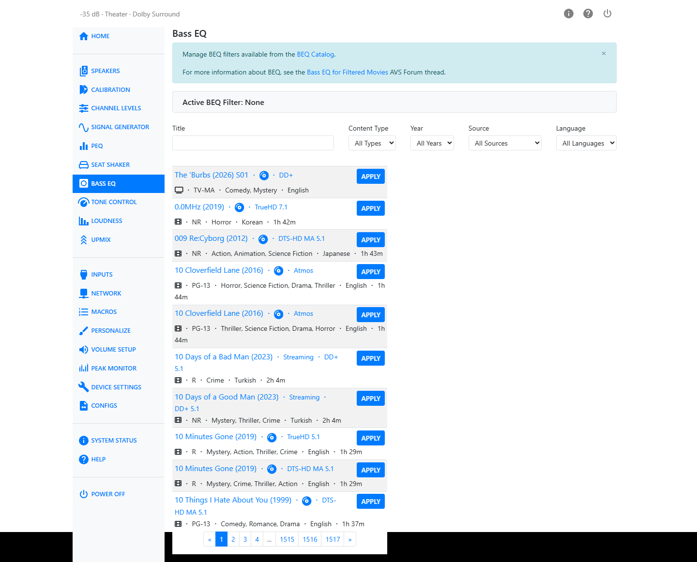

# Bass EQ

Many movie soundtracks are deliberately high-pass filtered during mastering, removing low bass that the mix originally had. Bass EQ (BEQ) restores that missing bass using pre-made filters drawn from a community-maintained catalogue of film and TV titles — the [BEQ Catalogue](https://beqcatalogue.readthedocs.io). Background on the technique is available in the AVS Forum thread [Bass EQ for Filtered Movies](https://www.avsforum.com/threads/bass-eq-for-filtered-movies.2995212/).

!!! note
    Bass EQ is unavailable when PEQ is set to post-Dirac Live placement. An alert reads *"BEQ is locked because PEQ is set to post. Switch PEQ to pre to restore access."* See [PEQ Placement](peq.md#peq-placement).

## Finding a Filter

Search the catalogue using the fields at the top of the page:

- **Title** — free-text search.
- **Content Type** — Movies or TV Shows.
- **Year**
- **Source** — the streaming service, disc, or other release the filter was measured from.
- **Language**

Results appear in a scrollable, paged list. Select a title to see its details — overview, genres, rating, runtime, and cover art — on the right.

## Applying a Filter

Select a title, then click **Apply** on its result row. The filter's bands are written into your subwoofer channels' PEQ, and PEQ is turned on if it wasn't already.

The **Active BEQ Filter** panel at the top of the page always shows what is currently applied. Click its name to jump back to that title's details, or click **Clear** to remove the filter and restore your subwoofer PEQ to its previous state.

Applying a new filter automatically clears whichever one was active before it.
