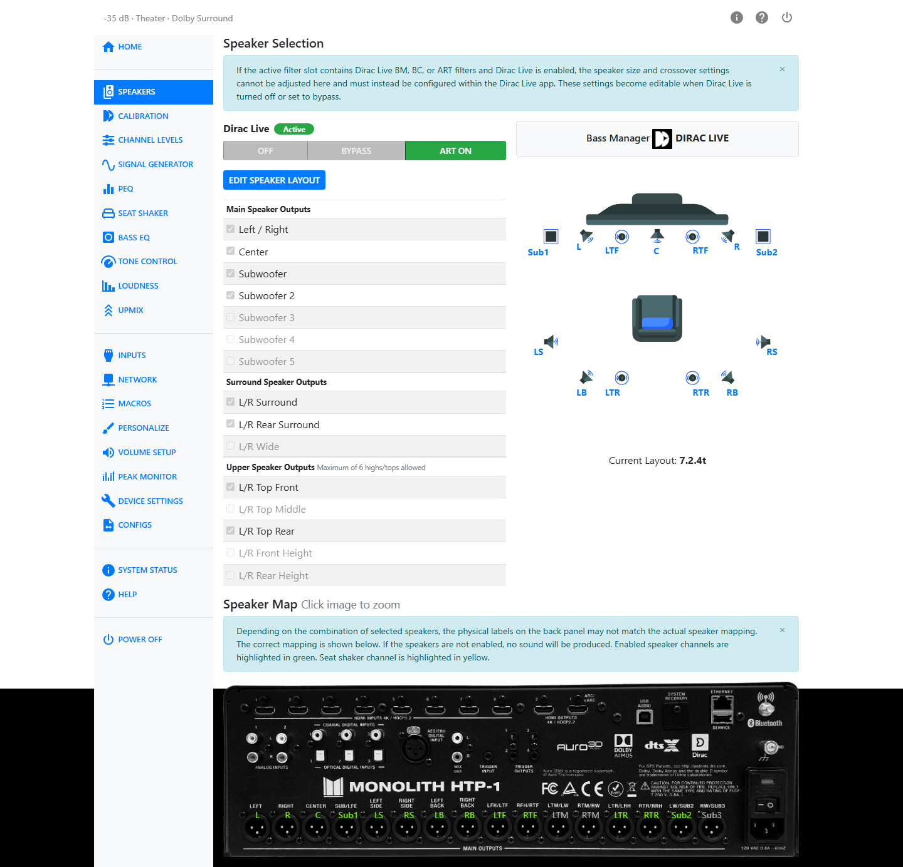

# Bass Management

Quoting the Wikipedia article on bass management:

> The fundamental principle of bass management in surround sound replay systems is that bass content in the incoming signal, irrespective of channel, should be directed only to loudspeakers capable of reproducing it, whether the latter are the main system loudspeakers or one or more special low-frequency speakers (subwoofers).
>
> The bass manager directs bass frequencies from *any* channel to one or more subwoofers, not just the content of the LFE channel. However, when there is no subwoofer, the bass manager would direct the LFE channel to the main speakers. This is the only time the LFE channel would *not* be sent to the subwoofer.
>
> The key concept is that the LFE channel is not the "subwoofer channel".

The frequency at which this bass "redirection" is accomplished is called the "crossover" frequency. The HTP-1 uses a fourth-order Linkwitz-Riley crossover, a standard, symmetric filter design.

The bass management system acknowledges that many speakers cannot reproduce low frequency sound. It requires a physically large device to produce 20 Hz audio. Subwoofers are optimized for this use. Since low frequency sound is non-directional, the bass manager collects the low frequency energy from other channels and reproduces it through the subwoofer(s) instead — with up to 5 subwoofers supported, that energy can be shared across more than one.

## Where the Controls Are

The bass management controls live on the **Speakers** page (`/#/settings/speakers`), in a **Bass Manager** section below the speaker layout table.

Whether that section appears at all depends on the **Bass Manager badge** shown near the top of the page:

- **HTP-1** — the HTP-1's own bass manager is active. The **Bass Manager** section below is visible, with the two controls described in the next section.
- **DIRAC LIVE** — a Dirac Live Bass Management, Bass Control, or ART filter is loaded and Dirac Live is on. Dirac Live is doing the crossover and subwoofer routing instead, and the **Bass Manager** section is hidden entirely — there is nothing to configure here. Turn Dirac Live off or to Bypass to fall back to the HTP-1 bass manager and reveal the section again. See [Speaker Configuration](speaker-configuration.md#the-bass-manager-badge) and [Dirac Live](dirac.md) for how filter type is chosen during calibration.

!!! note
    If a control you expect to see is missing, check the Bass Manager badge first. This is the single most common reason.

## HTP-1 Bass Manager Controls

When the badge reads **HTP-1**, two controls appear:

| Control | Range | What it does |
|---|---|---|
| **LPF for LFE Channel** | 40–200 Hz | Sets the cutoff frequency of the low-pass filter applied to the LFE channel. |
| **Reinforce Bass** | On / Off | Routes the subwoofer signal also to large speakers. |

**Reinforce Bass** redirects low-frequency content from speakers configured as **Small** to those set
as **Large**, so full-range mains carry some of the redirected bass energy rather than sending it to
the subwoofer alone.

With Reinforce Bass on, the subwoofer receives a low-pass filtered mix of all channels. The low-pass
cutoff is set to the **highest crossover frequency among the Small speakers**. If every speaker is
configured as Large, a default of 80 Hz is used.

## Speaker Size and Crossover

The other half of bass management — deciding *which* speakers hand off their bass, and at what frequency — is set per speaker in the **Edit Speaker Layout** dialog, on the same Speakers page. See [Speaker Setup](speaker-setup.md#the-edit-speaker-layout-dialog) for the full walkthrough. In short:

- A speaker set to **Small** (or **Dolby**) gets a crossover frequency field, range 40–200 Hz, and its bass below that frequency is redirected to the subwoofer(s).
- A speaker set to **Large** is treated as full-range and keeps its own bass.
- Subwoofers have no size or crossover control of their own. The **LPF for LFE Channel** control above applies only to the LFE channel and does not affect bass redirected from other speakers by bass management.

!!! tip
    If you don't have a spec sheet for your speakers, a basic Dirac Live calibration will show you the speaker's useful range. You can use that measurement to choose a crossover frequency. Unless you really have "Large" full-range speakers, set the size to "Small" or "Dolby" (if it is a Dolby Atmos Enabled speaker) and pick a cutoff within the effective range of the speaker.

!!! note
    Speaker size and crossover only affect the HTP-1's own bass manager. When a Dirac Live Bass Management, Bass Control, or ART filter is active, Dirac Live's own bass handling takes over and these controls are locked — see [Where the Controls Are](#where-the-controls-are) above.

## Multiple Subwoofers

With more than one subwoofer, the bass manager sums and distributes the redirected low frequencies across all of them rather than treating "the subwoofer" as a single destination. Trim (gain) and delay are still set independently per subwoofer on the Calibration page. See [Speaker Configuration](speaker-configuration.md#multiple-subwoofers-and-dirac-live-bass-control) for the rule that your enabled subwoofer count must match how many are actually connected, and for how Dirac Live Bass Control can take over the multi-subwoofer optimization.

## Seat Shaker

A tactile transducer ("seat shaker") output can be assigned to one of the subwoofer channels, giving low-frequency effects a physical, felt presence in the seating area in addition to what's heard. The Seat Shaker page (sidebar) has its own controls: content source (Downmix, LFE Only, or Auto), a low-pass filter, delay, LFE gain, trim, and a 4/8/16-band PEQ.

The seat shaker channel normally consumes one of the 16 available output channels. Alternatively, the **Mix Out** outputs can be configured as the seat shaker output, leaving all 16 speaker output channels available. The seat shaker appears in the speaker layout table with a couch icon instead of a checkbox, and is highlighted yellow (not green) on the Speaker Map. It is excluded from Dirac Live calibrations and receives no Dirac Live filter correction while Dirac Live is enabled.

!!! note
    Bass EQ (`/#/settings/bass-eq`, sidebar entry **Bass EQ**) is a separate feature: it pulls filters from an online catalog to bring back low-frequency content that may have been reduced during post-production. It is not the same thing as bass management, and does not appear on the Speakers page.

!!! tip
    Redirecting several channels' worth of bass into one or two subwoofers is a common cause of clipping on the sub channels. If you hear distortion during bass-heavy scenes, check the sub channels on the Peak Monitor page (sidebar entry **Peak Monitor**).
