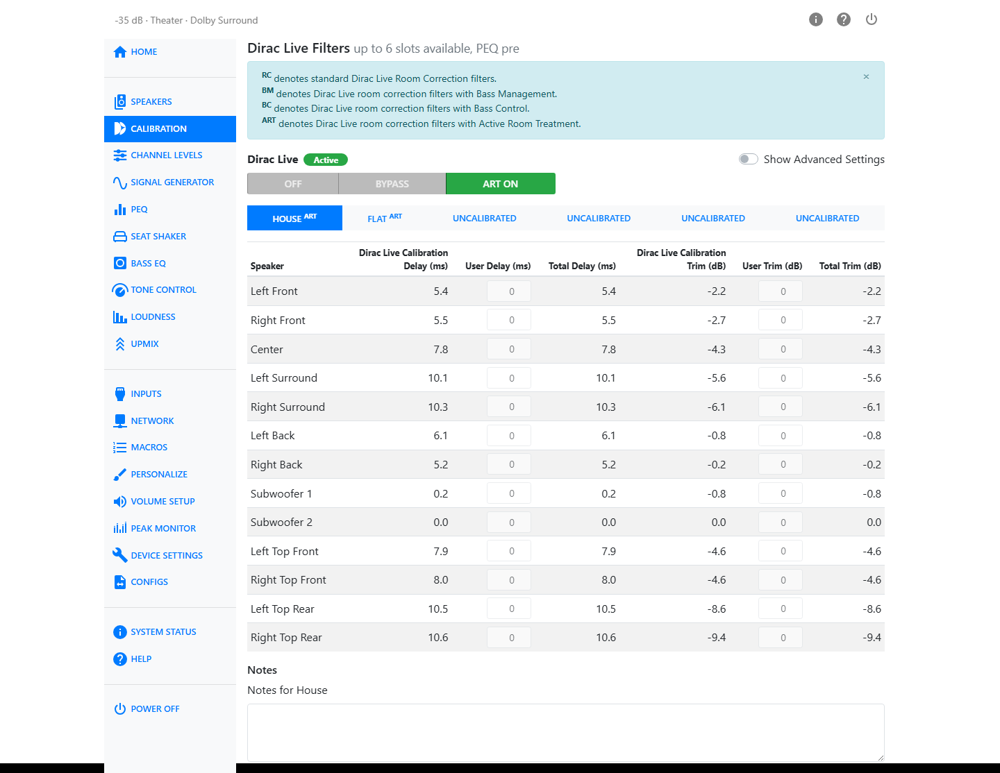
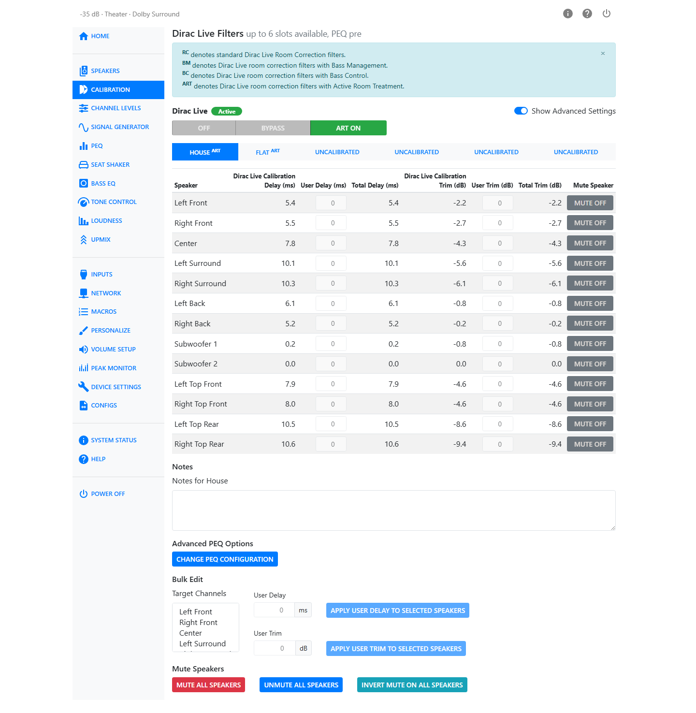

# Calibration

The Calibration page holds your Dirac Live filter slots and the per-speaker delay and trim values
that ride on top of them. For setting output levels and the maximum output voltage, see
[Volume Setup](volume-setup.md). For lip-sync delay, see [Inputs](inputs.md) — it is set per input,
not on this page.

## Dirac Live Filter Slots

Up to six Dirac Live filter slots are available. Each slot holds one calibration produced by the
Dirac Live app. Click a tab to switch slots. An empty slot shows as "Uncalibrated".

### Naming a Slot

You can rename a slot from the HTP-1 side. Click the
pencil icon next to the active slot's name, type a new name, and press Enter. This is only available
for an empty slot — once a calibration is loaded into a slot, its name comes from Dirac Live and
cannot be changed here.

### Notes

Each slot has a **Notes** field below the table. Use it to record anything about that calibration —
which microphone positions you used, which speaker layout it covers, or why you made it. Notes are
saved with the slot and are visible only in the HTP-1 UI.

## Filter Types

A slot's calibration can be one of four types. The type appears as a small superscript badge after
the slot name:

| Badge | Filter Type | What it means |
|---|---|---|
| RC | Dirac Live Room Correction | Standard room correction, each speaker treated individually. |
| BM | Dirac Live Bass Management | Room correction with Dirac Live's own bass management. |
| BC | Dirac Live Bass Control | Room correction with Bass Control optimization across multiple subwoofers. |
| ART | Dirac Live Active Room Treatment | Room correction where all speakers are optimized together as a matrix. |

See [Dirac Live](dirac.md#room-correction-methods-and-peq) for more on how these differ.

## The Delay and Trim Table

Each active speaker gets a row. Columns:

| Column | What it shows |
|---|---|
| Dirac Live Calibration Delay | The delay Dirac Live measured for this speaker. Read-only. |
| User Delay | Your own additional delay, 0–100 ms in 0.1 ms steps. Added to the calibration delay. |
| Total Delay | Calibration delay plus user delay. |
| Dirac Live Calibration Trim | The trim Dirac Live measured for this speaker. Read-only. |
| User Trim | Your own additional trim, −12 to 12 dB in 0.5 dB steps. Added to the calibration trim. |
| Total Trim | Calibration trim plus user trim. |
| Mute Speaker | Mutes the speaker. Only shown when **Show Advanced Settings** is on. |

Trim adjusts output levels, while delay compensates for differences in speaker distance based on the
speed of sound — roughly one foot per millisecond, or 0.34 m/ms. A properly completed Dirac Live
calibration sets optimal delay and trim automatically, so user delay and user trim should normally
remain at zero afterward.

!!! warning
    User delay and user trim are locked when a Bass Control (BC) or Active Room Treatment (ART)
    filter is loaded. Editing them here would work against what the filter is doing. Use the
    [Channel Levels](channel-levels.md) page instead to make a small, permanent level change under
    a BC or ART calibration.

!!! warning "User delay and trim are reset to zero on Dirac Live filter transfer"
    Delays and trims are set to zero during a Dirac Live calibration. When you open a saved Dirac
    Live project and transfer a filter into a slot, any user-defined delays and trims in that slot
    are therefore reset to zero as well. If you have hand-tuned values you want to keep, note them
    down before transferring a filter.

User delay and trim settings are stored independently with each slot, so you can keep different
adjustments for each calibration.

A speaker whose calibration doesn't match the current speaker layout is highlighted, and a row can
also turn red if it carries a leftover nonzero delay or trim from before a BC or ART filter was
loaded — those values are no longer being applied and should be cleared.

If you have a seat shaker channel, it is greyed out in this table. Its delay and trim are always
zero and cannot be edited here.

On a phone-sized screen the table becomes a set of cards, one per speaker, with a slot picker in
place of the tab strip.

## Show Advanced Settings

Turn on **Show Advanced Settings** to reveal the Mute Speaker column, Bulk Edit, and Advanced PEQ
Options described below.

### Bulk Edit

Bulk Edit applies one delay or trim value to several speakers at once. Select the speakers you want
in **Target Channels**, enter a value, and click **Apply User Delay to Selected Speakers** or
**Apply User Trim to Selected Speakers**. It respects the same BC/ART lockout as the per-speaker
fields.

### Mute All / Unmute All / Invert Mute

Three buttons let you manage mutes across every speaker at once: **Mute All Speakers**, **Unmute All
Speakers**, and **Invert Mute on All Speakers** (mutes everything that was unmuted and unmutes
everything that was muted). Muting a speaker preserves its trim, so unmuting restores the same value.

### Advanced PEQ Options

The **Change PEQ Configuration** button opens the same dialog described in
[PEQ](peq.md#peq-placement), for choosing whether PEQ runs pre or post the Dirac Live
filter.
