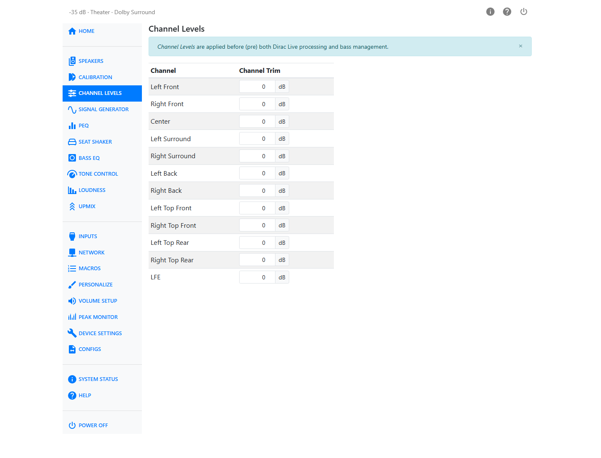

# Channel Levels

Channel Levels sets a per-channel trim, from −12 to +12 dB in 0.25 dB steps, applied upstream of
tone controls, loudness processing, PEQ, bass management and Dirac Live filters — so it does not
interfere with calibrations or other signal processing.

Because this trim sits upstream of Dirac Live, it's the right place to make level
changes — for example, lifting the center channel a little for dialog. Adjusting it here works with
the room correction rather than against it, unlike a speaker level change made after calibration.

If you have a seat shaker channel, it is marked in the table.

This is different from **User Trim** on the [Calibration](calibration.md#the-delay-and-trim-table)
page: User Trim sits downstream of the Dirac Live filter and is locked out entirely when a Bass
Control or Active Room Treatment calibration is loaded. Channel Levels is not locked, which makes it
the sanctioned way to adjust balance once a BC or ART filter is running.
