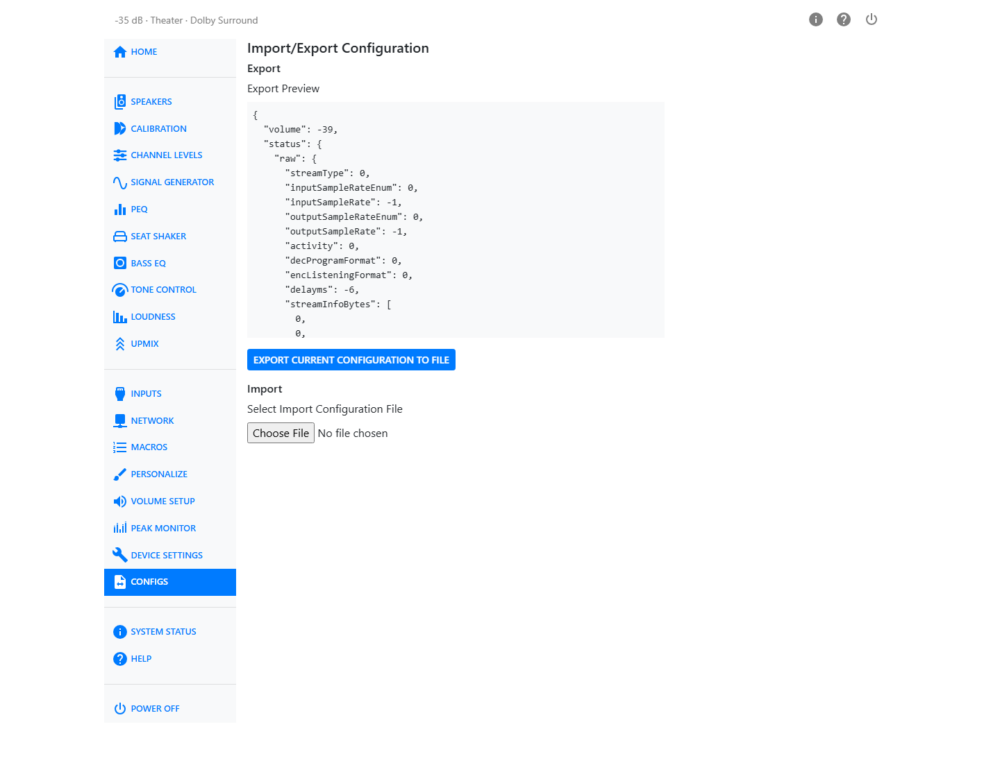

# Backup and Restore

Configs lets you save your entire HTP-1 configuration to a file and restore it later, or move it to
another unit.

## Export

The **Export Preview** pane shows your current configuration in full. Click **Export Current
Configuration to File** to save it as a JSON file.

!!! tip
    Export a backup before any major change — a firmware update, a factory reset, or a big change to
    your speaker layout or calibrations. If something goes wrong, you can get back to where you
    started.

## Import

Click **Select Import Configuration File** and choose a previously exported JSON file. The HTP-1
compares it against your current configuration and shows you exactly what would change — a list of
additions, removals, and changed values — before anything is applied.

If the file matches your current configuration exactly, you'll see a message saying no changes are
necessary. Otherwise, review the list and click **Confirm Import Configuration** to apply it.

!!! note
    Nothing is changed until you confirm. Reviewing the list first is your chance to catch a file
    you didn't mean to import, or one from a unit with a different speaker layout.
