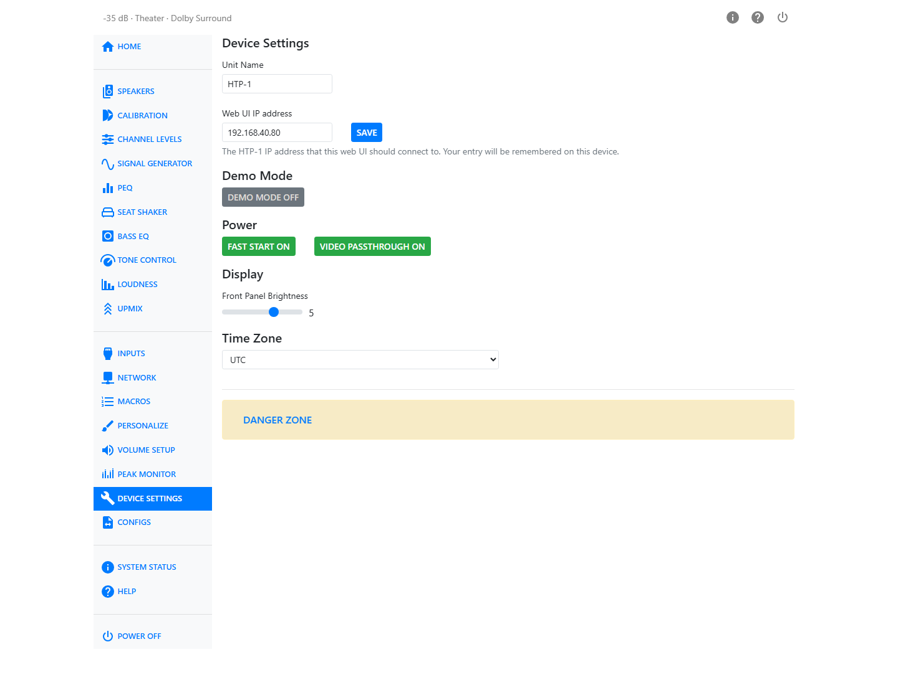

# Device Settings

Device Settings holds the controls for the unit itself — its name, how the web UI finds it, power
and display behavior, the clock, and the Danger Zone tools used for troubleshooting and reset.

Bass management now lives on [Speakers](bass-management.md), and lip-sync delay is a per-input
control on [Inputs](inputs.md) — neither is on this page any more.

## Unit Name

**Unit Name** is used for all other services the HTP-1 provides. Set it once. Spaces and capital
letters are allowed, though the name may be truncated in some places. You should see this name when
using Dirac Live, Roon, and Bluetooth.

## Web UI IP Address

**Web UI IP address** tells this web browser which HTP-1 to connect to. Enter the unit's IP address
or hostname and click **Save**. This is remembered on this device only — it doesn't change anything
on the HTP-1 itself, and other browsers or devices need their own entry.

## Demo Mode

**Demo Mode** points the web UI at a hosted demonstration unit instead of your own HTP-1, so you can
explore the interface without touching real hardware. Turning it off reconnects the web UI to your
unit.

!!! note
    While Demo Mode is on, you are not connected to your HTP-1 — any state you see is the demo
    unit's, not yours.

## Power

**Fast Start** and **Video Passthrough** are two-state switches.

With Fast Start off, the unit drops to a very low power state when off. CEC features such as
automatic power-on won't work in that state, and the system takes longer to start back up. Fast
Start keeps the unit ready to start quickly.

Video Passthrough only works when Fast Start is on — it lets video pass through the HTP-1 while the
unit itself is off.

## Display

**Front Panel Brightness** sets how bright the front panel display is, on a scale of 1 (dimmest) to
7 (brightest).

## Time Zone

Set the HTP-1's **Time Zone** from the list. This affects log timestamps and any scheduled
maintenance the unit performs in the background.

## Danger Zone

The Danger Zone holds tools for troubleshooting and reset. Each asks you to confirm before it acts.

| Button | What it does |
|---|---|
| Download Logs | Downloads `quicklogs.zip`, a log bundle useful for troubleshooting. It does not contain any personally identifiable information. |
| Restart Dirac Live Server | Restarts the Dirac Live server if you're seeing issues with Dirac Live filters. Takes about 30 seconds. |
| Restart avController | Restarts the avController component — the part of the system that handles most day-to-day control. Faster than a full reboot, taking about 60 seconds. |
| Factory Reset | Resets all settings to factory defaults and reboots the unit automatically. Network settings are left unchanged. |

!!! warning
    Factory Reset deletes your Dirac Live calibrations, not just your other settings. Export a
    backup on [Configs](configs.md) before you use it if you want to keep your current setup or
    calibrations.
