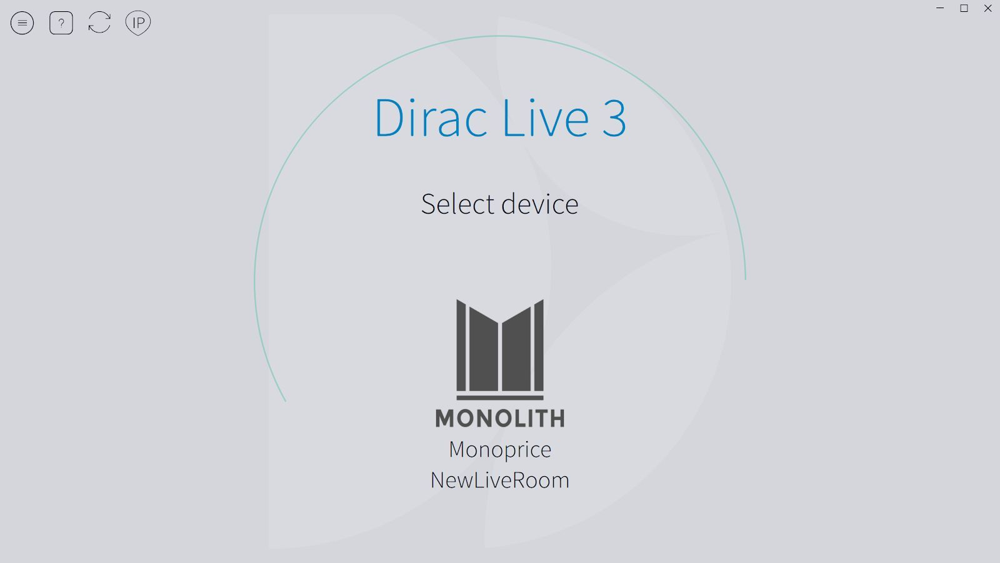
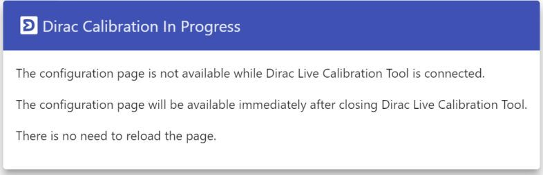
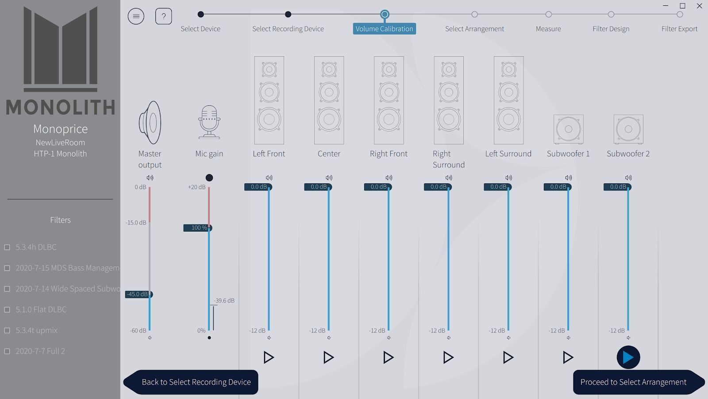
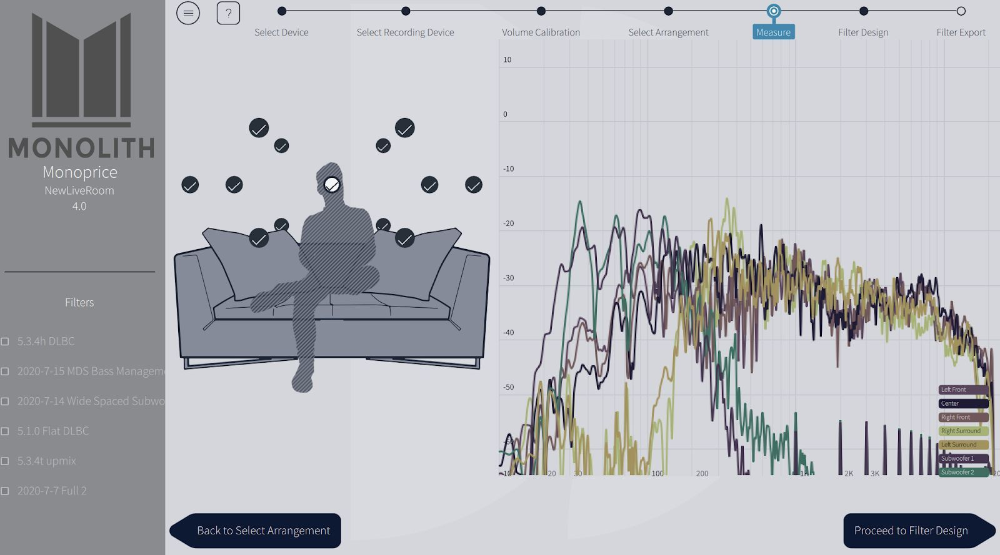
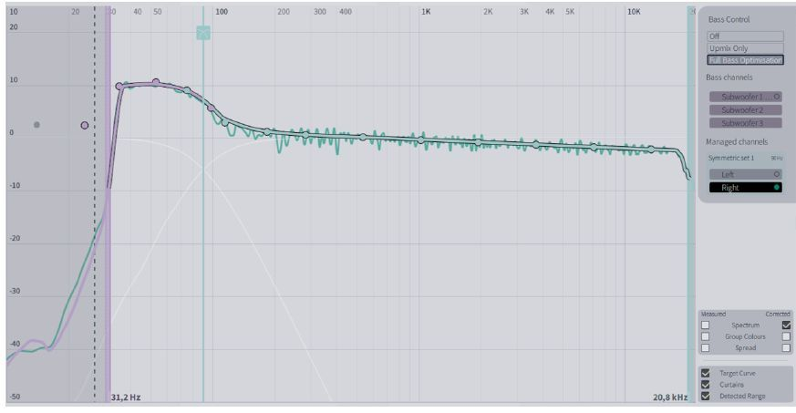
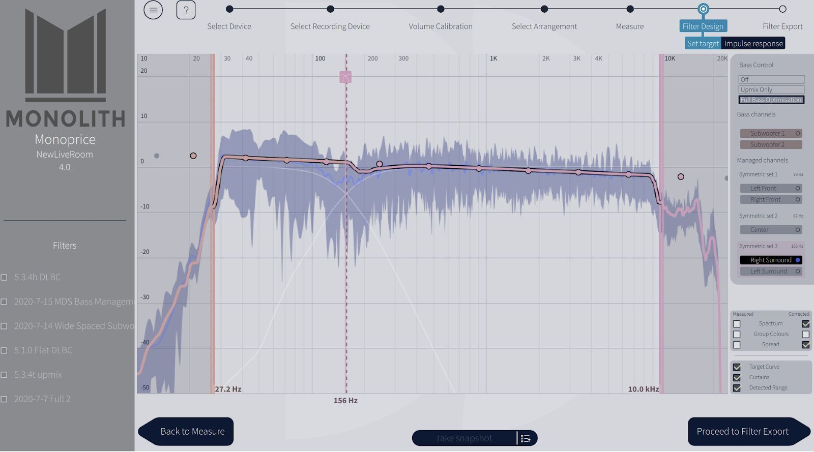
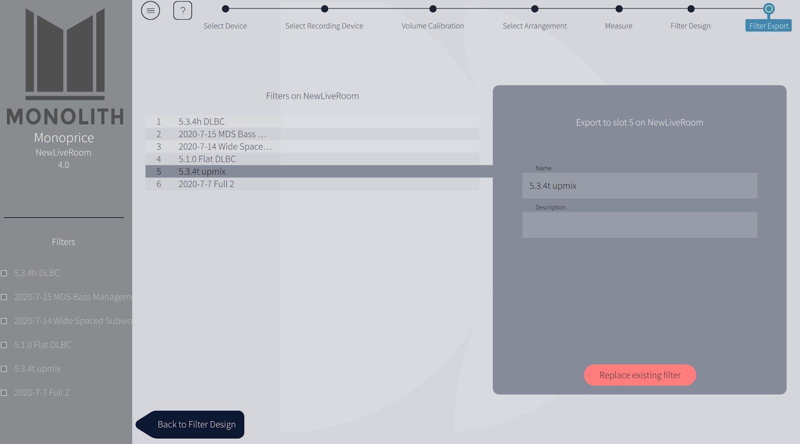
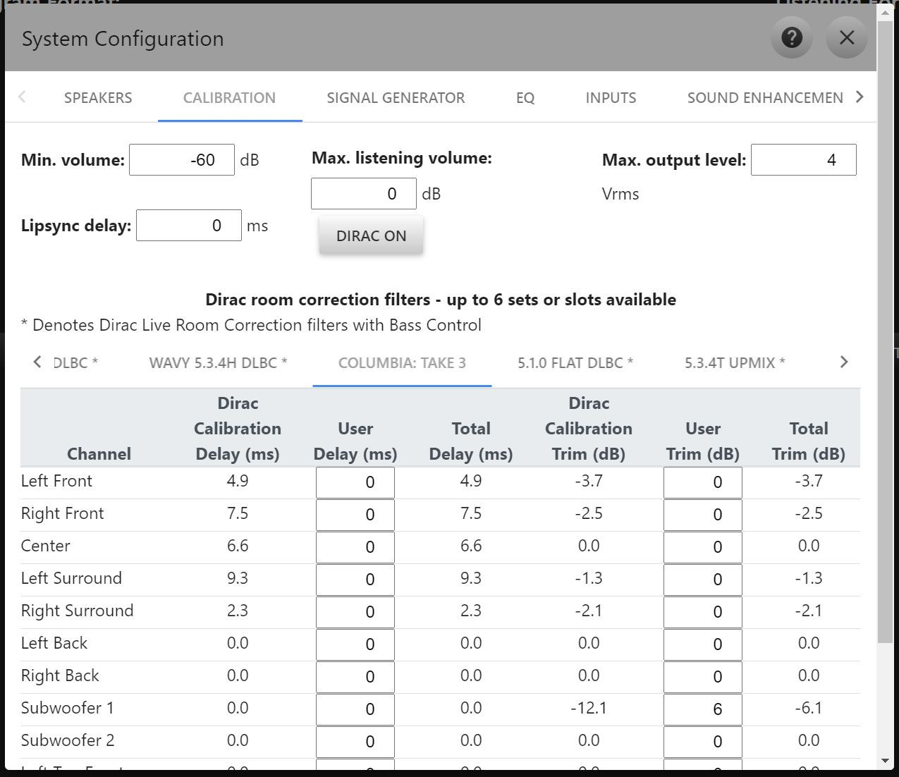

# Dirac Live

The Monolith™ HTP-1 supports Dirac Live® room correction. Using a calibrated microphone, the system
listens to the response of your room and your speakers and applies corrections to make the system
more linear and hence more correct. Calibration itself is done with the Dirac Live app on a PC or
Mac; the result is transferred to a filter slot on the HTP-1, described in
[Calibration](calibration.md).

The calibration system addresses several aspects of the system:

1. **It sets the delays on the speakers.** Sound travels about one foot per millisecond. The delays are designed to ensure that sound from all speakers reaches your ears at the same time. If the delays are not set correctly you are likely to perceive a sound in the center as coming from one side or the other.
2. **It sets the trim for each speaker.** Different speakers and amplifiers produce a different sound level for a given amplifier power. Distance also plays a role. Speaker trims are included so that the same sound from each speaker reaches your ears with the same loudness.
3. **It corrects the frequency response of the system.** The frequency response of speakers is often not flat. The Dirac Live system measures the frequency response and renders it flatter.
4. **It provides measurements of the frequency response of each of your speakers**, allowing you to set up the crossovers in the bass manager. The frequency response measurement reveals the low-frequency performance (the cutoff frequency) of each speaker. This is the information you need to set up bass management.

You should do a Dirac Live calibration. Setting up your speakers correctly is a key part of getting
the best sound out of your system.

!!! note
    The screenshots of the Dirac Live app on this page show the app itself, which looks the same
    regardless of HTP-1 firmware version. Screenshots of the HTP-1 web UI on this page are current.

## Before You Start

- **Turn off PEQ**, or leave PEQ placement set to pre-Dirac Live and be aware that it will be
  measured along with your speakers. If PEQ is enabled during calibration, the Dirac Live filter
  will attempt to nullify it back to a flat response. Advanced users can deliberately pre-compensate
  speakers with PEQ before calibrating — see [PEQ placement](peq.md#peq-placement)
  — but this is not where to start. Tone control and loudness are automatically disabled during
  calibration.
- Use the **Speakers** page to enable all of the speakers you have. Don't worry about size settings
  yet, but do label Dolby-enabled speakers correctly if you use them.
- A calibrated USB microphone is required. Using an uncalibrated mic, or a laptop's built-in mic,
  will skew the frequency response of your system.

Dirac® calibration requires a PC or Mac laptop running the Dirac Live app with an external mic
attached to the laptop.

!!! note
    The Dirac smartphone app does not support running a calibration, either with the phone's
    internal mic or with a mic attached to the phone.

## Calibration Steps

Complete the basic setup first — be able to play sound through your speaker set.

1. Download and install the Dirac Live app: <https://live.dirac.com/download/>. Use the latest
   version for the best results.
2. Attach a calibrated USB microphone to the computer.
3. Launch Dirac Live and log in. The ownership of the HTP-1 conveys a license for basic Dirac Live
   usage.
4. Open Dirac Live and connect to the Monolith HTP-1. The Dirac Live app finds the HTP-1 using
   common networking protocols. The name it shows is the HTP-1's name, set on the **Device
   Settings** page.

    

5. Choose the microphone you have connected.
6. The HTP-1 web UI is read-only while a Dirac Live calibration session is connected — a banner
   tells you this, and the front panel and remote still work for volume. Closing the Dirac Live app
   restores normal control.
7. Set the volumes for calibration. The volume control on the left side of the Dirac Live screen
   matches the one on the remote control — you can adjust it with the remote. The app sets the
   volume initially to -30 dB.

    

8. Press the play arrow under the left front speaker and adjust the master volume to reach
   approximately -20 dB on the scale for the channel. The noise plays for about 30 seconds; press
   play again if you need to. Repeat this for each channel. The volumes don't have to be identical,
   but they should be close. If several amps are involved, like with a powered subwoofer, it's
   better to get the volumes about even using the amp volumes.

    

    Dolby-enabled speakers are labeled with "Atmos" in the speaker name. Dirac Live uses a sweep
    tailored to preserve their frequency response.

9. Proceed to the **measure** screen and hear the sweeps. When a measurement completes you'll see
   the frequency response displayed. A single sweep is fine for trying things out, but a good
   calibration uses more measurements.

    

    If the volume is too low, the calibration will fail for "missing samples" or "poor signal to
    noise ratio". If it's too high, it will fail with clipping. If a run fails, go back to the
    volume page and adjust. Also check that your speaker configuration is correct: if you set up
    for 7.1.4 but have only 7.1.2, the missing speakers show as "missing samples".

10. The Dirac Live app encourages multiple sweep locations. Try a calibration with one location
    first to become familiar with the process, then do a full set of measurement locations for a
    better correction.
11. Proceed to the **Filter Design** screen and see the correction Dirac Live suggests. You can drag
    the left and right endpoints, investigate the cutoff frequency for your speakers, and grab the
    dots to adjust the target curve. With Dirac Live bass management you can drag the crossover
    point and recalculate. Dirac Live's default target curve has a slight downward tilt at the low
    end; most users want more bass than that default:

    

12. The "groups" at the right let you view one set of speakers at a time. The spread between
    measurements shows where more work is needed on the crossover and target curve.

    

13. Choose a slot to store this calibration in. The HTP-1 has up to six Dirac Live filter slots
    (the exact number is shown on the Calibration page heading). You can store calibrations for
    different room configurations, like curtains open and closed, or for different speaker layouts.
    Dirac Live suggests the names of physicists and philosophers; this name is visible in the HTP-1
    UI, so choose something meaningful to you. The description is not visible in the HTP-1 UI, but
    you can add your own note to the slot afterward — see [Calibration: Notes](calibration.md#notes).

    

14. Export the filter. This takes a minute or two. When complete, the resulting filter is installed
    and enabled on the HTP-1. You can see this on the [Calibration](calibration.md) page.
15. Save the session as a Dirac Live "project" on your PC before you exit. Each project contains one
    calibration session and is tied to your HTP-1's serial number. A project can't be transferred to
    a different serial number, but you can ignore the warning that results from changing the name.
16. Close the Dirac Live app. The read-only banner on the HTP-1 should clear. If it doesn't, launch
    the Dirac Live app again, then close it.
17. Open the HTP-1 web UI and go to **Calibration** (`#/settings/calibration`). If a calibration
    covers fewer speakers than your current layout, the uncalibrated speakers pass through without
    filtering, and the page highlights them as mismatched.
18. The calibration delay and trim values shown are what Dirac Live measured, applied whenever that
    filter is active. Notice that the delay and trim on one channel may read zero — that speaker was
    farthest from the microphone during calibration.

    

You can add **User Delay** and **User Trim** on top of the calibration values — see
[Calibration](calibration.md#the-delay-and-trim-table). These are only editable for RC and BM
filters; BC and ART filters lock them, since adjusting delay or trim downstream of those
calibrations would work against what the filter is doing. Total Delay cannot go below zero. Setting
trim to a large value can work, but it sacrifices headroom you may want for other filters.

## Dirac Live State: Off / Bypass / On

Clicking the Dirac Live button, in the web UI or on the remote, cycles the filter through three
states. The button label names the loaded filter type:

### Off

Dirac Live calibration delay and trim are ignored. User trim is still applied (for RC/BM filters).
The HTP-1's own bass manager is used. The button reads **Off**.

### Bypass

The room-correction filter itself is disabled, but the calibration's delay and trim values are still
applied, along with any user delay/trim. The HTP-1 bass manager is used. The button reads **Bypass**.
This lets you hear your system with delays and trims set correctly but without the spectral
correction from the filter.

!!! note
    The crossover frequencies of the HTP-1 bass manager are not automatically aligned with the
    crossover frequencies used by a Dirac Live bass manager.

### RC On / BM On / BC On / ART On

The filter is fully engaged — calibration delay and trim, user delay/trim, and the room-correction
filter itself are all applied. The button reads the loaded filter type followed by "On", for
example **ART On**. When a BM, BC, or ART filter is on, the HTP-1's own bass manager is disabled so
Dirac Live can handle bass management instead.

If the current speaker layout has no calibration in any slot, the button instead shows a single
**No Filter** state.

This cycle is sometimes called the "Dirac bypass loop". Because a calibration can carry large
negative trim values, your system may sound noticeably louder with Dirac Live off than on.

!!! tip
    If you switch between On and Bypass often, consider a macro that does it in one press. See
    [Macros](reference.md).

## Dirac Live Status

A status pill next to "Dirac Live" on the Calibration and Home pages shows one of four states:

| State | Meaning |
|---|---|
| Inactive | No Dirac Live filter is loaded or active. |
| Active | The calibration is active and the filter is working as expected. |
| Warning | The calibration is in an unexpected state. Turn Dirac Live off and back on. |
| Error | The filter failed to load. Restart the Dirac Live server or the HTP-1. |

On Error, a **Restart Dirac Live Server** button appears. This restarts just the Dirac Live process,
which is faster than rebooting the whole HTP-1 and is the recommended first step. A second copy of
this button lives on the Device Settings page, under Danger Zone.

## Tips for a Successful Dirac Calibration

Dirac Live is generally not too sensitive to small differences between calibrations, but a few tips
can help it go more easily.

- Make an initial measurement (one set of sweeps only) in the center of the sound stage, equidistant
  from and between the front left and right speakers, even if there is no seat there. After
  calibrating, check this by comparing the front left and front right Dirac Live Calibration Delay
  values on the Calibration page — they should be equal or very close.
- For the first measurement only, the mic should be at ear height in the main seat. For the UMIK-1,
  the mic should point straight up, its tip at ear level, using the 90-degree calibration file.
- A single measurement is useful for testing, but won't give Dirac Live enough information for a
  calibration that sounds good — it may sound dry and dull. More data produces better results.
- Try to match speaker volumes using amplifier volume controls before relying on the sliders in the
  Dirac Live app.
    - Establish proper levels for all speakers, including the sub channel, at the start of
      calibration. Dirac Live reduces the gain of speakers that are too loud but does not add gain
      for speakers that are too quiet — a speaker or group that starts too low will pull every
      channel's final level down to match it, which can be frustrating and require a much higher
      master volume to reach normal listening levels afterward. User trims can absorb differences of
      a few dB; differences of 10 dB should be fixed at the amplifier instead.
- Take remaining measurements several inches above and below the first mic position. For example,
  if your seated ear height is 41 inches: take the first measurement at 41 inches, the next several
  around 49 inches, and the rest around 33 inches. Precision matters less for these later positions,
  but a consistent routine helps.
- No two mic positions should be closer than about a foot to each other, and don't reuse a position
  for multiple measurements.
- Keep mic positions at least a foot from reflective boundaries where possible. If seat backs sit
  close to a mic position, fully recline the seat during calibration.
- At every mic position, the mic tip should have a clear line of sight to every speaker except
  subwoofers. Reclining seats can help with rear speakers.

## Calibrating for Higher Sample Rates

The Dirac Live filter itself does not run above 48 kHz; a sample rate converter drops the rate to
48 kHz range whenever the filter is active. Calibration runs at the sample rate of the active input.
44.1 kHz input is supported for calibration; 48 kHz is recommended.

<!-- verify: whether Dirac Live Bypass mode also avoids engaging the sample rate converter, or only the RC/BM/BC/ART filter itself -->

!!! tip
    You might reserve one filter slot just for a "user only" set of delay and trim values, with no
    room-correction filter loaded.

## Room Correction Methods and PEQ

A slot's calibration is one of four types, shown as a small badge after the slot name:

| Type | What it is |
|---|---|
| **RC** — Dirac Live Room Correction | Standard correction; each speaker and subwoofer is treated individually. |
| **BM** — Dirac Live Bass Management | Like RC, but Dirac Live's own bass management replaces the HTP-1 bass manager. |
| **BC** — Dirac Live Bass Control | Like BM, with added optimization across multiple subwoofers — delays and filters are tuned to smooth the response over the listening area. |
| **ART** — Dirac Live Active Room Treatment | All speakers are optimized together as a matrix rather than one-to-one, using every speaker's measured capability to reproduce the content best at the listening position. |

BC and ART both require phase alignment that a later delay or trim change would disturb, so both
lock out User Delay and User Trim on the Calibration page. Use [Channel Levels](channel-levels.md)
for a permanent trim adjustment under either filter type.

BC and Basic Dirac Live licenses are included with the HTP-1. Bass Control and Active Room Treatment
require additional licenses purchased from Dirac (<https://live.dirac.com/home-audio/>); if you
already own a BC license it also works with ART.

A more comprehensive overview of Dirac Live ART™ is available at
<https://www.dirac.com/live/art-technology/>.

### Filter Storage and Slot Behavior

- **Filters reload on speaker-layout change.** Whenever the speaker layout changes, filters for the
  new layout are loaded into a cache on the DSP. While a filter transfers, a progress overlay shows
  on screen. Once cached, switching between installed calibrations for the same layout is fast.
- **Filters are layout-specific.** If the current speaker layout has no calibration in any slot, a
  warning explains this and lists the layouts that do have a calibration:

    > Dirac Live is disabled; there are no Dirac Live filters available for the current speaker
    > layout.

- **Mismatched layouts are flagged.** If a calibration covers fewer speakers than the current
  layout, a warning appears and the uncalibrated speaker rows are highlighted on the Calibration
  page:

    > The selected Dirac Live calibration does not match the current speaker configuration.
    > Uncalibrated speakers are highlighted.

  Uncalibrated speakers are passed through without filtering. User delay and trim can still be added
  to them.
- **Subwoofer mismatches are not flagged.** Using a calibration made with more or fewer subwoofers
  than your current layout will still produce sound, but not optimally: extra subs get a copy of the
  first sub's signal, and a layout with fewer subs than the calibration only gets the primary sub
  signal. This can be useful for driving a non-speaker transducer like a seat shaker, but is worth
  knowing about if the balance sounds off after a layout change.
- **The Dirac Live app can affect HTP-1 slots.** Deselecting all filters in the app disables Dirac
  Live on the HTP-1. Deleting a slot in the app removes that slot's user delay and trim on the HTP-1.
  Transferring a new filter into a slot resets that slot's user delay and trim to zero.
- **Speaker-dependent delay is capped at about 35 ms** (roughly 35 feet, or 10.7 meters, of distance
  difference to the listener). If your room would need more, the applied delay may be zero for the
  affected speaker — worth knowing if you're calibrating a very large room.

## Troubleshooting

The Dirac Live system is reliable once a calibration is applied and you're listening, but it can
become confusing while you're experimenting with multiple calibrations. The status pill described
above is the first thing to check.

If the status shows a warning or error:

1. **Make sure an active slot is selected.** If the selected slot has no calibration for the current
   speaker layout, no filter is applied and a warning appears. Select a slot that has one.
2. **Select an active input.** A 48 kHz source is recommended but not required — see
   [Calibrating for Higher Sample Rates](#calibrating-for-higher-sample-rates).
3. **On a Warning**, turn Dirac Live off and back on.
4. **On an Error**, turn Dirac Live off and back on first. If that doesn't help, confirm a valid
   input is selected, then use **Restart Dirac Live Server** (on the Calibration page, or Device
   Settings → Danger Zone). This is faster than a full reboot and should be tried first.
5. **If none of that resolves it**, force a cache reload by switching to a different, unused speaker
   layout and back to your original one. This reloads the Dirac Live cache the same way a reboot
   does, without the downtime.

!!! tip
    Loading a large number of filters onto a large speaker layout can take a while — for example,
    filling all six slots for a 7.3.6 layout can take up to 10 minutes. If you're comparing speaker
    layouts, limit each layout to one or two calibrations to keep switching fast.

!!! note "Speaker layout after upgrading from a 1.x release"
    Upgrading from any 1.x release resets the speaker layout to 2.0, so that you deliberately choose
    your actual configuration rather than calibrating against a stale one. Set the layout to match
    your system before running a new calibration.
