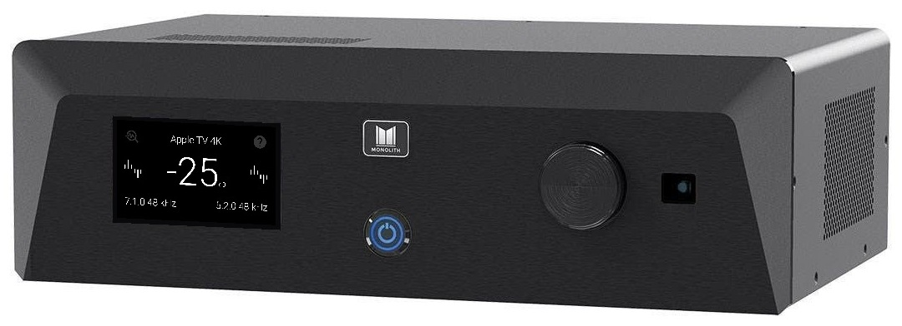
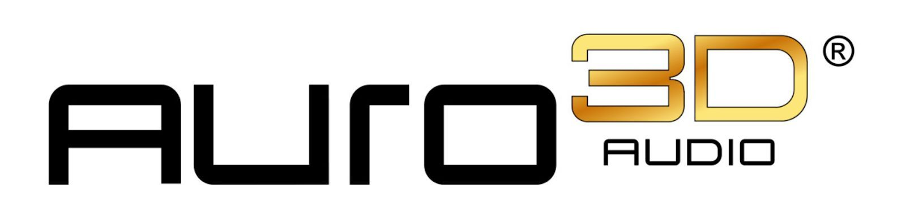

# HTP-1 User Manual

Monolith HTP-1

16-Channel Home Theater Processor

  
  

    
    
    
    
  

New to the HTP-1? Start with [Welcome](welcome.md), then [Basic Setup](basic-setup.md).

## Getting Started

| Chapter | Covers |
|---|---|
| [Welcome](welcome.md) | What's in the box, what you need, and what's new |
| [Safety and Regulatory](safety.md) | Safety warnings and licenses |
| [Product Overview](product-overview.md) | Front panel, rear panel, remote, and the web interface |
| [Basic Setup](basic-setup.md) | First power-on through first sound |
| [Home Page](home-page.md) | The screen you use most |

## Sound and Calibration

| Chapter | Covers |
|---|---|
| [Speaker Configuration](speaker-configuration.md) | Layouts, speaker positions, and valid configurations |
| [Speaker Setup](speaker-setup.md) | Enabling speakers, sizes, crossovers, and the speaker map |
| [Bass Management](bass-management.md) | Sending low frequencies to the right speakers |
| [Calibration](calibration.md) | Filter slots, delays, and trims |
| [Dirac Live](dirac.md) | Room correction, including Dirac Live ART |
| [Channel Levels](channel-levels.md) | Per-channel trim ahead of room correction |
| [Signal Generator](signal-generator.md) | Test signals for setup and troubleshooting |
| [PEQ](peq.md) | Parametric equalization |
| [Seat Shaker](seat-shaker.md) | Driving a tactile transducer |
| [Bass EQ](bass-eq.md) | Restoring filtered low bass on films |
| [Tone Control](tone-control.md) | Bass and treble adjustment |
| [Loudness](loudness.md) | Loudness compensation, night mode, and dialog enhancement |
| [Upmix](upmix.md) | Surround and upmix modes |

## Setup and System

| Chapter | Covers |
|---|---|
| [Inputs](inputs.md) | Naming inputs, per-input settings, CEC, and Bluetooth |
| [Network](network.md) | Wired and wireless connections |
| [ARC, eARC and CEC](connectivity.md) | Connecting to your TV |
| [Video Features](video.md) | UHD, EDID, Dolby Vision, and triggers |
| [Macros](macros.md) | Recording and running command sequences |
| [Personalize](personalize.md) | Choosing what appears in the interface |
| [Volume Setup](volume-setup.md) | Volume limits, Reference Output Voltage, and headroom |
| [Peak Monitor](peak-monitor.md) | Watching for clipping |
| [Device Settings](device-settings.md) | Unit name, power, display, and maintenance tools |
| [Backup and Restore](configs.md) | Saving and restoring your configuration |

## Status and Reference

| Chapter | Covers |
|---|---|
| [System Status](system-status.md) | Versions, detailed status, and HDMI diagnostics |
| [Updates and Support](maintenance.md) | Firmware updates, logs, and feedback |
| [Integrations and Control](integrations.md) | Roon, the mobile remote, and HTTP control |
| [Reference](reference.md) | Specifications, signal flow, IR codes, and glossary |

## If You Are Looking for a Setting That Moved

Several pages were renamed or reorganized in the V2 software.

| You may remember | It is now |
|---|---|
| Balance | [Channel Levels](channel-levels.md) |
| About | [System Status](system-status.md) |
| System | [Device Settings](device-settings.md) |
| Filtered Bass EQ | [Bass EQ](bass-eq.md) |
| Volume Control Setup | [Volume Setup](volume-setup.md) |
| Sound Enhancement | [Upmix](upmix.md) |
| Lip-sync delay, on the System page | Per input, on the [Inputs](inputs.md) page |
| Bass settings, on the System page | On the [Speakers](bass-management.md) page |
