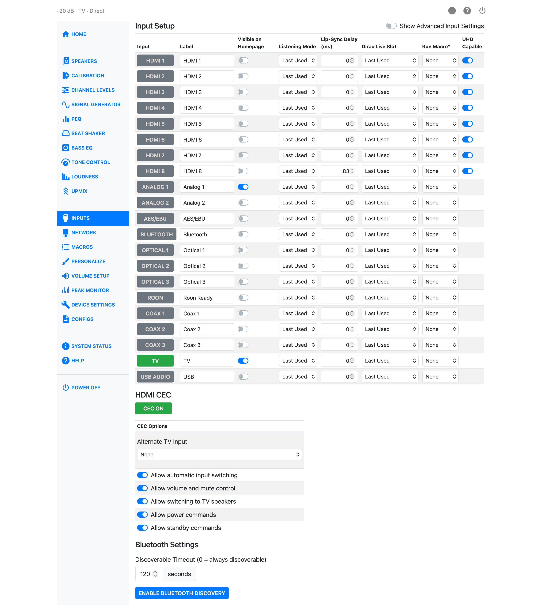
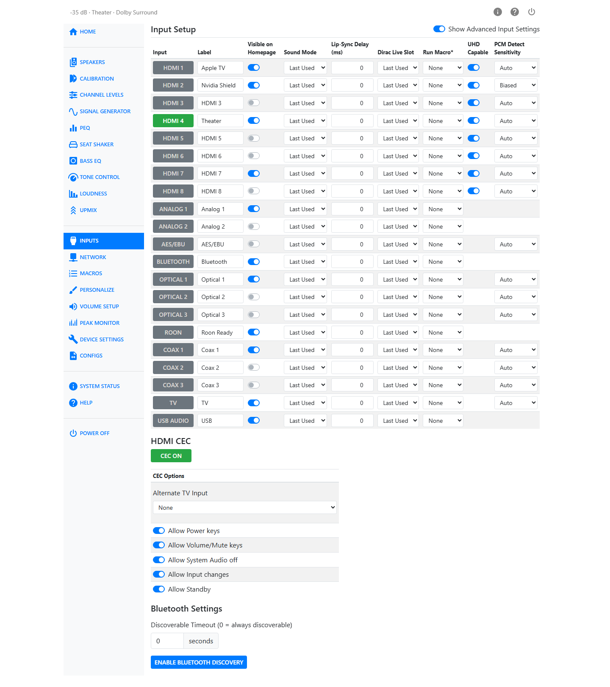
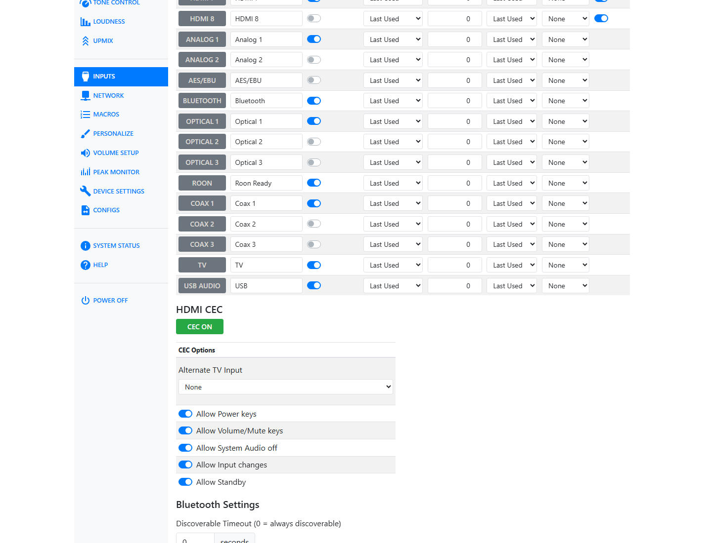

# Inputs

The Inputs page lets you set up each input: its name, whether it shows on the homepage, its default
listening mode, its lip-sync delay, its Dirac Live filter slot, and a macro to run when you select it.
HDMI CEC and Bluetooth are also set up on this page.

Clicking an input's name in the **Input** column selects that input immediately, so the table also
works as an input selector.

## The Input Table

| Column | What it does |
|---|---|
| Input | Shows the input's name. Click it to select that input. |
| Label | The name shown for this input on the front panel, the homepage, and the remote. |
| Visible on Homepage | Turns this input's button on or off on the Home page. |
| Listening Mode | The upmixer applied when you select this input, or **Last Used** to keep whatever upmixer was last chosen. |
| Lip-Sync Delay (ms) | Extra audio delay for this input, 0–340 ms. See [Lip-Sync Delay](#lip-sync-delay) below. |
| Dirac Live Slot | The Dirac Live filter slot applied when you select this input, or **Last Used**. |
| Run Macro | A macro to run automatically when you select this input, or **None**. |
| UHD Capable | Shown only for HDMI inputs. See [UHD Support](video.md#uhd-support). |
| PCM Detect Sensitivity | Shown only when **Show Advanced Input Settings** is on. See [PCM Detect Sensitivity](#pcm-detect-sensitivity) below. |

!!! note
    Turn on **Show Advanced Input Settings**, at the top right of the page, to reveal the PCM Detect
    Sensitivity column.

## Naming the Audio/Video Sources

Type a name into the **Label** field for any input to change what is displayed for it on the front
panel, the homepage, and the remote.

To make an input's button appear on the Home page, turn on its **Visible on Homepage** switch. Every
input with this switch on appears on the homepage — there is no limit there. The HTP-1 remote's USER
INPUT buttons work differently: they map to your visible inputs in order, and the remote can only
reach the first nine.

For example, if Satellite, Streaming Stick, Cable Box, Blu-ray, Game Console, CD Player, and Roon are
the visible inputs, in that order, the remote's user input buttons map as follows:

(1) Satellite (2) Streaming Stick (3) Cable Box (4) Blu-ray (5) Game Console (6) CD Player (7) Roon

## Listening Mode

**Listening Mode** sets the upmixer the HTP-1 switches to whenever you select this input. Choose **Last
Used** to leave the upmixer alone and keep whichever one was last selected.

## Lip-Sync Delay

**Lip-Sync Delay (ms)** adds extra delay to an input's audio, to bring it back into sync with video
that a TV or display has delayed through its own video processing. The range is 0–340 ms.

The **340 ms** figure is a ceiling on the total delay applied to a channel, not just the lip-sync delay you enter here — that ceiling also has to cover any delay already used by speaker calibration. The full 340 ms is guaranteed at all supported sample rates up to and including 192 kHz.

!!! tip
    Personalize lets you add an **Input Delay** ± stepper to the Home page, so you can nudge this
    value without opening the Inputs page.

## Dirac Live Slot

**Dirac Live Slot** sets the Dirac Live filter slot the HTP-1 switches to whenever you select this
input. Each option shows the slot's name along with a badge for its filter type (ART, BC, BM, or RC).
Choose **Last Used** to leave the current filter slot alone.

## Run Macro

**Run Macro** runs a macro automatically whenever you select this input — useful for things like
turning on a TV or switching an AV receiver's input at the same time. Choose **None** to do nothing.
The macros available here are the ones you have created on the [Macros](macros.md) page.

## UHD Capable

The **UHD Capable** switch appears only for HDMI inputs. By default, all HDMI inputs advertise Ultra
High Definition (UHD) support. Some older source devices behave poorly when told they can output a
4K/UHD signal — you might see discolored or corrupted video, or lose audio entirely. Turning UHD
Capable off for that input removes the UHD-related information from the EDID, so the source only
sees a 2K signal. See [UHD Support](video.md#uhd-support) for the technical detail.

## Watch Video with Other Audio

If you select a video (HDMI) input and then select a non-video input (analog or SPDIF, etc.), the
initially selected video will continue to be displayed while the new audio is played. There is no way
to watch video from one HDMI source and listen to audio from another HDMI source. This method does
allow you to listen to music from a non-HDMI source while watching an HDMI source. If you wish to
blank the video while listening to audio, just choose an inactive HDMI source before choosing the
audio.

To save a pairing you use often, so that one selection sets both halves, see
[Virtual Inputs](#virtual-inputs) below.

## Virtual Inputs

A virtual input shows the picture from one HDMI input while playing the sound from a different
input, under a name you choose. It saves the combination described above, so you can select it in
one step instead of choosing two inputs in the right order every time.

For example, a turntable on Analog 1 that you listen to while watching a streaming stick on HDMI 2
can be saved as a single input named Turntable.

Virtual inputs have their own **Virtual Inputs** table below the main input list. The main list is
fixed; the virtual list is yours to add to and remove from.

To create one:

1. Press **+ Add virtual input**.
2. In the **Video from** column, choose the HDMI input to take the picture from.
3. In the **Audio from** column, choose the input to take the sound from.
4. Type a name in the **Name** column.

The new input then works like any other. Turn on its **Visible on Homepage** switch to give it a
button on the Home page, set a listening mode, lip-sync delay, Dirac Live slot, or macro for it,
and click its name to select it.

To remove a virtual input, press the **×** button at the end of its row.

A few limits apply:

- **Video from** offers HDMI inputs only, because HDMI is the only source of picture.
- **Audio from** offers any other input, including Roon, Bluetooth, USB audio, and the streaming
  receivers described in [Integrations and Control](integrations.md#airplay-spotify-connect-and-dlna).
- A virtual input cannot take its sound from another virtual input.

!!! note
    The remote's **+** buttons (HDMI+, ANALOG+, SPDIF+, STRM+) step through the physical inputs
    only and skip virtual inputs. The USER INPUT buttons do reach them, because those buttons follow
    the inputs you have made visible on the Home page, in order.

## Partial Reset by Changing Inputs

Changing inputs resets the DSP path but not the entire DSP. In the rare case that a source is not
rendered properly, first try changing inputs. Powering down the unit when in Fast Start mode fully
resets the DSP. A cold power cycle from the back panel also resets the HDMI board and all controllers.

## PCM Detect Sensitivity

The HTP-1 normally detects the audio format by examining the incoming bitstream. **Auto** is
appropriate for almost all modern sources.

Turn on **Show Advanced Input Settings**, at the top of the Inputs page, to reveal the **PCM Detect
Sensitivity** column.

The choices depend on the input. Some inputs provide no PCM Detect Sensitivity setting, some provide
**Auto** and **Biased**, and some provide **Auto**, **Biased**, and **Indicated**.

- **Auto** detects the format by examining the bitstream and decodes it accordingly. This should be
  correct in almost all cases. Automatic detection was less reliable in older firmware versions.
- **Indicated** uses the format reported through HDMI signaling. If **Auto** does not identify an
  HDMI signal correctly, try **Indicated**.
- **Biased** biases automatic detection toward PCM. This was particularly useful with older Apple TV (Gen 1)
  devices that switched from coded audio to PCM for menu sounds.

Unconventional material from sources such as YouTube may occasionally be identified incorrectly. If
coded digital audio is mistaken for PCM, it is reproduced as loud white noise. If this happens, stop
playback and try another available setting.

## HDMI CEC

The **HDMI CEC** section turns CEC (Consumer Electronics Control) on or off and, when it's on, shows
the CEC options. CEC lets the HTP-1 and your TV pass remote-control commands to each other over HDMI,
and it underlies ARC. For what CEC and ARC/eARC do and how to connect them, see
[Connectivity](connectivity.md).

Turn on the **CEC** button to enable CEC. The **CEC Options** table then appears below it:

| Option | What it does |
|---|---|
| Alternate TV Input | The input the HTP-1 uses to pick up TV audio when your TV doesn't support ARC/eARC. Options are None, Analog1, Analog2, COAX1, COAX2, COAX3, Optical1, Optical2, Optical3. See [Alternate TV Input](connectivity.md#alternate-tv-input). |
| Allow Power keys | Lets other CEC devices turn the HTP-1 on, off, or toggle its power. |
| Allow Volume/Mute keys | Lets other CEC devices control the HTP-1's volume and mute. |
| Allow System Audio off | Lets other CEC devices turn off System Audio on the HTP-1. |
| Allow Input changes | Lets other CEC devices tell the HTP-1 to change inputs. |
| Allow Standby | Lets other CEC devices put the HTP-1 into standby. |

All five switches should stay on unless a specific device on your CEC network doesn't play well with
one of them. For instance, you might turn off Allow Input changes if a source doesn't handle it well.

## Bluetooth Settings

Bluetooth devices — such as a phone for casual music playback — are connected from this page.

**Discoverable Timeout** sets, in seconds, how long the HTP-1 stays visible to nearby devices after
you turn on discovery. Enter 0 to make it always discoverable. Press **Enable Bluetooth Discovery**
to start the discoverable window.

Your mobile device should now be able to see the HTP-1 and pair with it. A pairing-request prompt
appears in the web UI when a device asks to pair — accept it there.

!!! tip
    If you are pairing with the HTP-1 while also using your mobile device's web browser to control
    it, switching back and forth can clear the pairing prompt and abort pairing. Try again and accept
    the prompt as soon as you see it.

## USB Audio Input

Devices that produce USB audio can be connected to the (house-shaped) type B USB connector on the
back panel. HTP-1 advertises itself as capable of accepting 24-bit or 32-bit audio at 48000 Hz.
