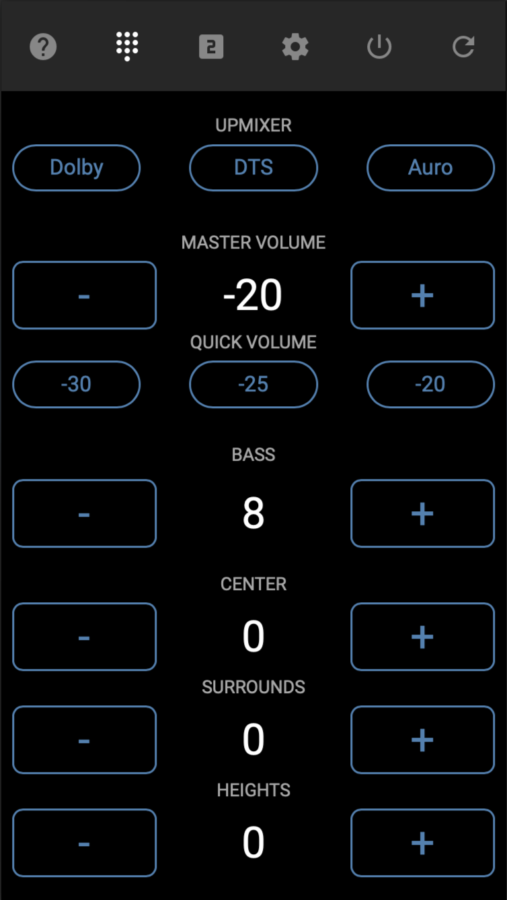

# Integrations and Control

## Using Roon

The HTP-1 is a Roon Ready device — Roon can send audio to it directly, with no separate app or
streamer needed. Roon is a music service you subscribe to, built around a locally stored or
network-attached music archive that can include high-quality formats like 96 kHz/24-bit and
192 kHz.

A Roon system needs a Roon Server, which knows where your music is (this can run on a PC or a
NAS), and a controller to browse your library and press play — the Roon app on a phone or PC. The
HTP-1 does not perform either of these roles; it is only the output device.

Select the **Roon** input on the HTP-1, then pick the HTP-1 as the output zone in Roon. It appears
in Roon's device list under whatever you've set as your **Unit Name** on the Device Settings page.

The Roon input works like any other input on the HTP-1: you can apply any of the upmixers to
expand a stereo Roon stream across your speaker layout, or leave it at **Direct** to pass the
source sample rate through unchanged. Every other upmixer resamples to 48 kHz (or 44.1 kHz), and
any loaded Dirac Live filter also caps output at 48 kHz — so a stream above that rate only stays
at its original rate with Direct selected and Dirac Live off.

!!! note
    Streaming at 44.1 kHz can be less stable through the Dirac Live path than 48 kHz. If you see
    issues, set Roon to resample to 48 kHz for this zone.

See [System Status](system-status.md) for the current release notes, which cover the latest Roon
behavior and any open issues.

## Mobile Remote

The HTP-1 serves a simple remote control page for phones and tablets at
`http://<your-htp1-ip>/remote/`. It gives you a lightweight way to control volume, bass, upmixer, center/surrounds/heights level, and
power without loading the full web UI.

{ width="50%" style="display: block; margin: 0 auto;" }

## HTTP Control

The HTP-1 accepts IR commands over plain HTTP, which makes it straightforward to drive from home
automation systems such as Control4, Home Assistant, or Crestron, or from your own scripts. Send a
request to:

```
http://<your-htp1-ip>/ircmd?code=XXXX
```

where `XXXX` is one of the codes from the IR code tables in [Reference](reference.md#ir-code-tables).
More than one code can be sent at once, separated by commas.

- Turn on Dirac Live filter slot 1 and unmute:

    ```
    curl "http://<your-htp1-ip>/ircmd?code=7887,4cb3"
    ```

- Select HDMI 1 and set the upmixer to Native:

    ```
    curl "http://<your-htp1-ip>/ircmd?code=0ff0,1ee1"
    ```

Every request returns the full system status as JSON, so a script can also use `/ircmd` to read
current state after making a change.

## Third-Party Applications

A number of third parties have built their own tools around the HTP-1, discussed in the
[Official Monoprice Monolith HTP-1 Owners Thread](https://www.avsforum.com/threads/the-official-monoprice-monolith-htp-1-owners-thread.3112176/)
on the AVS Forum. If you're building your own integration, see the Developers section of
this site for the underlying control protocol.
