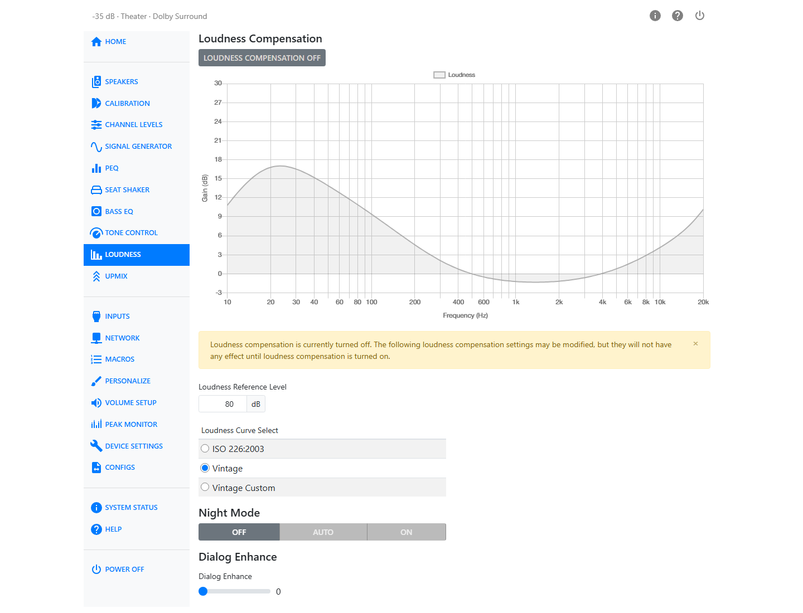
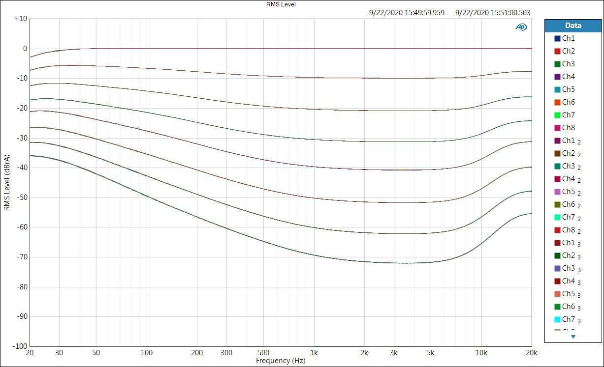
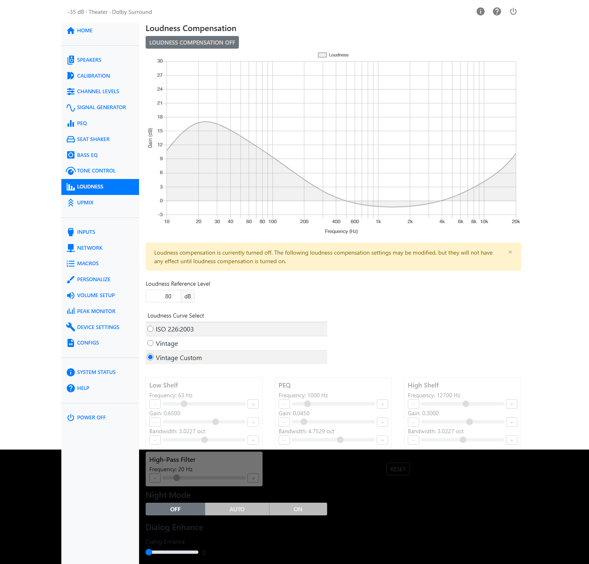

# Loudness

Human hearing is non-linear. When the volume is turned down, listeners report that bass and
treble seem to fade before the midrange does. This was first described by Fletcher and Munson in
the 1930s, and the "equal loudness" contours have since been standardized and repeatedly
re-measured. Older audio receivers included a "loudness" button that simply boosted the bass.
Loudness compensation on the HTP-1 boosts bass and treble as the volume is turned down, following
one of these equal-loudness curves, so quiet listening still sounds full.

Turn loudness compensation on or off with the **Loudness Compensation** button at the top of the
page.

The chart below the button is interactive. It shows the selected loudness curve, the current
volume, and the contribution of Tone Control, all overlaid so you can see what compensation is
being applied right now. If loudness compensation is off, a banner reminds you that the settings
below can still be changed but will have no effect until it is turned on.

## Loudness Reference Level

The loudness curve needs to be calibrated against how loud your room actually plays at a given
volume setting. **Loudness Reference Level** sets this, from 50 to 90 dB. This control was
previously called "Loudness Calibration."

The number corresponds roughly to the sound pressure level at which you want a flat response —
your normal listening volume. A higher number means more bass boost is added as you turn the
volume down; a lower number means less.

!!! note
    A high-pass filter keeps the compensation from boosting frequencies below 20 Hz. Because the
    bass boost at low volume can be substantial, you may hear a thump or a tick when switching
    loudness compensation on or off.

## Loudness Curve Select

Choose which equal-loudness curve to follow:

| Curve | Description |
| --- | --- |
| ISO 226:2003 | The modern, internationally standardized equal-loudness contours. |
| Vintage | An older curve shape, closer to what classic receivers' "loudness" buttons produced. |
| Vintage Custom | The Vintage curve shape, but with its own Low Shelf, PEQ, High Shelf and High-Pass Filter that you can adjust yourself. |

### Vintage Custom

Selecting Vintage Custom reveals four filter editors. Each is a simple PEQ-style band; all four are
disabled whenever loudness compensation is off.

| Filter | Frequency | Gain | Bandwidth |
| --- | --- | --- | --- |
| Low Shelf | 20–200 Hz | 0.01–1 | 1–5 oct |
| PEQ | 200–5000 Hz | 0.01–0.3 | 0.1–8 oct |
| High Shelf | 4000–20000 Hz | 0.01–0.5 | 1–5 oct |
| High-Pass Filter | 10–80 Hz | — | — |

**Reset** restores the Vintage defaults: Low Shelf at 63 Hz, High Shelf at 12700 Hz, PEQ at
1000 Hz, and the High-Pass Filter at 20 Hz.

## Night Mode

Action movies are notorious for wide dynamic range: dialog can be very quiet while explosions rock
the house. Night Mode reduces the difference between loud and soft, useful if the children are
sleeping. It uses features of the Dolby and DTS coding systems, so it has little effect on plain
PCM streams.

| Mode | Description |
| --- | --- |
| Auto | Recommended. Adjusts automatically based on metadata in the program stream — Dolby streams specify their own dynamic range parameters, and Auto follows them. The subwoofer is not attenuated. |
| On | Enables the available Dolby or DTS features to compress the dynamic range, and reduces the subwoofer level by 6 dB, making low-volume listening more comfortable. |
| Off | Disables all such processing, including **Dialnorm** — dialog normalization, which adjusts overall volume based on a value embedded in the audio stream. This gives the greatest contrast between loud and soft sounds. The subwoofer is not attenuated. |

## Dialog Enhance

Some listeners want to hear dialog more clearly. When the content carries DTS Dialog control
information, Dialog Enhance uses it directly. Otherwise it simply raises the center channel, since
most dialog comes from the center speaker.

**Dialog Enhance** ranges from 0 (as authored) to 6, using a slider.

!!! warning
    Applying large boosts can result in digital clipping. Check the
    [Peak Monitor](peak-monitor.md) if you raise the reference level or dialog enhancement
    substantially.
