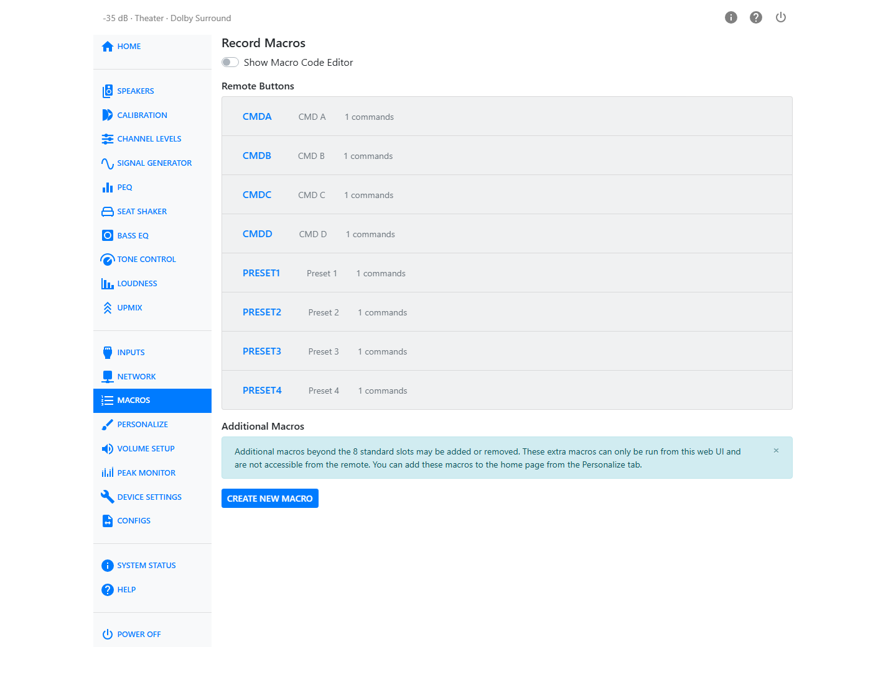

# Macros

A macro is a recorded sequence of setting changes that you can play back with one button.
Instead of changing several settings by hand every time you sit down to watch a movie, record
those changes once as a macro, then run it from the remote, the Home page, or an input.

## Remote Button Macros

The HTP-1 has 8 macro slots tied to physical remote buttons: **CMD A**, **CMD B**, **CMD C**,
**CMD D**, **Preset 1**, **Preset 2**, **Preset 3**, and **Preset 4**. Each slot has its own
editor, shown as a row in the Remote Buttons accordion.

### Recording a Macro

1. Open the editor for the slot you want to use and turn on **Record**.
2. Make the setting changes you want the macro to reproduce, anywhere in the web UI.
3. Turn **Record** off.

Each change you make while recording is added to the macro as a command. The editor lists the
recorded commands in order, with the number of commands recorded so far. You can drag a
command to reorder it, or delete one you didn't mean to record.

### Naming a Macro

Give the macro a name in the **Macro Name** field. This name is what appears on its button
wherever the macro is shown — on the remote-triggered slot, on the Home page, and on the
Inputs page.

Press **Save** to keep your changes, or **Clear All Commands** to empty the macro and start
over.

## Additional Macros

Beyond the 8 remote slots, you can create any number of additional macros in **Additional
Macros**. These extra macros can only be run from the web UI — they have no remote button —
but they can be added to the Home page from [Personalize](personalize.md). Only the 8
remote-button macros can be set to run automatically from an input; see below.

Press **Create New Macro** to add one. Each additional macro can also be deleted from its
editor.

## Macro Code Editor

Turn on **Show Macro Code Editor** to reveal the raw list of recorded commands as editable
text for each macro. This is an advanced view — use it only if you are comfortable editing
the underlying command list directly.

## Where Macros Appear

- On the **Home Page**, if you have added them in Personalize.
- On the **[Inputs](inputs.md)** page, where one of the 8 remote-button macros can be set to
  run automatically when you select that input.
