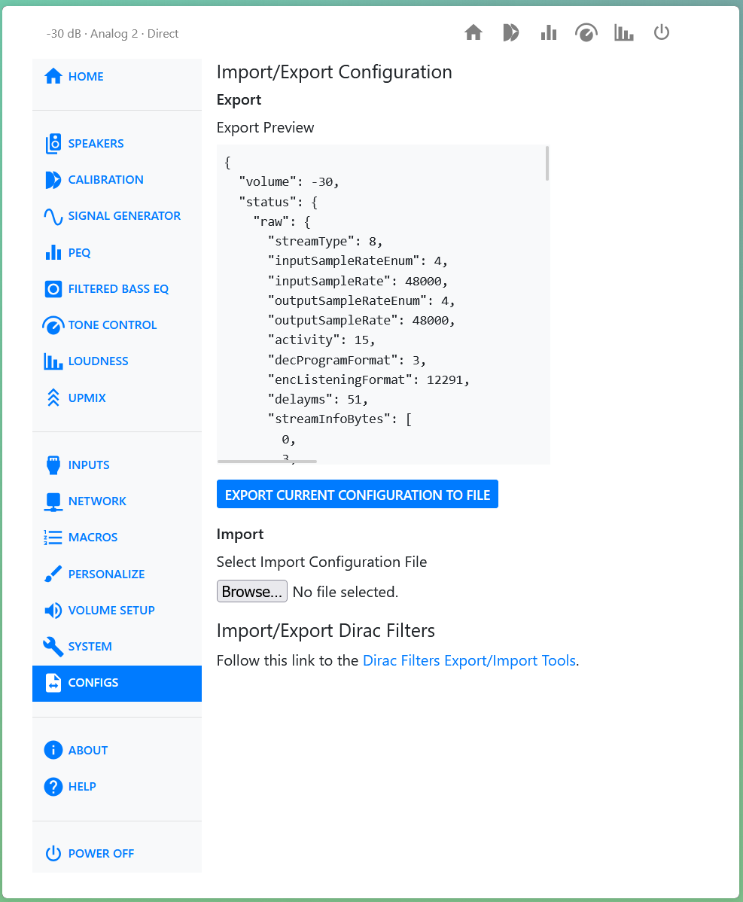

# Updates and Support

## Checking Your Version

Open [System Status](system-status.md) to see the software version currently running, under
**System Software Version**. If a newer release is available, an **Update available** badge
appears next to the **Open History page** button.

## Reading Release Notes

Click **Release Notes**, next to the software version, to see what changed in the current
release — new features, fixes, and any known issues. Read these before updating, especially if
you rely on a feature that could be affected.

## Performing an Update

Click **Open History page** on the System Status page. This opens a separate page listing
available software releases.

Releases on the **master** branch are recommended for most users. **preview** releases are also
listed; these are newer builds still being tested, and are meant for owners who want to help find
problems before a release reaches master. Choose a release from the list to install it. You will
be asked to confirm before the update starts.

!!! tip
    Export a configuration backup before updating, in case anything needs to be restored
    afterward. See [Backup and Restore](configs.md).

## What to Expect

Once an update starts, the web UI switches to a full-screen progress view with a status message
and a progress bar. This can take several minutes depending on what changed in the release. Don't
close the browser tab or power down the unit while this is showing — the unit reboots on its own
when the update finishes.

User settings, input names, and calibrations are preserved across a normal update.

## Upgrading from Version 1.x

Moving from the version 1.x software to the version 2 software is a one-time procedure with a few
extra steps. The update backs up your existing system so you can roll back, but take your own
backup first if you have spent time configuring the unit.

Export your settings from the [Backup and Restore](configs.md) page before you begin. You can also
export your existing Dirac Live filters from that page as an extra copy. Those exports are in the
older filter format and cannot be loaded into the new system, but they are worth keeping.

Then perform the update in two stages:

1. Open **History and Updates** from the [System Status](system-status.md) page. It can take a few
   moments for the list to appear. If it times out the first time, try again.
2. Install the release labeled **final non-ART build** first. This creates the backup files that let
   you revert later.
3. When that finishes, a new release supporting Dirac Live ART becomes available. Install it.

Your existing Dirac Live filters are preserved, and you can revert to the earlier software if you
need to.

### Your First Calibration Afterward

No Dirac Live filters are loaded when the new software starts for the first time. To be sure the
unit begins in a consistent state, change the speaker layout twice before calibrating: select a
layout you do not intend to use, then switch to the layout you want to calibrate. Preparing an
unused layout takes about 30 seconds. This is only needed once.

!!! tip
    Each time you change the speaker layout, the filter cache is cleared and reloaded for the new
    layout. With large speaker configurations this takes a while — loading six filters for a 7.3.6
    layout can take up to 10 minutes. If you want to compare layouts, keep one or two calibrations
    per layout to reduce the wait.

## Support

### Downloading Logs

Open **Device Settings**, then the **Danger Zone** section, and click **Download Logs**. This
downloads `quicklogs.zip`, a set of logs useful for troubleshooting. It does not contain any
personally identifiable information.

Send this file along when you report a problem — it gives the development team the detail needed
to reproduce and diagnose it.

### Submitting Feedback

When the HTP-1 is in standby, the web UI shows a **Quick Links** list with a **Submit Feedback**
link. This opens a form hosted on the unit at `http://<your-htp1-ip>/feedback`.

!!! note
    This form is not a customer support request — think of it as a suggestion box. It's optional
    and anonymous unless you choose to leave a contact address. If you need help with a problem,
    include your contact details or reach out to support directly as well.

### On-Device Help

Every page has a **Help** entry in the sidebar, and a "?" icon that jumps straight to the section
for the page you're on. Help also links to the full User Guide, the User Guide Addendum, and the
Front Panel Manual as PDFs, all served by the unit itself.
