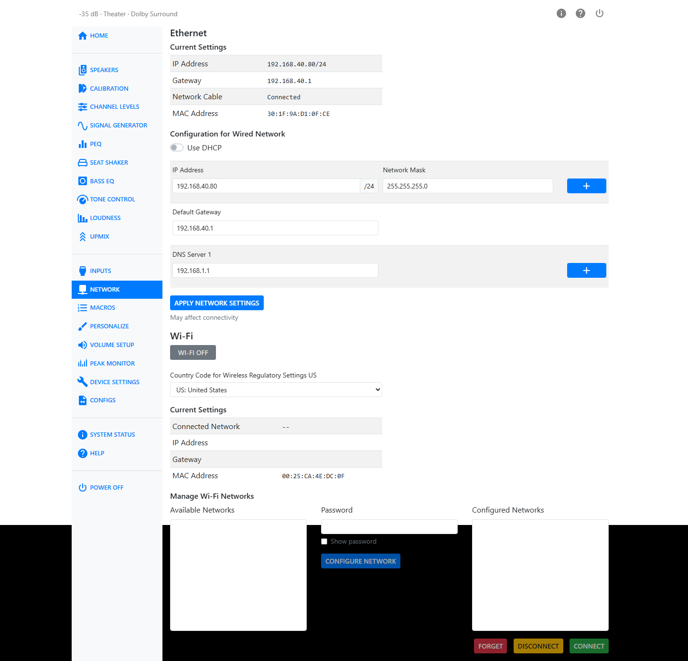

# Network

The Network page sets up the HTP-1's wired and wireless network connections.

## Ethernet

The **Current Settings** table shows the wired connection's IP Address, Gateway, whether the Network
Cable is Connected or Disconnected, and the interface's MAC Address.

!!! note
    The wired network interface prefers to be on a 100BASE-T network. It can fail to get an IP
    address by DHCP when it is cold-booted on a gigabit network. If you see this, some owners
    configure their network switch to limit that port to 100 Mbit/s.

Below Current Settings, **Configuration for Wired Network** lets you choose **DHCP** or a manual
address. DHCP is typically used to automatically assign an IP address; turn it off to enter a static
address instead. With DHCP off you can add more than one IP address, set the default gateway, and add
more than one nameserver, using the plus and minus buttons next to each row. Press **Apply Network
Settings** to send your changes — you may lose your connection briefly while they take effect.

If no Ethernet cable is connected, this section prompts you to connect one before you can configure
the wired network.

## Wi-Fi

Turn on the **Wi-Fi** button to enable the Wi-Fi radio. Make sure the antenna that came with the unit
is connected to the gold SMA antenna connector on the rear panel.

Set **Country Code for Wireless Regulatory Settings** to your country. This affects which Wi-Fi
channels and transmit power levels the HTP-1 is allowed to use, so pick the country you're actually
in.

Once connected, a **Current Settings** table shows the Connected Network, IP Address, Gateway, and
MAC Address for the Wi-Fi interface.

### Manage Wi-Fi Networks

**Available Networks** lists nearby Wi-Fi networks. The HTP-1 rescans automatically every five
seconds while this page is open — there is no separate Scan button, and scanning stops once you
navigate away.

Select a network from the list, enter its **Password** (turn on **Show password** if you want to
check what you typed), and press **Configure Network** to add it.

**Configured Networks** lists networks you have already set up. Select one to enable **Forget**,
**Disconnect**, and **Connect** for it. DHCP or static addressing for that network is set up
underneath, in a **Configuration for Wi-Fi Network** panel identical in layout to the Ethernet one.

!!! note "Dirac Live and Wi-Fi"
    Third-party tools like the Dirac Live calibration app may not find the HTP-1 if both network
    interfaces are enabled. Choose either wired or wireless for calibration.

## Resetting the Network Connection

There is a way to completely reset the network connections from the front panel. Poke your finger on
the gear icon on the front panel. You may need to move your finger around a bit. The front panel
responds by displaying information about the network connection. A "Reset Ethernet Network" button is
an option there. This is designed to bring the Ethernet network back to normal DHCP operation.
