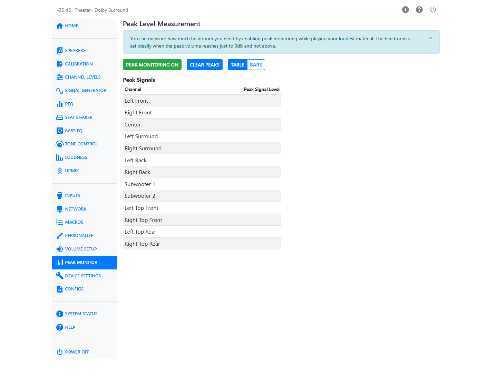
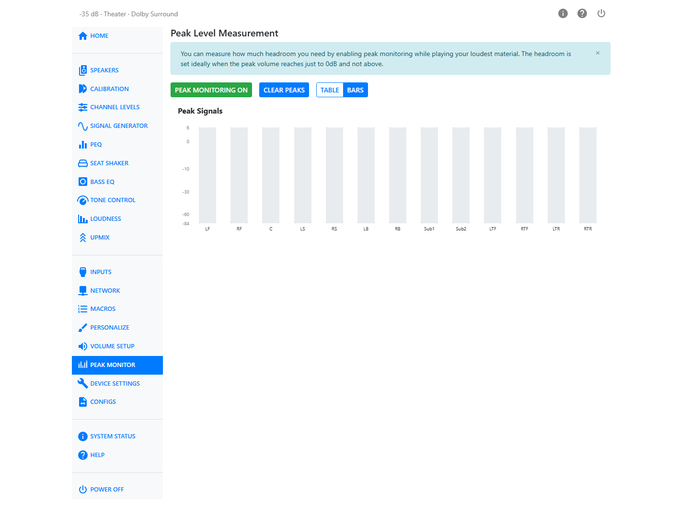

# Peak Monitor

Peak Monitor shows how close each channel is getting to clipping (the signal exceeds the available digital range and creates audible distortion), so you can set **Maximum Digital Headroom** by measurement instead of by ear. It does not measure RMS level or analog output voltage and does not determine **Reference Output Voltage** which is configured separately in [Volume Setup](volume-setup.md).

Peak Monitor measures the largest instantaneous processed sample, so it reports how close the signal is to digital full scale. It does not measure RMS level or analog output voltage.

## Turning It On

Click **Peak Monitoring** to turn it on. The meters start updating live as audio plays. Click it
again to turn monitoring off.

**Clear Peaks** resets the peak-hold markers so you can start a fresh measurement — useful when you
want to check a specific scene or passage without earlier, louder peaks skewing the reading.

## Table and Bars Views

Switch between **Table** and **Bars** with the buttons above the meters.

Table view lists each active channel with its peak signal level in dBFS. A channel is shown in red
once it reaches clipping.

Bars view shows the same channels as vertical meters, with a scale down the left side from +6 to
below −84 dBFS. Each bar has a peak-hold marker showing the highest level reached since you last
cleared peaks. The marker is green while there's headroom to spare, amber as the channel approaches
0 dBFS, and red at or above clipping.

If you have a seat shaker channel active, it appears alongside the speaker channels, set apart by a
divider and its own icon.

## Setting the Controls

Peak Monitor is most useful for setting **Maximum Digital Headroom**.

1. With Peak Monitor running and your loudest program material playing, lower **Maximum Digital Headroom** until clipping first appears.
2. Increase **Maximum Digital Headroom** by 1–2 dB until the peaks stay below clipping.
3. Recheck at your normal loudest listening level and adjust again if needed.

Peak Monitor is a peak-level measurement, not an RMS measurement.

## If a Channel Clips

Clipping means the digital signal ran out of headroom and was cut off — you'll hear it as distortion
on loud passages. Ideally no signal should clip, that is, peak above 0 dB. If Peak Monitor shows a
channel clipping:

- Increase **Maximum Digital Headroom** until no further peaks occur

The control is on [Volume Setup](volume-setup.md). Play your loudest material while watching the
meters, and adjust until peaks land close to 0 dBFS without crossing it.

## Peak Monitor and Seat Shaker

The Seat Shaker XLR output and the Seat Shaker Mix Out RCA output use different volume control, which affects how you check for clipping:

- The **XLR outputs** use analog volume control up to the digital headroom limit as explained above. Clipping on the XLR outputs can be checked at any master volume.
- The **Mix Out RCA output** uses digital volume control. Because its level changes with the master volume, check for clipping at the loudest master volume you plan to use.

!!! warning "Hearing safety"
    To protect your hearing and your speakers, mute all speakers on the
    [Calibration](calibration.md) page before setting headroom for the seat shaker RCA outputs.
