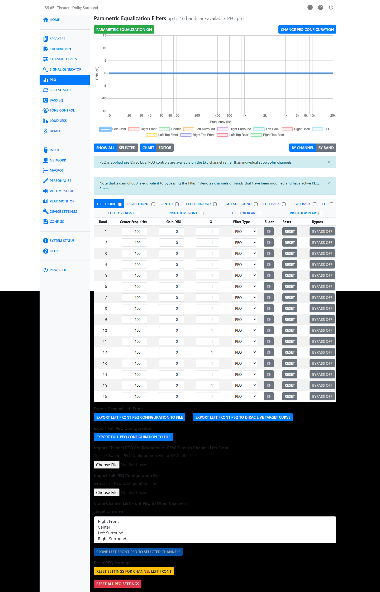
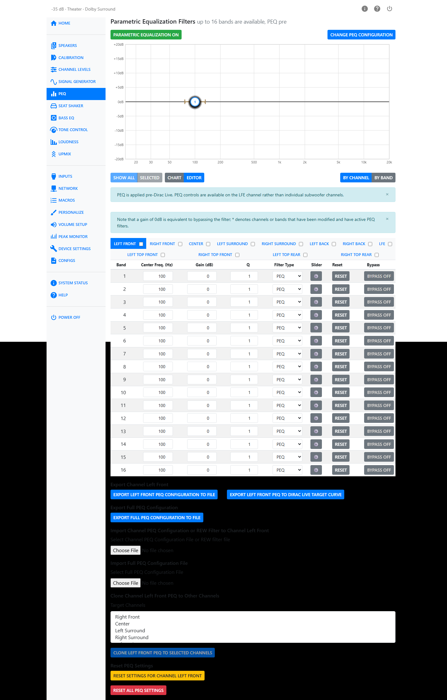
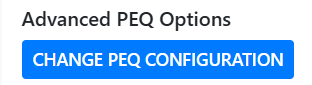
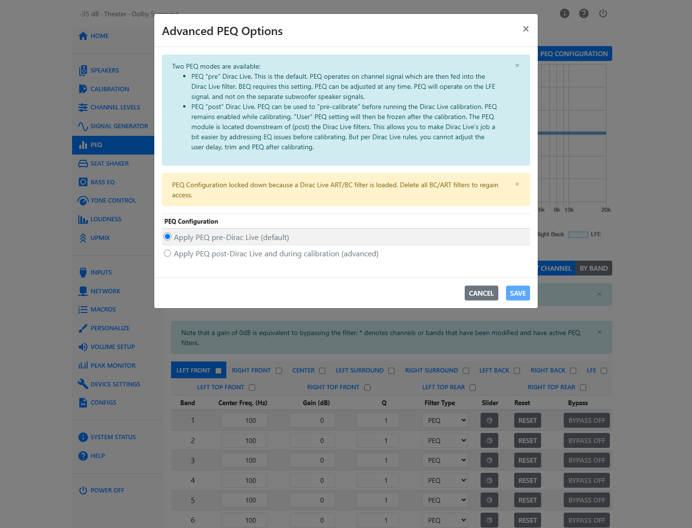

# PEQ

Parametric EQ, or PEQ, lets you boost or cut specific frequencies. Each band you add targets a center frequency, a gain, and a width — called Q — around that frequency. Up to 16 bands are available per channel.

The coefficients of the PEQ filters are computed using the so-called "Robert Bristow-Johnson" equations.

!!! note
    There can be differences in the definitions of Q in various audio systems.

## Turning PEQ On and Off

The **PEQ** page heading shows **Parametric Equalization on** or **off**, along with the current placement — for example "PEQ pre". Use the button to turn PEQ on or off.

When PEQ is off, an alert reminds you that band settings can still be changed, but they will have no effect until PEQ is turned on.

When a Dirac Live ART or Bass Control filter is loaded, PEQ is locked: an alert reads *"PEQ locked down because a Dirac Live ART/BC filter is loaded. Delete all BC/ART filters to regain access."* This is a Dirac Live requirement, not a bug — it protects the integrity of the calibration.

## Chart and Editor

The PEQ page shows a response chart for the bands you have set. Two buttons above the chart switch between views:

- **Chart** — a read-only plot of the combined response.
- **Editor** — an interactive chart where you can drag a band's marker to change its frequency and gain, and drag its edges to change Q. The Editor is only available when grouping **By Channel**.

Two more buttons control what the chart displays:

- **Show All** / **Selected** — plot every channel at once, or only the channel you have selected.

## Grouping: By Channel or By Band

A second pair of buttons controls how the band table below the chart is organized:

- **By Channel** — pick a channel, then adjust all of its bands in one table.
- **By Band** — pick a band number, then adjust that band across every channel in one table.

## Per-Band Controls

Each band has the following controls:

| Control | Range | Notes |
|---|---|---|
| Center Frequency | 15–20000 Hz | |
| Gain | −99 to 20 dB | A gain of 0 dB is equivalent to bypassing the filter. |
| Q | 0.1–10 | Hidden for filter types that don't use Q. |
| Filter Type | PEQ, Low Shelf, High Shelf | |
| Bypass | on/off | Turns the individual band off without losing its settings. |
| Reset | — | Resets that one band back to a flat, unmodified state. |

An inline slider panel (the gear icon on each row) gives you frequency, gain and Q sliders with step buttons, if you prefer dragging to typing numbers.

Channels or bands with active, non-zero settings are marked with an asterisk.

## Channel Groups and Linking

You can link channels so that editing one band updates the same band on every linked channel. Check the link box next to a channel's name (in **By Channel** view) to add it to the link group; editing that channel's bands then also edits every other linked channel. Use **Disable** to turn linking off.

## Import and Export

The PEQ page offers several import and export operations, at different scopes:

- **Export Band {n} PEQ Configuration to File** — every channel's setting for one band.
- **Export Channel {name} PEQ Configuration to File** — every band for one channel.
- **Export Full PEQ Configuration to File** — the entire 16-band, all-channel configuration.
- **Import Band PEQ Configuration to Band {n}**
- **Import Channel PEQ Configuration or REW Filter to Channel {name}** (or to all linked channels, if any are linked) — this accepts both the HTP-1's own channel export format and a filter file exported from Room EQ Wizard (REW).
- **Import Full PEQ Configuration File**

!!! tip
    Importing a REW filter file is a fast way to bring in PEQ bands you designed in REW.

## Cloning a Channel's PEQ

**Clone Channel {name} PEQ to Other Channels** copies the selected channel's entire PEQ setup onto one or more channels you pick from a target list. This is useful when several speakers need the same correction.

## Reset PEQ Settings

You can reset PEQ at three scopes: the current band across all channels, the current channel across all its bands, or every band on every channel (**Reset All PEQ Settings**, which asks for confirmation).

## PEQ Placement

PEQ can be placed either before (pre) or after (post) the Dirac Live filter block. Pre is the default.

Two things drive this choice:

1. **Correcting the input signal** — restoring bass that was filtered out during mastering, or compensating for a listener's hearing. This requires PEQ **pre**, so the correction is applied to the source signal before bass management and Dirac Live process it.
2. **Correcting speakers or the room** — this requires PEQ **post**, so PEQ isn't fighting the phase changes bass management introduces.

Open the **Advanced PEQ Options** dialog to change placement. On the PEQ page, the **Change PEQ Configuration** button at the top is always visible. On the Calibration page, the same control lives under an **Advanced PEQ Options** heading, but only when **Show Advanced Settings** is turned on.

The dialog stages your choice locally — nothing is applied until you click **Save**. A banner reads *"You have unsaved changes. Click Save to apply them."* until you do.

- **Apply PEQ pre-Dirac Live (default).** PEQ operates on the LFE signal, not on the separate subwoofer speaker signals. Bass EQ requires this setting.
- **Apply PEQ post-Dirac Live and during calibration (advanced).** PEQ remains enabled while a Dirac Live calibration runs, so you can use it to pre-compensate the speakers Dirac Live will measure. Once an ART or BC calibration completes in this mode, the user delay, trim and PEQ settings are frozen — this is a Dirac Live rule, not a choice the HTP-1 makes.

!!! warning
    PEQ is not automatically disabled during a Dirac Live calibration in either mode. If you want a clean calibration with no PEQ influence, turn PEQ off yourself first.

Two separate locks can appear here, and they are not the same thing: whether you can edit the PEQ bands at all, and whether you can change pre/post placement. Both are driven by whether a Dirac Live ART or BC filter is currently loaded, and both are released the same way — delete the ART/BC filter.

## Room Correction Methods and PEQ

- **Manual calibration** — mainly used to tame room resonances with a single subwoofer, though tools like REW can compute more advanced multi-sub or multi-speaker solutions using PEQ, trim and delay together.
- **Dirac Live Room Correction (RC)** — corrects frequency and phase per speaker and subwoofer individually. PEQ pre can prepare the speakers before calibration; subwoofer delay is often fine-tuned after.
- **Dirac Live Bass Management (BM)** — similar to RC, using Dirac Live's own bass management. PEQ pre can prepare the speakers first.
- **Dirac Live Bass Control (BC)** — adds smoothing across multiple subwoofers and flattens the sub/speaker crossover region. PEQ pre can prepare the speakers first.
- **Dirac Live Active Room Treatment (ART)** — all speakers work together for the smoothest response across the listening area. PEQ pre can prepare the speakers first.

## Using PEQ with Dirac Live

PEQ can also be used to adjust the result of a Dirac Live calibration — effectively the same idea as setting a target curve in Dirac Live. If that is your intent, turn PEQ off before running the calibration, since PEQ is not disabled automatically.

Alternatively, PEQ post can be used as pre-compensation to make Dirac Live's job easier — an advanced technique used in professional setups. With post selected, PEQ stays enabled while calibrating, so Dirac Live measures the pre-compensated speakers. To keep a copy of this pre-compensation, use **Export Current Configuration to File** on the Configs page, or the PEQ page's own **Export Full PEQ Configuration to File**.

Loudness compensation is covered in the [Loudness](loudness.md) chapter.
