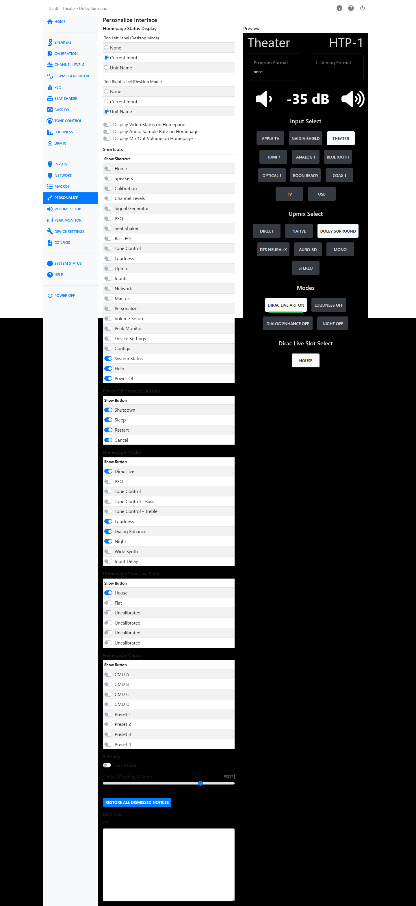

# Personalize

The Personalize page controls what appears on the [Home Page](home-page.md), what shortcuts
you see throughout the web UI, and a few display preferences for the interface as a whole.
A live preview of the Home page sits alongside the settings, so you can see the effect of a
change immediately.

## Homepage Status Display

Choose what appears in the top-left and top-right corners of the Home page in desktop mode:
nothing, the current input name, or the unit name.

Three switches control extra detail on the Home page:

| Switch | Effect |
|---|---|
| Display Video Status on Homepage | Adds the Video status card. |
| Display Audio Sample Rate on Homepage | Adds the sample rate to the Program Format and Listening Format cards. |
| Display Mix Out Volume on Homepage | Adds the Mix Out Volume control below the main volume. |

!!! note
    "Display Mix Out Volume on Homepage" is unavailable when the Seat Shaker is using the
    Mix Out as its content source.

## Shortcuts

Choose which pages get a shortcut icon in the shortcut bar. Home and Power Off can each be
shown or hidden, along with every other settings page.

### Power Off Shortcut Buttons

If the Power Off shortcut is turned on, choose which buttons appear in the power dialog:
Shutdown, Sleep, Restart, and Cancel.

## Homepage Modes

Choose which buttons appear in the Home page's Modes row: Dirac Live, PEQ, Tone Control,
Tone Control - Bass, Tone Control - Treble, Loudness, Dialog Enhance, Night, Wide Synth, and
Input Delay (lip-sync).

## Homepage Dirac Live Slots

Choose which Dirac Live filter slots get a button on the Home page. Each slot is listed by
name, or as "Uncalibrated" if it holds no filter.

## Homepage Macros

Choose which macros get a button on the Home page, both the eight remote-button macros and
any additional macros you have created. See [Macros](macros.md).

## Settings

| Setting | Effect |
|---|---|
| Dark Mode | Switches the web UI (other than the Home page, which is always dark) between light and dark display styles. |
| Vertical Padding | Adjusts the row spacing used in tables throughout the web UI, from 0 to 0.4 rem. |
| Restore All Dismissed Notices | Brings back any on-page notices you have dismissed. |

## User CSS

An advanced option for owners comfortable with CSS. Enter custom styles here to change the
appearance of the web UI beyond what Dark Mode and Vertical Padding offer.

## Preview

A live, scaled copy of the Home page sits next to the settings on this page, so you can check
each change as you make it.
