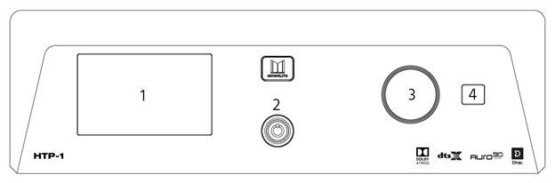
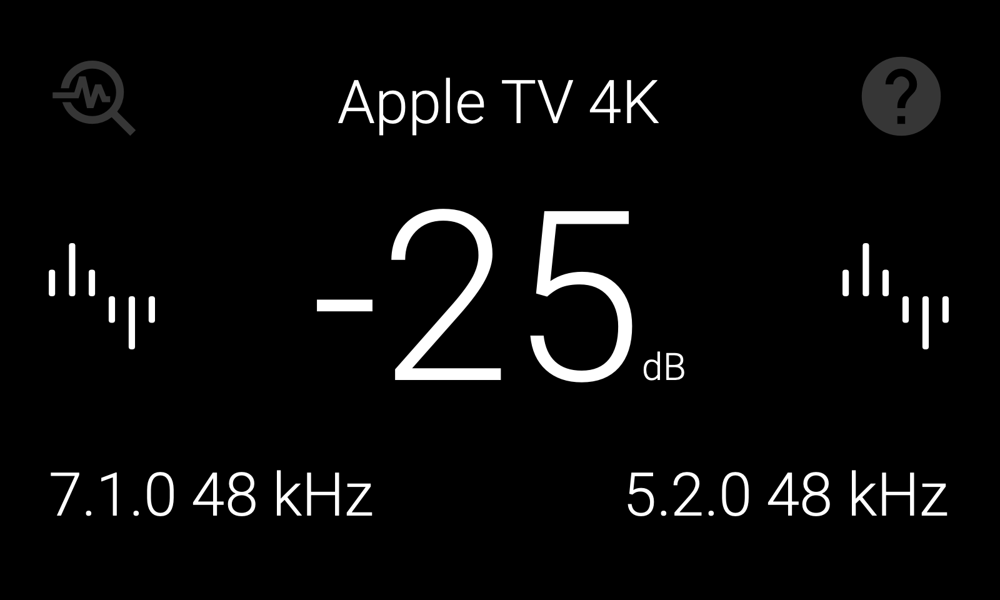
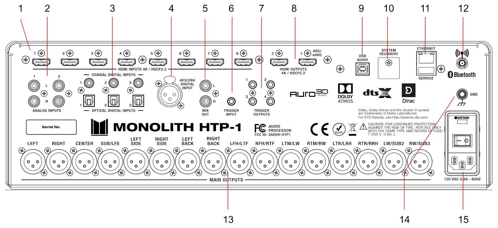
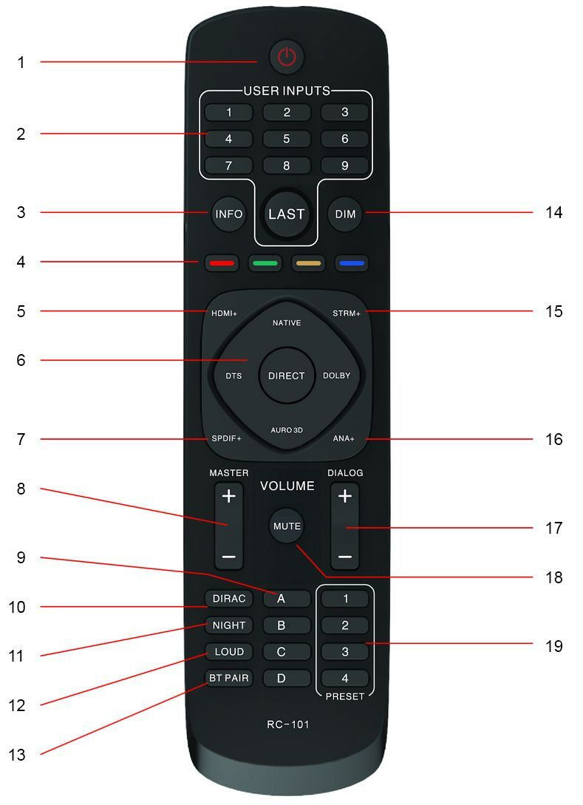
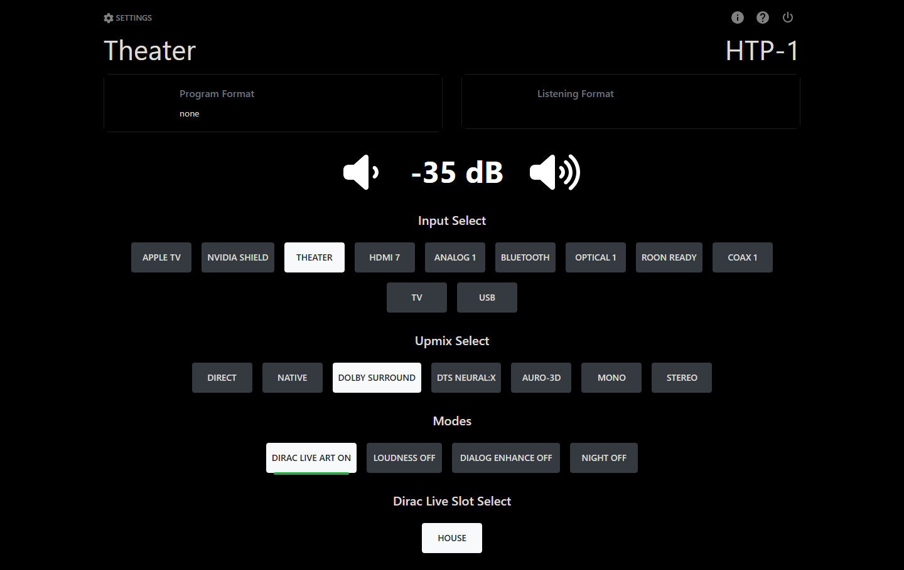
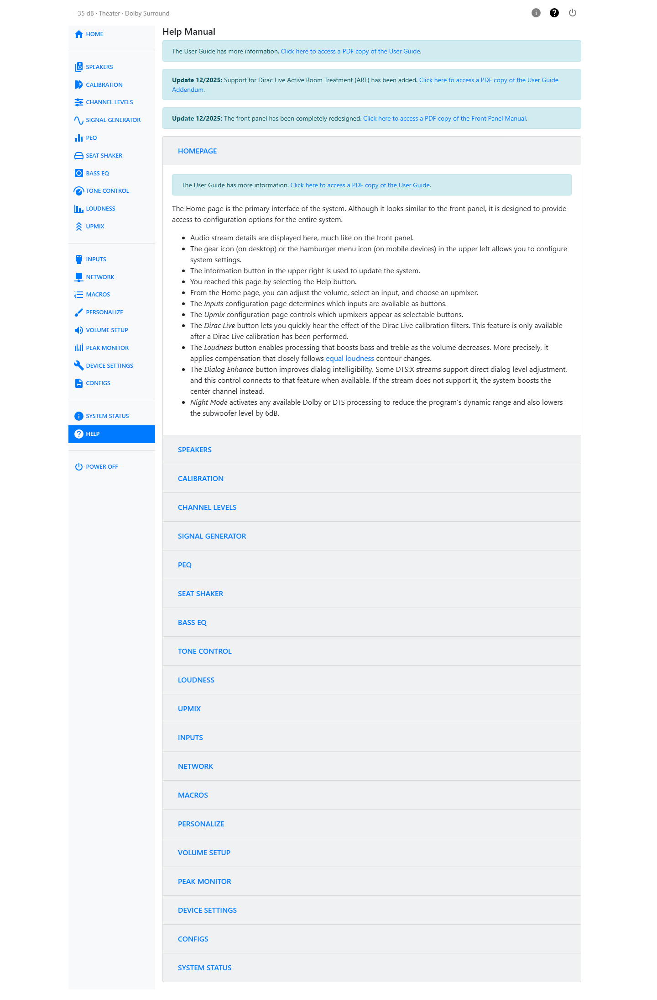

# Product Overview

## Front Panel

1. **LCD Display:** This 5" touchscreen displays the volume level, selected input, upmix selection, and various other system statuses. See [Front Panel Display](#front-panel-display) below for details.
2. **Power Button:** If the **Master Power Switch** on the rear panel is in the **ON** position, the front panel **Power Button** turns the unit on or puts it into standby. A blue LED illuminates the power button while the unit is powering on or powering off. The LED is extinguished when the unit reaches a stable state.
3. **Volume Knob:** Rotate the **Volume Knob** counterclockwise to decrease the volume level or clockwise to increase the volume level.
4. **IR Receiver:** The **IR Receiver** accepts infrared signals from the included **IR Remote Control**.

## Front Panel Display

The touchscreen shows the current input, program format, volume, upmix selection, and IP address, and doubles as a set of touch controls:

- **Help icon (top right):** Tap to open the Help screen. This is the first place to look when setting up your HTP-1, as it provides the IP addresses needed to connect to the web-based user interface for setup and control. It also lets you reset the wired and wireless network connections if there is a networking problem. The icon turns red when no network connection is available.
- **Peak monitoring icon (top left):** Tap to start peak monitoring, which monitors the digital signal pre volume control. Whenever one of the channels clips, a red bar lights up at the bottom of the screen. Tap the icon again to reset and stop peak monitoring. The same measurement is also available as the **Peak Monitor** page in the web interface.
- **Input source display (top center):** Tap to show video input details. This area also shows if the signal generator is on. Tap twice to view detailed playback and processing information.
- **Master volume level (center):** Tap to mute your HTP-1. Tap again to unmute. When muted, the display changes from white to red. The displayed value is the current master volume. 0 dB represents the configured **Reference Output Voltage**; negative values indicate attenuation below that level.
- **Input format (middle left):** Tap to show more details.
- **Output format (middle right):** Tap to show more details.
- **Audio input details (bottom left):** Tap to show more information about the audio input. Tap twice to view detailed playback and processing information.
- **Audio output details (bottom right):** Tap to show more information about the audio output. Tap twice to view detailed playback and processing information.

To access the web interface, first open the **Help** screen on the front panel to find the HTP-1's IP address. Enter the displayed address into your browser's address bar, making sure to type `http://` explicitly, as some browsers default to `https://`, which will not work. If both wired and Wi-Fi addresses are shown, either can be used.
You can also scan the displayed QR code with your mobile phone to open the web interface directly in your phone's browser.

!!! note
    **Front Panel Brightness** and **Demo Mode**, all set on **Device Settings** in the web interface, affect what the front panel shows. Demo Mode in particular makes the front panel and web interface show simulated activity rather than the real system state.

## Rear Panel

1. **HDMI INPUTS:** Eight HDMI® inputs for connecting HDMI source devices. Each input supports 4K resolution and the HDMI 2.0b and HDCP™ 2.3 standards.
2. **ANALOG INPUTS:** Two pairs of RCA analog stereo jacks for connecting an analog stereo audio source.
3. **COAXIAL/OPTICAL DIGITAL INPUTS:** Three digital coaxial and three digital optical S/PDIF audio inputs for connecting digital audio sources. All six inputs are active and can be independently selected.
4. **AES/EBU DIGITAL INPUT:** Three-pin XLR jack for connecting an audio device that outputs an AES/EBU (aka AES3) digital audio signal.
5. **MIX OUT:** One pair of RCA analog stereo jacks for connecting a stereo amplifier or powered speakers. The main signal is mixed down to a stereo signal. Mix Out has its own volume and power-on volume, independent of the main outputs, set from the Home page and the Volume Setup page. Mix Out can also carry the Seat Shaker signal instead, in normal or differential mode.
6. **TRIGGER INPUT:** A 3.5mm trigger input turns the HTP-1 on when a 12V signal is applied. The HTP-1 will go into standby mode when the trigger signal is removed. Note that the **Master Power Switch** on the rear panel must be in the **ON** position for the trigger signal to turn the HTP-1 on.
7. **TRIGGER OUTPUTS:** Four 3.5mm jacks send a 12V trigger signal when the HTP-1 is powered on. These triggers are typically used to power on the power amplifiers.
8. **HDMI OUTPUTS:** Two HDMI® outputs for connecting HDMI displays. The "HDMI 1" output supports the Audio Return Channel (ARC)/Extended Audio Return Channel (eARC) HDMI features, which receive audio signals from the connected display. This is necessary if you are going to stream video from an app on your TV or if you are receiving over-the-air television broadcasts using an HD antenna. The **System Status** page reports eARC connection status if you need to troubleshoot this link.
9. **USB AUDIO:** A USB Type-B jack for streaming audio from a connected computer.
10. **SYSTEM RECOVERY:** Mini SD card slot used by the factory for production purposes only. A factory restore procedure is available using this.
11. **ETHERNET/SERVICE:** An RJ45 jack for making a wired connection to an existing Ethernet network. The USB port is for performing service at the factory.
12. **ANTENNA:** An SMA connector for attaching the included Bluetooth®/Wi-Fi® Antenna.
13. **MAIN OUTPUTS:** Sixteen balanced XLR jacks for connecting external power amplifiers. The channel labels silkscreened on the back panel are supplemented by the **Speaker Map** on the Speakers page of the web interface, which shows the current mapping for your speaker configuration.
14. **GND:** Screw terminal for making a ground connection to the chassis.
15. **POWER SECTION:** The **POWER SECTION** contains the **Master Power Switch**, the IEC **Power Connector** for attaching the included **AC Power Cord**, and a **Fuse Holder**. Always disconnect the power cord from the power source before replacing the fuse, and replace the fuse with the same type.

!!! tip
    To assure a completely clean reboot, allow the HTP-1 to be powered down for 15 seconds before powering on again via the master power switch.

## Remote Control

1. **POWER:** Press the **POWER** button to turn the unit on or to put it into standby mode.
2. **USER INPUTS:** Press the number buttons to select individual inputs. The numbers map to the visible inputs, from left to right, on the web interface Home page. Press the **LAST** button to select the last input used.
3. **INFO:** Press the **INFO** button once for playback details and twice for audio processing status.
4. **COLORS:** The **Red**, **Green**, and **Yellow** remote buttons control the front panel: **Red** displays the debug screen, **Green** displays audio processing status, and **Yellow** reloads the front panel. The **Blue** button resets the HDMI subsystem.
5. **HDMI+:** Press the **HDMI+** button to cycle forward through the eight HDMI® inputs as well as the TV input. When using this button the interface will display the HDMI input that will be selected after a short timeout period expires (about 3 seconds). This allows the user to rotate through the input options without actually changing the input (which can slow things down). This delayed input change only applies to this button, not any of the other + buttons.
6. **SURROUND MODES:** Press the buttons to select the **NATIVE**, **DTS**®, **DIRECT**, **DOLBY**®, or **AURO-3D**® surround modes.
7. **SPDIF+:** Press the **SPDIF+** button to cycle forward through the digital audio inputs. The cycle order is **COAXIAL 1**, **COAXIAL 2**, **COAXIAL 3**, **OPTICAL 1**, **OPTICAL 2**, **OPTICAL 3**, and **AES/EBU**.
8. **MASTER:** Press the **+** button to increase the **MASTER** volume level or press the **-** button to decrease the **MASTER** volume level.
9. **LETTERS:** The **A**, **B**, **C**, and **D** buttons run whatever is assigned to those slots on the **Macros** page.
10. **DIRAC:** Press the **DIRAC** button to cycle Dirac Live between on, bypass, and off.
11. **NIGHT:** Pressing the **NIGHT** button rotates between off, auto, and on. Night mode is designed for low volume movie viewing. See more details under *Audio Features*.
12. **LOUD:** Press the **LOUD** button to enable or disable Loudness mode, which boosts low and high frequencies for low volume music listening. This is described in more detail under *Audio Features*.
13. **BT PAIR:** Press the **BT PAIR** button to initiate Bluetooth® pairing.
14. **DIM:** Press the **DIM** button to cycle through several brightness levels for the front panel LCD display. When the dim level is zero, the screen will briefly brighten to show changes in volume.
15. **STRM+:** Press the **STRM+** button to cycle through the **USB**, **Roon**®, and **Bluetooth**® streaming inputs.
16. **ANALOG+:** Press the **ANALOG+** button to toggle between the two analog audio inputs.
17. **DIALOG:** Press the **+** button to increase the **DIALOG** volume level or press the **-** button to decrease the **DIALOG** volume level.
18. **MUTE:** Press the **MUTE** button to turn audio muting of all speakers on or off.
19. **NUMBERS:** The preset **1**, **2**, **3**, and **4** buttons run whatever is assigned to those slots on the **Macros** page.

## Web Interface

The web interface is where you configure the HTP-1 and where day-to-day control happens from a phone, tablet, or computer. Reach it by typing `http://` followed by the HTP-1's IP address into a browser's address bar — for example, `http://192.168.1.101/`. The front panel display shows the current IP address (tap the Help icon in the top right). Some browsers default to `https://`, which will not work; type `http://` explicitly. Pages within the interface use hash-style addresses, such as `http://<your-htp1-ip>/#/settings/speakers` — bookmark the plain `http://<your-htp1-ip>/` address rather than a settings page.

### Home Page

The Home page is what you land on, and what most day-to-day control happens from:

- Your **unit name** is the page title, with the HTP-1 wordmark in the top-right corner.
- **Program Format** and **Listening Format** status cards report the incoming and actual decoded formats. A **Video** status card can also appear here, if enabled on Personalize.
- The **Volume** readout sits in the center, with tap targets on either side to step it up or down. If Mix Out is enabled, a second **Mix Out Volume** control appears below it.
- **Input Select** and **Upmix Select** button rows choose the active input and upmix mode. Which inputs and upmixes appear, and in what order, is set on the [Inputs](inputs.md) and [Upmix](upmix.md) pages.
- A row of **Modes** buttons toggles **Dirac Live** (a three-state on / bypass / off control), **Loudness**, **Dialog Enhance**, and **Night** (off / auto / on).
- If you have Dirac Live calibrations saved, a **Dirac Live Slot Select** row lets you switch between them directly from Home.
- Rows of **macro** buttons can also appear here, if you have set any up.

Which of these rows appear, and in what order, is controlled from the **Personalize** page. You may also see transient banners across the top of the screen — for example when the signal generator is left on, a macro is recording, or a Dirac Live calibration is in progress — reminding you that something is active elsewhere in the system.

### Settings

Click the **gear** icon (labeled **Settings**) in the top-left corner of the Home page to open the settings area. It replaces the Home page with a **sidebar** down the left side and the selected settings page on the right. The sidebar lists **Home** at the top, then twenty pages in three groups, then **Power Off** at the bottom:

| Group | Pages |
|---|---|
| Speakers & audio | Speakers, Calibration, Channel Levels, Signal Generator, PEQ, Seat Shaker, Bass EQ, Tone Control, Loudness, Upmix |
| Setup | Inputs, Network, Macros, Personalize, Volume Setup, Peak Monitor, Device Settings, Configs |
| Status & help | System Status, Help |

Once you are inside settings, a small line of text at the top of the screen — `<volume> dB · <input> · <upmix>` — shows current status and links back to Home. A row of **shortcut icons** also sits in the top-right corner; which pages appear there is chosen on the Personalize page, so you can jump straight to the pages you use most.

### System Status, Help and Power

The **?** button in the top-right corner of every page opens **Help**, a set of sections — one per settings page — that explains the controls on the page you came from.

The **i** button opens **System Status**, which displays the software version, release notes, and update history. It is also the place from which you can check for and install system software updates.

The **power** button opens a confirmation dialog that lets you put the unit into standby, restart it, or power it off completely.
