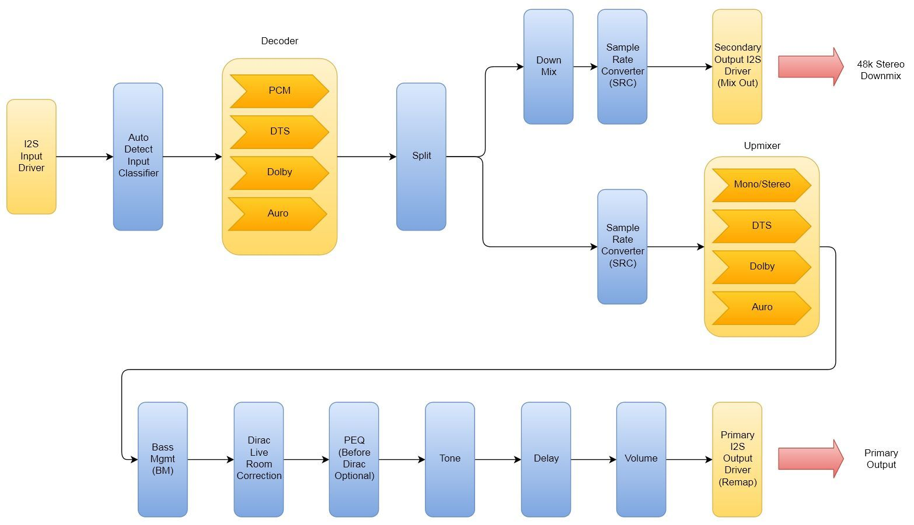

# Reference

## Specifications

| Item | Specification |
| --- | --- |
| Model | HTP-1 |
| Part Number | 38788 |
| Video Inputs | 8x HDMI® |
| Audio-Only Inputs | 2x analog stereo RCA, 3x digital coaxial, 3x digital optical, 1x AES/EBU, 1x ARC/eARC |
| Streaming Inputs | Roon Ready®, USB audio, Bluetooth® |
| Video Outputs | 1x HDMI ARC/eARC, 1x HDMI |
| Audio Outputs | 16-channel balanced XLR line outputs, max level 4.0 Vrms. Unbalanced stereo analog RCA Mix Out, with its own volume, mute, and power-on volume, independent of the main output. The Mix Out (or an XLR sub output) can also carry the Seat Shaker signal. |
| Triggers | 1x trigger input, 4x trigger outputs |
| HDMI Version / HDCP™ Version | 2.0 / 2.3 |
| Maximum Video Resolution | 4K@60Hz UHD |
| Audio Performance | THD+N < 0.0005% (-106 dB) at 1.8Vrms, 20-20 kHz, AES17<br>Dynamic Range = 116dB, 4Vrms, 20 kHz BW, A-weighted<br>Frequency Response = 20-20 kHz, +1/-0.2 dB |
| Supported Audio Codecs | Dolby Atmos®, Dolby TrueHD™, Dolby Digital®, Dolby Digital Plus®, Dolby Surround®, DTS:X®, DTS Neural:X®, DTS-HD Master Audio™, DTS-HD High Resolution Audio™, Auro-3D®, Auro-Matic® |
| Crossover | Variable 4th order Linkwitz-Riley |
| Room Correction/Equalization | Dirac Live® (Room Correction and Bass Management, included with HTP-1 ownership); Dirac Live® Active Room Treatment and Bass Control are separately licensed upgrades — up to 6 filter slots |
| Built-in Audio Correction | Bass and Treble tone controls, 16-band parametric equalizer with independent speaker control on each band, Channel Levels (per-channel trim), Bass EQ, Seat Shaker PEQ, Loudness compensation, Dialog Enhance, Night Mode |
| Connectivity | Wired 100BASE-T Ethernet, Wi-Fi® |
| Input Power | 100 ~ 240 VAC, 50/60 Hz |
| Dimensions | 17.1" x 5.7" x 12.0" |

## Signal Processing Flow

This diagram gives a rough idea of the signal flow inside of the HTP-1, from the input driver
through decoding to the output driver. It dates from the original (2021) manual and predates
Channel Levels, the Seat Shaker/Mix Out path, Bass EQ, and the current Dirac Live configurations
described below.

??? note "Historical (2021) diagram"
    

The diagram below shows the 2.x processing chain for each of the four Dirac Live
configurations: no Dirac Live, Room Correction (RC), Bass Management (BM), and Bass Control or
Active Room Treatment (BC/ART). A clearer picture of how the system operates helps you achieve the
most accurate and effective calibrations for your specific needs.


### Channel Signals and Speaker Signals

It is especially important to distinguish between *channel signals* and *speaker signals*. Audio leaving the decoder is organized into **channel signals**, one of which is the LFE (Low-Frequency Effects) channel. A **channel signal** is the decoded audio stream for one audio channel before bass management and other speaker-specific processing.

From there, the bass manager and other processing stages convert these channel signals into **speaker signals** that are sent to the physical loudspeakers. A **speaker signal** is the final processed signal sent to one physical loudspeaker after bass management, delay, trim, and other speaker-specific processing have been applied. Unlike a channel signal, it may contain audio originating from several decoded channels.

As part of this processing, delay and trim are applied to compensate for differences in speaker distance, sensitivity, and amplifier gain. The bass manager redirects bass from Small speakers and routes the LFE (Low-Frequency Effects) channel according to the speaker configuration. This may include combining redirected bass and LFE in one or more subwoofers, or routing the LFE channel to Large speakers when no subwoofer is configured.

Dirac Live provides four filter types. Depending on the selected filter, bass management is performed either by the HTP-1 or by Dirac Live. With the HTP-1's traditional bass manager, PEQ is commonly used to correct speaker and/or room response after bass management. However, when Dirac Live ART or BC performs bass management, applying PEQ after the Dirac Live processing can interfere with or even invalidate the calibration. **Pre** is therefore the default PEQ placement. A BC or ART calibration is created using the signal path that exists during calibration. Changes that alter the calibrated signal path, such as modifying active Post PEQ filters or changing PEQ placement, can invalidate the calibration.

Note that the HTP-1 bass manager and the Dirac Live bass manager are separate processing stages. When Dirac Live is off, or a Dirac Live RC filter is loaded, the HTP-1's traditional bass manager is used. When a Dirac Live BM, BC, or ART filter is selected, the Dirac Live bass manager becomes active. The active filter type is shown as a badge, with a legend, on the Calibration page; which bass manager is active—HTP-1 or Dirac Live—is badged on the Speakers page.

With an ART or BC filter loaded, PEQ placement is locked, whether it is **Pre** or **Post**. Switching placement, or editing user delay or user trim, is blocked because these changes would alter the speaker signals produced by the calibration. With Dirac Live RC and BM filters, these controls remain editable.

### Delays and Trims

Dirac Live computes its own speaker delays and trims as part of calibration. The separate user-adjustable speaker delay and trim controls are set to zero during every calibration. This applies to RC, BM, BC, and ART. Whenever a filter is transferred to a slot, any existing user delay and trim settings are reset because the calibration was created with those controls at zero.

With RC and BM filters, user delay and trim can be adjusted again after the filter is loaded. With BC and ART filters, these controls remain locked because changing them would alter the speaker signals produced by the calibration.

The **Channel Levels** page adjusts channel trim upstream of the Dirac Live filters and other speaker-specific processing. These adjustments affect the *channel signals* before they are converted into the *speaker signals* produced by the calibration, so they do not compromise BC or ART.

## IR Code Tables

The tables below illustrate the entire set of supported IR codes. The HTP-1 accepts NEC format
remote codes at address 0x36C9. The first table lists the codes sent by the remote.

!!! note
    Only the Volume Up and Down keys support the standard NEC repeat code for repeating these
    keys. All other keys do not support key repeat.

### Codes Sent by the Remote

| Function | NEC Code | Function | NEC Code | Function | NEC Code |
| --- | --- | --- | --- | --- | --- |
| Power Toggle | 02fd | User Input 1 | 609f | Red | 51ae |
| Vol Down | 09f6 | User Input 2 | 619e | Green | 52ad |
| Mute Toggle | 0af5 | User Input 3 | 629d | Yellow | 53ac |
| Vol Up | 0bf4 | User Input 4 | 639c | Blue | 54ab |
| Mode None | 1be4 | User Input 5 | 649b | A | 55aa |
| Mode Dolby Sur | 1ce3 | User Input 6 | 659a | B | 56a9 |
| Mode Neural-X | 1de2 | User Input 7 | 6699 | C | 57a8 |
| Mode Native | 1ee1 | User Input 8 | 6798 | D | 58a7 |
| Mode Auro | 1fe0 | User Input 9 | 6897 | | |
| Preset 1 | 03fc | Night Toggle | 40bf | Last Input | 44bb |
| Preset 2 | 04fb | Dialog Up | 41be | BT Pair | 59a6 |
| Preset 3 | 05fa | Dialog Down | 42bd | HDMI+ | 4db2 |
| Preset 4 | 06f9 | Dirac Toggle | 47b8 | SPDIF+ | 4eb1 |
| Info | 43bc | | | Analog+ | 4fb0 |
| Dim | 45ba | Loudness Toggle | 5aa5 | Stream+ | 50af |

The second table lists other codes recognized by the HTP-1.

### Other Codes Recognized by the HTP-1

| Function | NEC Code | Function | NEC Code | Function | NEC Code |
| --- | --- | --- | --- | --- | --- |
| Power Off | 25da | TV Input | 0ef1 | In Analog 1 | 27d8 |
| Power On | 26d9 | In HDMI 1 | 0ff0 | In Analog 2 | 28d7 |
| Mute On | 4bb4 | In HDMI 2 | 10ef | In Optical 1 | 29d6 |
| Mute Off | 4cb3 | In HDMI 3 | 11ee | In Optical 2 | 2ad5 |
| Loud On | 3ac5 | In HDMI 4 | 12ed | In Optical 3 | 49b6 |
| Loud Off | 3bc4 | In HDMI 5 | 13ec | In Coaxial 1 | 2bd4 |
| Night On | 3cc3 | In HDMI 6 | 14eb | In Coaxial 2 | 2cd3 |
| Night Off | 3dc2 | In HDMI 7 | 15ea | In Coaxial 3 | 48b7 |
| Dirac On | 3ec1 | In HDMI 8 | 17e8 | In Roon | 4ab5 |
| Dirac Off | 3fc0 | | | In Bluetooth | 46b9 |
| | | | | In USB | 2dd2 |
| | | | | In AES | 5ba4 |

### Color Buttons and A-D / Preset Buttons

The remote's color buttons run fixed system functions:

| Button | NEC Code | Command |
| --- | --- | --- |
| Red | 51ae | Toggle debug menu on front panel |
| Green | 52ad | Show playback settings on front panel |
| Yellow | 53ac | Reload front panel |
| Blue | 54ab | Reset HDMI |

The **A**–**D** buttons (55aa, 56a9, 57a8, 58a7) and **Preset 1**–**4** buttons (03fc, 04fb, 05fa,
06f9) are freely assignable from the [Macros](macros.md) page. Macros can record multiple setting
changes so a single button plays them all back in sequence. Macros beyond these 8 remote slots —
**Additional Macros** — can be added to the Home page from [Personalize](personalize.md), but they
are not reachable by remote or IR code.

### Additional Codes for Automation

The 16 codes below aren't printed on the remote, but they work over the [HTTP control
gateway](#http-control) described below, which makes them useful for macros and third-party
automation:

| Function | NEC Code | Function | NEC Code |
| --- | --- | --- | --- |
| Tone control on/off | 708f | Dirac Live filter slot 1 | 7887 |
| PEQ on/off | 718e | Dirac Live filter slot 2 | 7986 |
| Tone control Bass +1 | 728d | Dirac Live filter slot 3 | 7a85 |
| Tone control Bass -1 | 738c | Dirac Live filter slot 4 | 7b84 |
| Tone control Treble +1 | 748b | Dirac Live filter slot 5 | 7c83 |
| Tone control Treble -1 | 758a | Dirac Live filter slot 6 | 7d82 |
| Lipsync +1 | 7689 | Loudness level +1 | 7e81 |
| Lipsync -1 | 7788 | Loudness level -1 | 7f80 |

!!! note
    The Dirac Live filter slot codes select filter slots 1 through 6 (internally slots 0 through
    5). A code for a slot beyond how many your unit has calibrated does nothing.

The Seat Shaker, Bass EQ, Channel Levels, Demo Mode, and other features added since 2021 don't
have their own IR codes — control them through a macro instead.

## HTTP Control

An IR-code-over-HTTP gateway lets you send the codes above using plain HTTP requests, for remote
control and automation of the HTP-1. All IR codes except Power Off and Power On are confirmed
supported.

<!-- verify: whether Power Off (25da) and Power On (26d9) now work over /ircmd on V2.1.1 — the
2.0.3 release notes fixed "power on/off/toggle via HTTP GET," which may or may not be this same
endpoint. Test on device before removing this exception. -->

The URL for the gateway is:

```
http://<your-htp1-ip>/ircmd?code=XXXX
```

where `XXXX` is the NEC code from the tables above. More than one code may be sent by separating
them with commas. Each code must be sent exactly as shown — 4 lower-case characters. The examples
below use `wget` and `curl`:

- Selects HDMI 1, Native upmix mode, unmute:

    ```
    wget "http://<your-htp1-ip>/ircmd?code=0ff0,1ee1,4cb3"
    curl "http://<your-htp1-ip>/ircmd?code=0ff0,1ee1,4cb3"
    ```

- Selects HDMI 2, Direct upmix mode, mute:

    ```
    wget "http://<your-htp1-ip>/ircmd?code=10ef,4bb4,1be4"
    curl "http://<your-htp1-ip>/ircmd?code=10ef,4bb4,1be4"
    ```

- Sets the upmixer to None and activates Dirac Live filter slot 1:

    ```
    wget "http://<your-htp1-ip>/ircmd?code=1be4,7887"
    curl "http://<your-htp1-ip>/ircmd?code=1be4,7887"
    ```

The gateway can also be used directly from a web browser's address bar. For example, this URL
toggles PEQ on and off: `http://<your-htp1-ip>/ircmd?code=718e`

Every request returns the full system status as JSON. This is an advanced feature intended for
automation and control; some properties in the response are internal and undocumented, and can be
ignored. See [Integrations and Control](integrations.md) for more on driving the HTP-1 from a home
automation system, and the Developers section of this site for the full control protocol used by
the web UI itself.

!!! warning
    `/ircmd` has no authentication. The HTP-1 is designed to sit inside your home network — do not
    expose it directly to the internet.

Web UI page addresses are hash-mode, for example `http://<your-htp1-ip>/#/settings/speakers`.

## Custom Presets, Macros, and Bass EQ

Owners have historically built their own tools around the HTP-1's controls — preset editors,
enhanced PEQ editors, and BEQ filter management. Those capabilities now ship as built-in pages:
use [Macros](macros.md) to record and assign actions to the remote's buttons, and [Bass
EQ](bass-eq.md) to apply community-maintained BEQ filters to your subwoofers.

## Glossary

| Term | Meaning |
| --- | --- |
| RC | Dirac Live Room Correction — the base Dirac Live filter type; does not manage bass, so the HTP-1's own bass manager stays active. |
| BM | Dirac Live Bass Management — a Dirac Live filter type that combines room correction with Dirac Live's own bass management for seamless integration of speakers and subwoofers. |
| BC | Dirac Live Bass Control — an earlier Dirac Live filter type that adds advanced bass management. Superseded by ART for new calibrations, but still fully supported. |
| ART | Dirac Live Active Room Treatment — Dirac's most advanced filter type. It manages bass across all capable speakers and subwoofers, and locks PEQ placement, speaker delay, and speaker trim. |
| Channel Signal | The decoded audio stream for one audio channel before bass management and other speaker-specific processing. |
| Speaker Signal | The final processed signal sent to one physical loudspeaker after bass management, delay, trim, and other speaker-specific processing. |
| LFE | Low-Frequency Effects — the dedicated bass channel carried in surround formats, normally routed to the subwoofer(s) by bass management. |
| Crossover | The frequency at which bass is redirected from a speaker to the subwoofer(s) during bass management. |
| Upmixer | A process that expands a stereo or lower-channel-count signal to fill more of your speaker layout, for example Dolby Surround or Auro-Matic. |
| dBFS | Decibels relative to Full Scale — a digital level measurement where 0 dBFS is the loudest a signal can be before clipping. |
| Headroom | The margin between the digital signal level and 0 dBFS, where clipping occurs. |
| Zero Point | Offsets the displayed master volume reading without changing the actual playback level or internal master volume. |
| eARC | Enhanced Audio Return Channel — the HDMI connection that carries audio back from your display to the HTP-1, supporting higher-bandwidth formats than the original ARC. |
