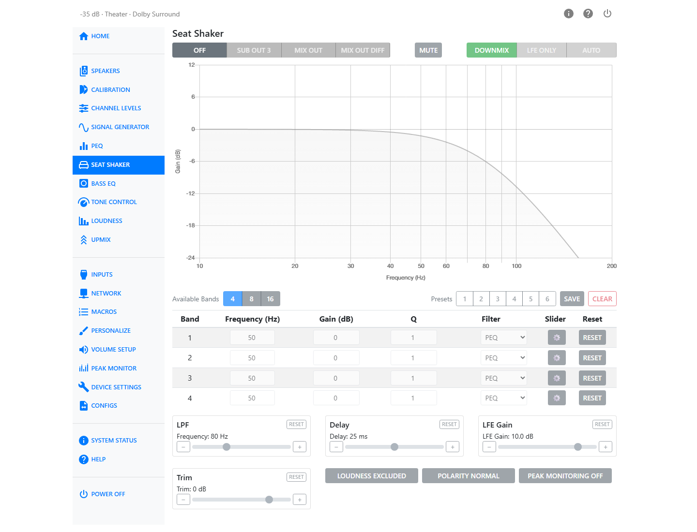

# Seat Shaker

A seat shaker — also called a tactile transducer, ButtKicker, or bass shaker — is bolted to a chair
or to a riser under the seating. It turns low-frequency signal into motion you feel rather than
sound you hear. The HTP-1 generates a dedicated seat shaker signal with its own input source,
filtering, delay, gain, trim and PEQ, and routes it either to an XLR output or to the Mix Out RCA outputs.

## Output

Choose where the seat shaker signal is sent.

| Option | What it does |
| --- | --- |
| Off | No seat shaker signal is generated. A standard stereo mixdown of the input signal is sent to the Mix Out. |
| Sub Out *n* | The seat shaker signal is routed to one of the XLR outputs. The number shown is the next available subwoofer slot. |
| Mix Out | The seat shaker signal is sent to the Mix Out. Both outputs carry the same signal. |
| Mix Out Diff | The seat shaker signal is sent to the Mix Out. The left and right outputs carry the same signal with inverted polarity. |

!!! note
    When **Sub Out** is selected, that output is highlighted in yellow on the Speaker Map on the
    [Speakers](speaker-setup.md) page, so you can always see which physical output the seat shaker
    has claimed.

!!! note
    While Output is set to **Off**, every other control on this page is locked. The page still
    displays the settings it will use — the Content selection stays lit, for example — but nothing
    can be changed until an output other than Off is chosen.

## Mute

**Mute** silences the seat shaker without changing the Output selection, so you can quickly compare
how the system sounds with and without the seat shaker. It becomes available once an output other
than Off is chosen.

## Input Source

Choose what the seat shaker plays.

| Option | What it does |
| --- | --- |
| Downmix | The seat shaker receives a downmix of all input channels, including the LFE channel. |
| LFE Only | The seat shaker receives only the LFE channel. |
| Auto | The seat shaker receives the LFE signal when it is present, and automatically reverts to an all-channel mixdown when the source material has no dedicated LFE channel. |

## Response Chart

The chart on the page shows the seat shaker's frequency response in real time, combining the LPF
setting and the PEQ bands below it. Use it to see the effect of a filter change before you feel it.

## Available Bands and PEQ

Choose how many PEQ bands are available: **4**, **8**, or **16**. Reducing the band count resets
any bands above the new count back to their default values, so the page asks you to confirm before
it does this.

Each band has the following controls:

| Column | Range | Notes |
| --- | --- | --- |
| Frequency | 10–150 Hz | Center or corner frequency of the band. |
| Gain | −20 to +12 dB | Hidden for filter types that have no gain (All Pass, LPF, HPF). |
| Q | 0.1–10 | Hidden for the All Pass 1st Order type. |
| Filter Type | PEQ, Low Shelf, High Shelf, All Pass 1st Order, All Pass 2nd Order, LPF, HPF | Changing type shows or hides the Gain and Q fields as needed. |
| Reset | — | Returns that single band to its default (50 Hz, 0 dB, Q 1, PEQ). |

Click the gear icon at the right of a band's row to expand it into sliders with step buttons, for
finer adjustment than the number fields allow.

!!! warning
    Large EQ boosts can cause digital clipping. Watch the level with **Peak Monitoring** after
    adding gain to any band.

## Presets

Six preset slots store a complete seat shaker setup: content, LPF, delay, LFE gain, trim, polarity,
band count, and all PEQ bands.

- Select **Preset 1**–**6** to recall a stored setup.
- **Save** asks which of the six slots to save the current settings into.
- **Clear** removes the saved data from the active preset and returns the page to defaults.

A preset button changes color when its stored settings differ from what is currently on the page,
so you can tell when you have made changes that have not been saved.

## LPF

Sets the low-pass filter corner frequency for the seat shaker, from 20 to 200 Hz. The default is
80 Hz. Use this to remove higher frequencies from the signal. The shaker cannot reproduce them effectively, and they can cause unwanted buzzing.

## Delay

Adds up to 50 ms of delay to the seat shaker channel, in addition to any speaker distance
compensation, so the tactile effect is aligned in time with the rest of the system. The default is
25 ms, which compensates for the processing latency introduced by Dirac Live.

## LFE Gain

Sets the gain applied to the LFE content feeding the shaker, from 0 to 12 dB in 0.5 dB steps. The
default is 10 dB: LFE is typically recorded 10 dB lower than the main channels, so it is boosted by
10 dB to match their level.

## Trim

Adjusts the overall level of the seat shaker signal, from −24 to +6 dB. The default is 0 dB.

## Loudness

**Loudness Included / Excluded** chooses whether loudness compensation is applied to the seat shaker
signal, boosting bass as volume decreases. It follows the settings configured on the
[Loudness](loudness.md) page.

## Polarity

**Polarity Normal / Inverted** inverts the polarity of the seat shaker signal — effectively the same
as swapping the input wires on your seat shaker.

## Peak Monitoring

**Peak Monitoring** lets you watch the seat shaker signal level to prevent clipping. The indicator
turns red when the signal exceeds 0 dBFS, showing that clipping is occurring. Lower the **Trim**
setting to keep the signal below this threshold for optimal performance without distortion.

## Setting Levels and Headroom

The two output paths use different volume control, which changes how you check for clipping:

- The **XLR outputs** use analog volume control up to a digital headroom limit. XLR clipping can be
  checked at any volume.
- The seat shaker signal on the **Mix Out RCA** uses digital volume control. Its level changes with
  master volume, so clipping is only displayed accurately when the master volume is set to the
  loudest level you plan to use.

!!! warning "Hearing safety"
    To protect your hearing and your speakers, mute all speakers on the
    [Calibration](calibration.md) page before setting headroom for the seat shaker RCA outputs.
    See also [Safety](safety.md).
