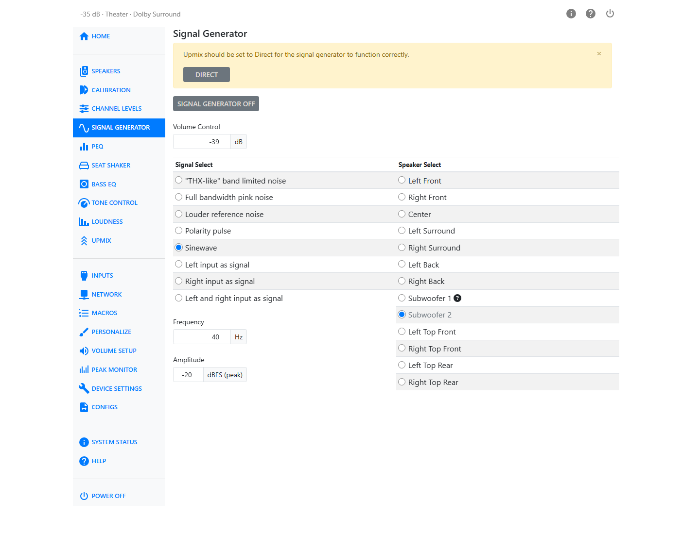
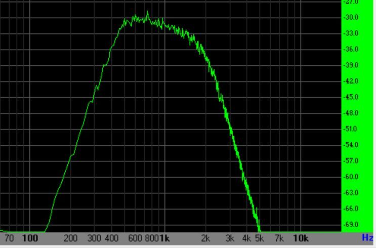
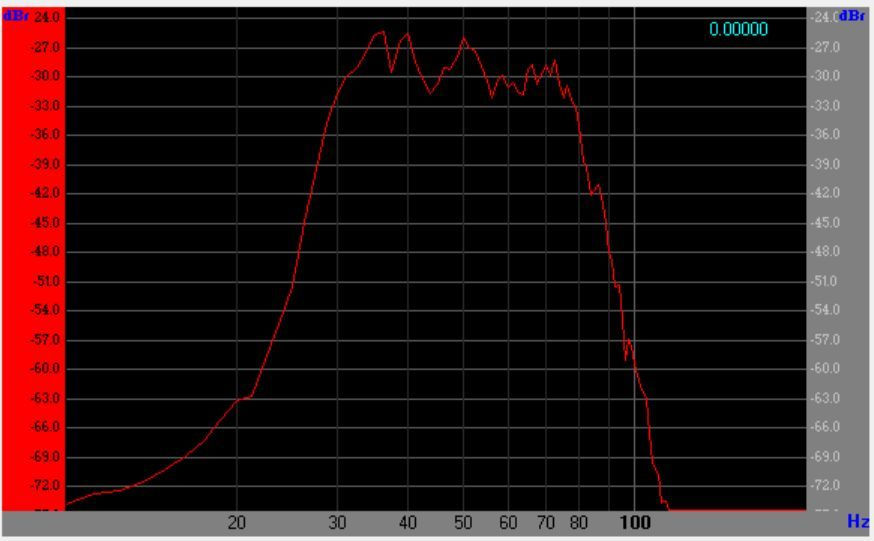
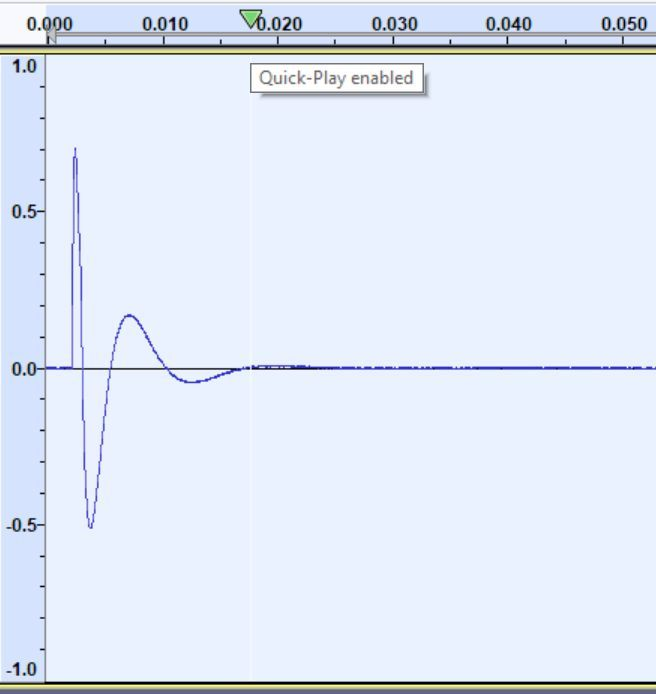
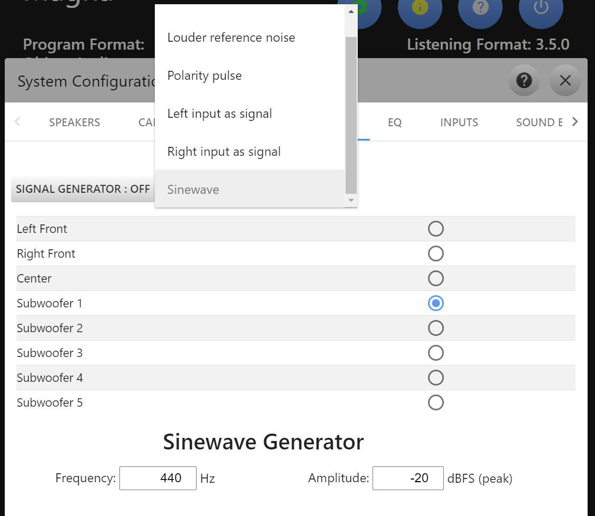

# Signal Generator

The HTP-1 provides a set of signal generator functions that can be quite helpful in system setup.

First choose a signal type from the **Signal Select** list. Then choose a channel from the **Speaker Select** list — the list of channels matches the speakers you have enabled on the speakers page. Then turn the signal generator on using the on/off button at the top of the page.

!!! warning
    The signal generator needs the upmixer set to **Direct** to work correctly. If it isn't, a warning appears on this page with a **Direct** button that sets it for you.

!!! note
    The subwoofers are a special case. Their behavior is different depending on whether the HTP-1 bass manager or the Dirac Live bass manager is engaged. When the HTP-1 bass manager is engaged (and Dirac Live is not), the bass manager is turned off and each subwoofer receives an independent signal. You cannot generate independent subwoofer signals when the Dirac Live bass manager is engaged: it applies the crossover to the main channels and generates all of the subwoofers you have enabled. Subwoofer 1 sends signal to all subwoofers in that case.

A **Volume Control** field on this page lets you set the output level in dB without leaving the page. It is clamped to the minimum and maximum volume you have configured.

Several test signals are available:

## "THX-like" Band-Limited Noise

The industry commonly uses a reference originally defined by THX. This is a band-limited pink noise signal. Each of these signals is calibrated to be at 30 dB below full scale RMS.

The main channel spectrum looks something like the illustration above. The left- and right-hand sides of the spectrum are 4th-order band-limiting filters. The slope downward from 400 to 2000 Hz is the "pink" spectrum falling off as 1/f.

The spectrum of the subwoofer signal is quite different from the main speaker spectrum. It is similarly band-limited pink noise, but the band limiting is applied with 8th-order filters at 30 and 80 Hz.

## Full Bandwidth Pink Noise

This is pink noise without the THX-like signal's band limiting — its energy spreads across the full audible range rather than falling off at either end. It suits full-range measurement sweeps and broadband level checks in tools like REW, where the THX-like signal's band limits would get in the way.

## Louder Reference Noise

This more generic noise is band-limited differently on the mains and on the subs. The band limiting is not so drastic, and the 1/f spectrum is not so accurate. The signal is about 10 dB louder than the THX signal.

!!! tip
    It might be easier to hear if you are just listening.

## Polarity Pulse

The polarity pulse is an upward-going tick presented about once per second. This can be helpful in checking the phase of speakers.

## Left/Right Input as Signal

Here the left (or right) input channel is taken as the input to the signal generator and routed to the selected channel. This allows you to supply any test signal to the system via a Blu-ray player or any other test source such as REW.

## Left and Right Input as Signal

This mode takes both the left and right input channels as signal at once, and routes each to its own channel. Selecting it splits **Speaker Select** into two tables — one for the left input, one for the right — so you can route a two-channel test signal, such as a REW stereo sweep, to two different speakers in one pass.

## Sine Wave

A sine wave can also be chosen as the signal. Frequency is adjustable from 10 to 20000 Hz. Amplitude is set in dBFS (peak), from −140 to 0 dBFS.

