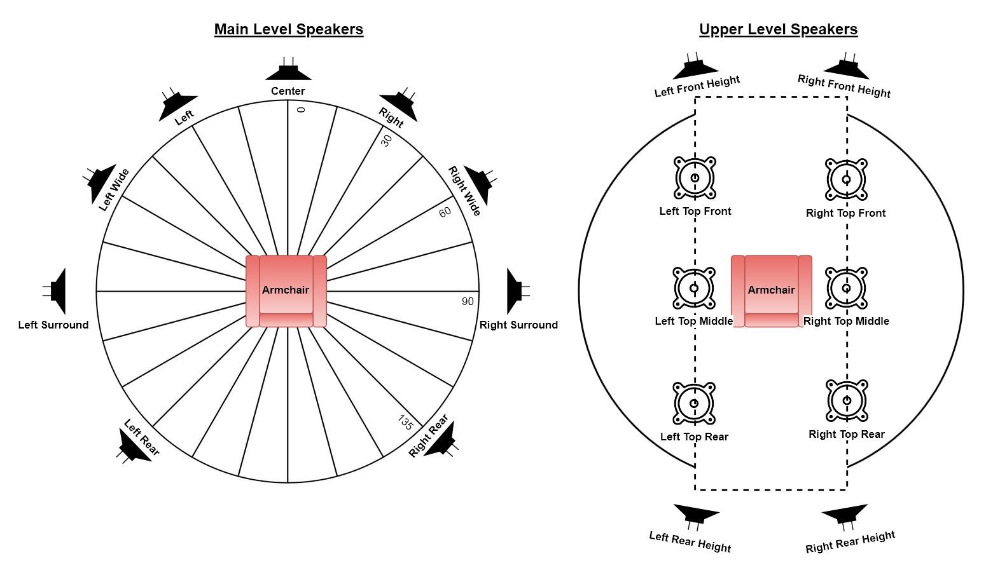

# Speaker Configuration

## Speaker Configurations

A **speaker layout** is described by three numbers in the form **x.y.z**. The first number (**x**) indicates the number of ear-level speakers arranged around the listening position. The second number (**y**) indicates the number of subwoofers in the system. The third number (**z**) indicates the number of height speakers.

For example, a **5.1.4** layout consists of five ear-level speakers (Front Left, Center, Front Right, Surround Left, and Surround Right), one subwoofer, and four height speakers. A **7.1.4** layout adds a pair of rear surround speakers, while a **9.1.4** layout also includes a pair of front wide speakers.

When describing the playback system, the HTP-1 uses the second number to indicate the number of configured subwoofers. This differs from Dolby's conventional notation, where the **.1** refers to the single LFE (Low Frequency Effects) channel in the source audio. Dolby soundtracks, for example, contain a single LFE channel, which is processed by the bass management system together with low-frequency content redirected from the other speakers. Depending on the speaker layout and bass management settings, this bass may be reproduced by one or more subwoofers, the full-range speakers, or both. **When referring to the decoded input signal, however, the HTP-1 follows the standard Dolby notation, where the second number represents the number of LFE channels in the source.**

Speaker layouts without subwoofers or height speakers are commonly written using fewer fields. For example, **5.0** is equivalent to **5.0.0**, and **5.1** is equivalent to **5.1.0**.

The **Speakers** page (`/#/settings/speakers` in the sidebar) is a great reference for understanding various speaker layouts, and is where you enable speakers and set their size and crossover. See [Speaker Setup](speaker-setup.md) for the full walkthrough.

### The Bass Manager Badge

A card at the top of the Speakers page shows a **Bass Manager** badge reading either **HTP-1** or **DIRAC LIVE**. This tells you which system is handling bass redirection right now.

The badge reads **DIRAC LIVE** whenever the loaded Dirac Live filter is a Bass Control, Bass Management, or ART filter. In that case Dirac Live is doing the crossover and subwoofer routing work, and the HTP-1's own Bass Manager section and the speaker size/crossover controls are hidden. See [Bass Management](bass-management.md) for the controls that appear when the badge reads **HTP-1**.

### The Dirac Live Lockout

Next to the badge is the **Dirac Live** button group, a three-state control: **Off**, **Bypass**, and **On**. When the active filter slot holds a Dirac Live Bass Control, Bass Management, or ART filter and Dirac Live is **On**, speaker size and crossover cannot be changed on the Speakers page — those settings live inside the Dirac Live app instead. Turn Dirac Live off or set it to Bypass to unlock size and crossover editing here.

!!! note
    Dirac Live filters come in four types: **RC** (Room Correction), **BM** (Bass Management), **BC** (Bass Control), and **ART** (Active Room Treatment). RC filters use the HTP-1's own bass management and therefore leave speaker controls editable. BM, BC, and ART filters take over bass management and lock the affected controls while Dirac Live is on.

### The Current Layout Readout and Dirac Live Filter Mismatch

Under the speaker diagram, a **Current Layout** readout shows the speaker configuration string (for example `7.1.4h`) for whatever you have enabled. This is the fastest way to confirm what the HTP-1 thinks your layout is.

Each Dirac Live filter slot is calibrated for a specific speaker layout. If the enabled speakers don't match the layout the loaded filter was calibrated for, the page shows:

> The selected Dirac Live calibration does not match the current speaker configuration. Uncalibrated channels are highlighted.

Rows for the mismatched channels are highlighted in the layout table so you can see exactly which speakers have no correction applied. When you open **Edit Speaker Layout** to change speakers, the dialog also lists which layouts currently have a matching Dirac Live filter available, so you can tell in advance whether a change will leave you uncalibrated.

!!! note
    Most on-page guidance boxes, including this one, can be dismissed permanently. If you don't see the text described here, you (or a previous user) may have already dismissed it. Dismissed notices can be restored from the **Personalize** page.

## Speaker Location Diagrams

These two diagrams illustrate the ideal placement of main level and upper level speakers. Real world rooms may not allow for ideal placement. This is just a guide. Do the best you can. The main level speakers should be placed at the ear level of the listener. The upper level speakers should be mounted high on the wall or on the ceiling. All speakers should be aimed in the direction of the listener.

Dolby Atmos™ favors top speakers on the ceiling. DTS-X™ and Auro-3D™ favor height speakers on the wall. As the following section on mapping channels to speakers points out, the HTP-1 uses standard compliant mapping techniques to support any of these speaker locations.

!!! note
    Speaker installation references published by Dolby and Auro Technologies are readily available on the internet. See *Dolby Atmos® Home Theater Installation Guidelines*, dated Dec 2018, and *AURO-3D® HOME THEATER SETUP, Installation Guidelines*, version 6 dated 2015. The official DTS reference is harder to find, but we include it here, with some comment.

### Speaker Positions Based on DTS Recommendations

| Speaker Position | Speaker Notation | DTS Azimuth Range (degrees) | DTS Elevation Range (degrees) | DTS Nominal (Azimuth, Elevation) | Comment |
|---|---|---|---|---|---|
| Center | C | 0 | 0 | (0, 0) | |
| Left | L | −30 to −45 | 0 | (−30, 0) | |
| Right | R | 30 to 45 | 0 | (30, 0) | |
| Left Surround | Ls | −100 to −120 | 0 | (−110, 0) | DTS 5.1 layout |
| Right Surround | Rs | 100 to 120 | 0 | (110, 0) | DTS 5.1 layout |
| LFE 1 | LFE1 | N/A | N/A | N/A | |
| Left Rear Surround | Lsr | −135 to −150 | 0 | (−150, 0) | |
| Right Rear Surround | Rsr | 135 to 150 | 0 | (150, 0) | |
| Left Side Surround | Lss | −90 | 0 | (−90, 0) | DTS 7.1 layout |
| Right Side Surround | Rss | 90 | 0 | (90, 0) | DTS 7.1 layout |
| Left Front Height | Lh | −30 to −60 | 20 to 45 | (−45, 45) | |
| Right Front Height | Rh | 30 to 60 | 20 to 45 | (45, 45) | |
| Left Wide | Lw | −50 to −70 | 0 | (−60, 0) | |
| Right Wide | Rw | 50 to 70 | 0 | (60, 0) | |
| Left Side Height / Top | Lhs / Ltm | −90 | 20 to 45 | (−90, 45) | Wider than Atmos, farther front than Auro |
| Right Side Height / Top | Rhs / Rtm | 90 | 20 to 45 | (90, 45) | Wider than Atmos, farther front than Auro |
| Left Rear Height | Lhr | −110 to −150 | 20 to 45 | (−135, 45) | |
| Right Rear Height | Rhr | 110 to 150 | 20 to 45 | (135, 45) | |
| Left Top Front | Ltf | −30 to −60 | 50 to 70 | (−45, 60) | |
| Right Top Front | Rtf | 30 to 60 | 50 to 70 | (45, 60) | |
| Left Top Rear | Ltr | −110 to −150 | 50 to 70 | (−135, 60) | |
| Right Top Rear | Rtr | 110 to 150 | 50 to 70 | (135, 60) | |

## 5.1 vs 7.1 Surround Speakers

The surround speakers are illustrated at 90 degrees in the diagram above. The positioning of this speaker pair is not completely agreed between the three codecs.

90 degrees is recommended by Dolby and DTS for a 7.1 system. DTS refers to these as the "side surrounds" as opposed to the "surrounds" that are used with a 5.1 system. The other codecs don't make this distinction. The various codecs agree that the surround speakers should be located closer to 110 degrees when no rear speakers are present. Auro-3D recommends the surround speakers be at 110 degrees in all cases. Dolby and DTS acknowledge a range of acceptable surround speaker locations from 90 to 110 degrees. Auro-3D consistently recommends 110 degrees. Hence 110 degrees is absolutely correct for a 5 channel main level system. Dolby and DTS encourage the side surrounds to move forward to 90 degrees when adding the back speaker pair. Auro-3D does not. You must choose a compromise based on your listening preferences and your room.

!!! note
    DTS deals with this discrepancy by "remapping" the two 5.1 native "surround" speakers to the four 7.1 native side and rear surround speakers. A 5.1 DTS track played on a 7.1 system will be rendered as a 7.1 signal by splitting the surround speakers. The same effect can be achieved with a Dolby signal using Dolby Surround or the upmixers from Auro and DTS. They will all similarly split a 5.1 signal to 7.1.

## Top Middle vs High Side

The Dolby Atmos decoder can be commanded to produce a channel pair labeled "top middle". If you only have two upper speakers, Dolby prefers the top middle pair. The DTS and Auro-3D decoders produce a pair labeled "high side". Both Dolby and DTS acknowledge that this pair can be placed in either location (high side or top middle). Auro-3D™ specifies a "height side left/right" pair at 110 degrees. Like the surround speakers, the three codecs simply do not agree on the use of the upper speakers.

If you have only four upper speakers, then the Auro-3D™ high side pair will be reproduced through the upper rear pair. This arrangement is very good for Dolby and DTS but it's less optimal for Auro-3D™. If you have six upper speakers, then the Auro-3D™ high side pair will be reproduced through the top middle/high side pair. If you are an Auro aficionado you should probably place your top middle speakers high on the wall. A strict Dolby aficionado will want to use a more closely spaced pair on the ceiling. A more widely spaced pair on the ceiling splits the difference.

Note that the Auro-3D™ "voice of god" speaker channel is reproduced by splitting it between the top middle speakers.

!!! note
    The placement of the upper speakers matters much more for Auro-3D™ coded content than it does for the AuroMatic™ upmix. The AuroMatic upmix is generally synthesizing a pleasing effect while the Auro-3D™ decoder can aim to accurately reproduce a carefully recorded signal.

## Valid Speaker Configurations

The HTP-1 can support up to 16 output channels: up to 9 main level channels, 6 upper/height channels, and up to 5 subwoofers. These can be allocated in various ways. Some of the more complex ways are discussed in the following sections.

If you try to enable more speakers than the current allocation allows, the Speakers page disables the toggle and explains why with a tooltip, most commonly *"A maximum of 16 speakers is allowed."* Note that this limit is checked at 15 speakers, not 16, for any paired left/right group — a stereo pair can't be the thing that pushes you over the limit, so the toggle disables one speaker pair earlier than you might expect. Center channel and subwoofers are each checked at the full 16.

!!! note
    If you use a **seat shaker** (see [Bass Management](bass-management.md#seat-shaker)), it normally consumes one of the 16 available output channels. It appears in the speaker layout table with a couch icon and no size or crossover controls, and is highlighted yellow—not green—on the Speaker Map. Count it against the 16-channel total when planning a large layout.

    Alternatively, the **Mix Out** RCA outputs can be configured as the seat shaker output. In this mode, the seat shaker does **not** consume one of the 16 XLR output channels, allowing all 16 XLR outputs to remain available for speakers.

The speakers in the main and upper levels are restricted to the following configurations:

| Main Level Speaker Count/Configuration | Upper Level Options* |
|---|---|
| **2 speakers**: L/R Front | 0 or 2 speakers |
| **3 speakers**: L/R Front + Center | 0 or 2 speakers |
| **4 speakers**: L/R Front + L/R Surround | 0, 2, or 4 speakers |
| **5 speakers**: L/R Front + Center + L/R Surround | 0, 2, 4, or 6 speakers |
| **6 speakers**: L/R Front + L/R Surround + L/R Rear | 0, 2, 4, or 6 speakers |
| **7 speakers**: L/R Front + Center + L/R Surround + L/R Rear/Back | 0, 2, 4, or 6 speakers |
| **9 speakers**: L/R Front + Center + L/R Surround + L/R Rear + L/R Wide | 0, 2, 4, or 6 speakers |

*Refer to the table below regarding upper level options. There is no supported 8-speaker main level configuration; L/R Wide requires L/R Rear Surround to already be enabled, which is why the main level jumps from 7 to 9.

The upper level table on the Speakers page is named **Upper Speaker Outputs**, with the subtitle *"Maximum of 6 highs/tops allowed."* Beyond the counts above, a few pairs depend on each other:

- **L/R Top Front** and **L/R Front Height** are mutually exclusive — enabling one requires the other to be off.
- **L/R Top Rear** and **L/R Rear Height** are mutually exclusive in the same way.
- **L/R Top Middle** requires Center or L/R Rear Surround to already be enabled.
- If **L/R Top Front** or **L/R Front Height** is enabled, then either L/R Surround must be enabled, or L/R Top Middle must be disabled.
- **L/R Rear Height** and **L/R Top Rear** each require L/R Top Front or L/R Front Height to already be enabled.

The HTP-1 can support many different configurations of upper speakers. The upper speakers can be "high," which are mounted on the wall, or "top," which are on the ceiling firing down.

Dolby® Atmos Enabled speakers are also supported. Dolby Atmos Enabled speakers have two independent drivers with two independent inputs. One of the drivers points up, so that sound will reflect off the ceiling and sound like a Top speaker. Dolby Atmos Enabled speakers are convenient in that they are integrated with typical front firing (Front or Surround) speakers. They work best when the ceiling is flat, reflective to sound and no greater than 10 feet in height. Only **top** speaker groups can be set to Dolby Atmos Enabled; high-mounted groups cannot.

Dolby content is typically authored with the upper level speakers in the ceiling. DTS® and Auro-3D® content is typically authored with the speakers High on the walls. The HTP-1 remaps the source material to match the user-defined speaker configuration. The following table explains the upper level speaker options:

| Upper Level Speaker Count/Configuration | Details, Suggestions, and Restrictions |
|---|---|
| **2 Top**: middle or top front pair only | Dolby® content is often authored assuming only the top middle speaker pair. If only two upper speakers are available, top middle is the best bet. |
| **2 High**: front pair only | If your speakers are here, then use this setting. But this is not a preferred speaker arrangement. |
| **4 Top**: 4 ceiling mounted (down firing speakers, front and rear left and right) | This is a Dolby® preferred speaker layout. Other formats also support this configuration. Auro-3D™ will work, but this is not optimal for Auro-3D™. |
| **4 High**: 4 wall mounted high speakers, front and rear, left and right | This is a DTS® preferred configuration. Other formats also support this configuration, but it's not optimal for Auro-3D™. See [Top Middle vs High Side](#top-middle-vs-high-side). |
| **4 Mixed**: front high, rear top or front top and rear high | If your speakers are most easily set in such a mixed arrangement, the HTP-1 can be configured to map the signal to these configurations. |
| **6 Top**: front, middle and rear | Ideal for Dolby. Acceptable for DTS. OK for Auro-3D®. See [Top Middle vs High Side](#top-middle-vs-high-side). |
| **6 High**: front and rear are high on the wall | The signal for the upper middle pair is actually the "top middle" for Dolby, so the pair is separated more widely than Dolby suggests. But this is best for Auro-3D®. See [Top Middle vs High Side](#top-middle-vs-high-side). |
| **6 Mixed**: top middle plus front high, rear top or front top and rear high | Might be a good compromise with high fronts for Auro and top rears for Dolby. |

The status display uses suffixes (e.g. 7.1.4**h**) to indicate the type of height speaker layout:

* **h** – Height speakers.
* **t** – Top Front, or Top Front and Top Rear speakers.
* **b** – Top Front and Rear Height speakers.
* **s** – Front Height and Top Rear speakers.

These suffixes distinguish (mixed) height speaker layouts from standard top speaker layouts.

The HTP-1 supports many speaker layouts, allowing you to configure the system to match the speakers you have installed. While some layouts are more common than others, the recommendations below provide a good starting point for most home theaters.

- 5.1.2 is a "minimum object audio" recommendation.
- 7.1.4 is a "normal object audio" configuration.
- 9.1.6 is increasingly common for a well-appointed object audio room.
- Six upper speakers gives a clear advantage to match common source material exactly without remapping.

## Multiple Subwoofers and Dirac Live Bass Control

The HTP-1 supports up to five subwoofers. Multiple subwoofers are commonly used to create a more even bass response across the listening area, not simply to increase bass output. The trim (gain) and delay of each subwoofer can be adjusted independently.

Dirac Live Bass Control automatically optimizes the gain, delay, phase, and integration of all subwoofers with the main speakers. Without Bass Control, a standard Dirac Live calibration calibrates each subwoofer independently but cannot optimize how they work together as a system.

!!! warning
    Your speaker configuration needs to match the number of subwoofers you are using. If you have two subwoofers, you must configure the system for two subwoofers and use the first two subwoofer outputs, as shown on the Speaker Map at the bottom of the Speakers page. If you have three subwoofers, use 1, 2 and 3. The system adjusts the gains of the subwoofers to account for how many subs are in the system. Enabling a subwoofer on the Speakers page and then not connecting it will result in a "sub"-optimal experience. This is in fact true for any speaker.

## Mapping Channels to Speakers

There can be cases in which the channels found in the program material do not exactly match the speakers in the room. The various decoders apply "remap" algorithms to pan the source signal to the best available set of speakers. This is best illustrated with a set of examples:

1. DTS-X™ material is typically constructed with "high" channels, but a room may have only "top" speakers. DTS applies a "remapping" feature in this case and the resulting signal is heard both from the top speaker as well as from the matching main level speaker. The sound from the front left high speaker is hence panned between the top left high and the top left speaker so that it sounds like it is coming from the high speaker location between these two.

2. A 5.1 DTS stream is usually authored with the surround speakers at 110 degrees from the listening position (see the [Speaker Location Diagrams](#speaker-location-diagrams) above). A 7.1 speaker setup places surrounds (sides) at 90 degrees and rear speakers at 135 degrees. Hence a 5.1 DTS signal is often presented for a 7.1 configuration with the surround signal split between the side and rear speakers.

3. The full Auro-3D® channel set includes the "Voice of God" (VoG) speaker located directly overhead and the "Front Center High" or "Center Vertical High" (CVH) speaker on the wall above the screen. These signals are not directly supported as they are not generated by the other decoders. Like all of the higher speaker modes, the available signals are mapped to the available speakers. The VoG signal is routed equally to the two "top middle" speakers, if available. In a ".4" configuration, the VoG signal will be routed to all 4 upper speakers. The CVH signal is split between the upper front signals.

4. The Auro-3D® speaker set is in fact "high" channels, not top channels. If you choose to install top speakers, the Auro-3D® high channels are mapped directly to the top speakers.

!!! note
    **Dolby Atmos™** and **DTS:X™** are object-based audio systems. Sound objects are not tied to fixed speaker channels but are rendered according to your configured speaker layout during playback. This allows sounds to move naturally around the room across a wide range of speaker configurations, so the same soundtrack automatically adapts to different layouts without requiring a separate mix.

    **Auro-3D®**, on the other hand, is a channel-based system. Sounds are mixed into fixed speaker channels, which are downmixed or remapped if the corresponding speakers are not present.
