# Speaker Setup

Open the **Speakers** page from the sidebar (`/#/settings/speakers`). This is where you configure the speaker layout, specify the location of each speaker, and define its size. Speaker size determines whether a speaker is treated as **Large** (full-range) or **Small** (bass-managed). For speakers configured as **Small**, bass below the user-selected crossover frequency is redirected by the bass management system to the configured subwoofer(s) or, if no subwoofer is present, to speakers configured as **Large**.

The layout table on the Speakers page is read-only — the checkboxes, crossover fields, and size buttons shown there just reflect your current settings. To change anything, click **Edit Speaker Layout**. This opens a dialog where enabling, disabling, sizing, and setting the crossover for a speaker all take effect.

!!! note
    If the active Dirac Live filter slot holds a Bass Control, Bass Management, or ART filter and Dirac Live is on, size and crossover cannot be changed at all — not even in the dialog — because Dirac Live is doing that work. Turn Dirac Live off or set it to Bypass first. See [Speaker Configuration](speaker-configuration.md#the-dirac-live-lockout).

## The Edit Speaker Layout Dialog

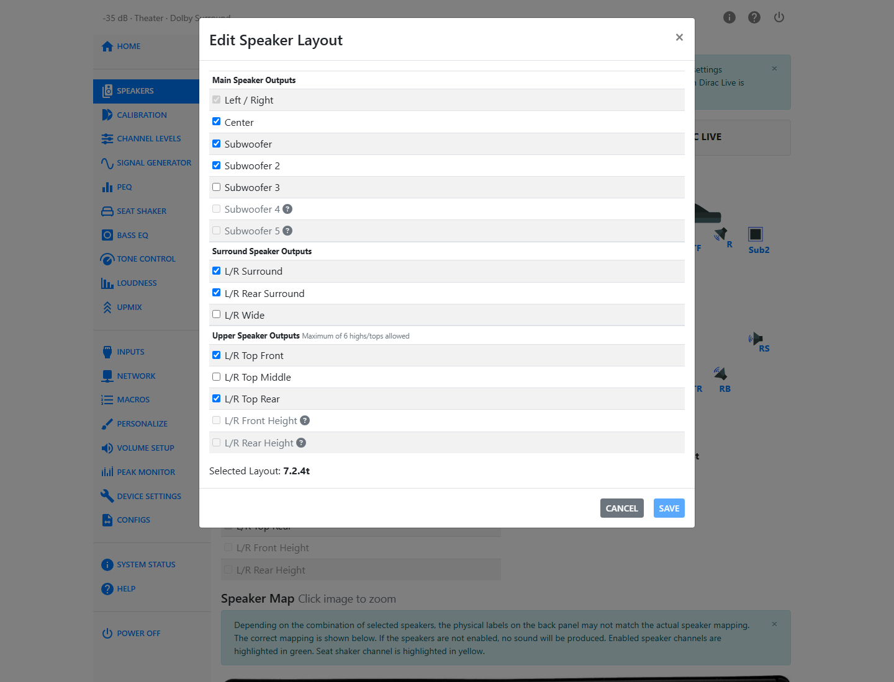

The dialog lists every possible speaker in three groups — Main Speaker Outputs, Surround Speaker Outputs, and Upper Speaker Outputs — each with up to three controls per row:

1. **Presence checkbox.** Click the speaker's row or its checkbox to enable or disable it. A speaker you can't currently enable shows a question-mark icon; hover it to see why (see [Valid Speaker Configurations](speaker-configuration.md#valid-speaker-configurations) for the underlying rules).
2. **Crossover frequency (fc).** A numeric field, range **40–200 Hz**, that sets the corner frequency of that speaker's high-pass filter. It only appears for speakers set to **Dolby** (Dolby Atmos Enabled) or **Small**—**Large** speakers are full-range and do not use a crossover. Subwoofers have no crossover field of their own; their low end is handled by the **LPF for LFE Channel** control described in [Bass Management](bass-management.md).
3. **Size buttons — Dolby / Small / Large.** Choose **Large** for a full-range speaker that needs no bass redirection, **Small** for a speaker that should hand its low frequencies to the subwoofer(s), or **Dolby** for a Dolby Atmos Enabled speaker. The **Dolby** button only appears for **top** speaker groups — a wall-mounted "high" speaker cannot be Dolby Atmos Enabled.

Changes you make in the dialog are staged, not applied immediately. A warning banner appears once you have unsaved changes: *"You have unsaved changes. Click Save to apply them. Updating speaker layout may take up to 5 minutes."* Click **Save** to send the change to the HTP-1, or **Cancel** to discard it.

While the dialog is open it also tells you whether the layout you're building has a matching Dirac Live filter:

- If Dirac Live is off and no filter exists for the current layout, it shows the **Current Layout** and the list of layouts that do have filters available.
- If you've changed the selection to a layout with no Dirac Live filter, it warns that saving will produce an empty (uncalibrated) layout — the necessary first step before you can calibrate it.

### Most Speakers Should Be Small

"Small" speakers do not handle low frequency sounds well. Surround sound systems typically use a bass management system to compensate, redirecting the low end to a subwoofer. See [Bass Management](bass-management.md) for how this works on the HTP-1.

If you are not sure whether your speakers are small or large, they are probably small. A large, full-range speaker does not need a subwoofer to produce the lowest frequencies. Setting a speaker to **Small** causes the bass manager to redirect its lowest frequencies to the subwoofer(s), protecting the speaker and letting it operate more efficiently.

Many speaker manufacturers publish the frequency response of their speakers. For example, "60Hz to 18KHz" indicates that the speaker is not designed to produce sound much below 60 Hz. In that case, set the crossover frequency to 60 Hz. Choosing a cutoff clearly in the linear region of the speaker ensures the crossover, not the speaker's own natural roll-off, defines where bass hands off to the subwoofer. The HTP-1 uses a fourth-order Linkwitz-Riley crossover.

!!! tip
    If you don't have a spec sheet for your speakers, a basic Dirac Live calibration will show you the speaker's useful range. You can use that measurement to choose a crossover frequency, then finish the layout on the Speakers page.

A Dolby Atmos Enabled speaker behaves like a "Small" speaker except that a Dirac Live calibration preserves the special filters used in Dolby Atmos Enabled speakers.

## Enabling Speakers

The factory default enables only the front left and right speakers. From there, the dialog only lets you build supported speaker configurations. Depending on the selected speaker layout, some output channels can instead be allocated to additional subwoofers, allowing up to five independently configurable subwoofers. A speaker you can't yet add shows why in its tooltip. The full rule set is documented in [Valid Speaker Configurations](speaker-configuration.md#valid-speaker-configurations); the tooltips in the dialog quote the same rules directly, for example *"Subwoofer 2 must be enabled before Subwoofer 3."*

!!! tip
    If you have only two upper speakers it is a good idea to choose the top middle pair. Many Dolby tracks are authored to favor this upper pair. The "5.1.2" Atmos configuration uses the top-middle pair. DTS-X streams are likely authored using four high speakers. The HTP-1 "remaps" any source arrangement to match the speaker setup you choose using algorithms provided by the decoder. This is why you should describe/configure your speaker setup as accurately as possible, though few people will be able to tell the difference if a pair of speakers labeled "top front" are actually high on the wall in front.

## Current Layout and the Speaker Diagram

Under **Edit Speaker Layout**, the speaker diagram on the right shows the speakers you currently have enabled and hides the ones you don't — a quick visual confirmation that matches what you just set. Below the diagram, the **Current Layout** readout spells out the resulting configuration string, such as `7.1.4h`.

## The Speaker Map

At the bottom of the Speakers page is the **Speaker Map**: an image of the HTP-1's back panel showing which output jack drives which speaker. Click the image to zoom in.

As you use more of the 16 output channels, the jack assignment changes depending on which speakers you've enabled. This allows layouts ranging from 9.1.6 (nine mains, one subwoofer, six uppers) to layouts with up to five independently configurable subwoofers, such as 5.5.6 or 7.5.4. The Speaker Map always reflects the current assignment and should be considered authoritative over the labels printed on the back panel, which may not match less common configurations.

The map also shows activity, not just wiring:

- **Enabled** speaker channels are highlighted **green**.
- If you're using a seat shaker, its channel is highlighted **yellow** and marked with a couch icon rather than a speaker label. See [Bass Management](bass-management.md#seat-shaker).
- A channel that isn't enabled won't produce sound even though it still appears on the map.

!!! tip
    The Speaker Map is most useful for less common configurations, such as 7.5.4 or 9.5.2, where the location of the subwoofer or wide channels can vary.

## Dolby Atmos Enabled Speakers

Dolby Atmos Enabled speakers use upward-firing drivers to create the perception of overhead sound by reflecting audio off the ceiling. They may be integrated into a conventional speaker or provided as a separate module placed on top of one. Dolby Atmos Enabled speakers use a specially designed frequency response that enhances this psychoacoustic effect.

When you set a top speaker group to **Dolby** in the **Edit Speaker Layout** dialog, Dirac Live calibration preserves this frequency response instead of attempting to flatten it.

Only top speaker groups can be set to **Dolby**. High-mounted (wall) speaker groups do not offer the **Dolby** option.

## Example Speaker Setups

The back panel of the unit is shown below along with a diagram of the XLR connectors on the back of the HTP-1. The diagram will be used in the following sections to show you how to connect an amplifier to the unit for various speaker configurations. In the diagram, the XLR connectors have been divided into two rows to make it easier to fit the information on a single page.

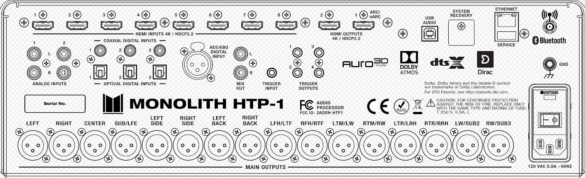

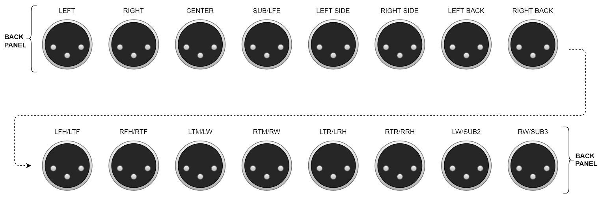

As you use more of the 16 channels, the order of channels assigned to the back panel varies with your choice of speakers. The actual assignment for your current layout is always shown on the [Speaker Map](#the-speaker-map) at the bottom of the Speakers page.

### Example 7.1.4h Speaker Configuration (Upper Level On the Wall)

This speaker configuration uses 7 surround sound speakers, 1 subwoofer and 4 height speakers. The height speakers are mounted high on the walls, in the corners of the listening area.

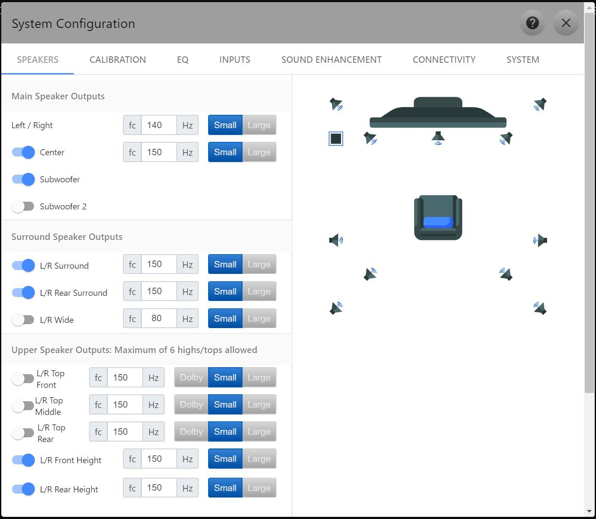

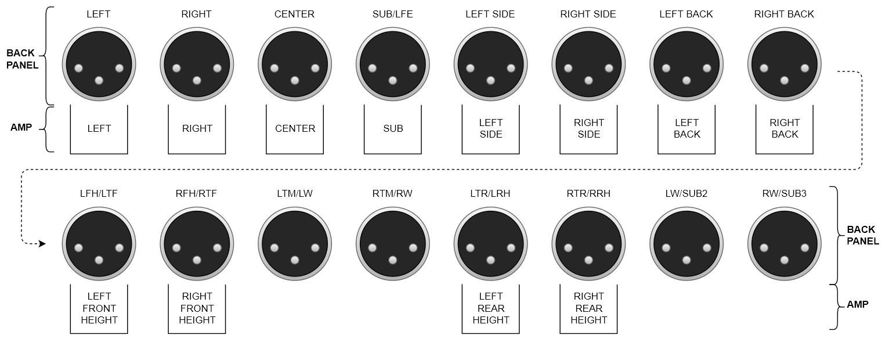

### Example 7.2.6 Speaker Configuration (Upper Level On the Ceiling)

This speaker configuration uses 7 surround sound speakers, 2 subwoofers and 6 height speakers. The height speakers are mounted in the ceiling.

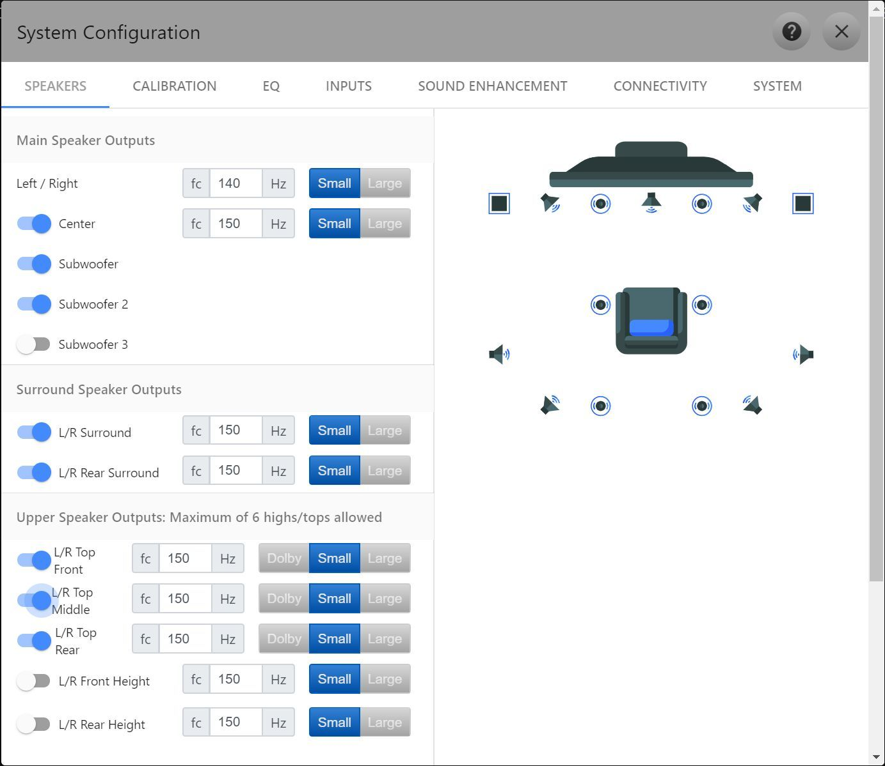

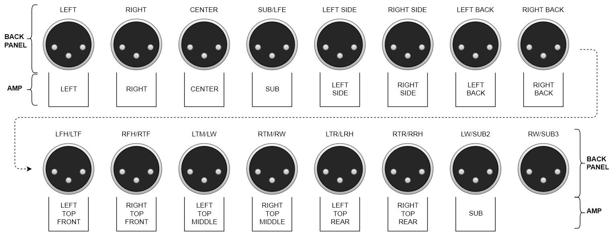

### Example 9.3.4 Speaker Configuration (Upper Level On the Ceiling)

This speaker configuration uses 9 surround sound speakers, 3 subwoofers and 4 height speakers. The upper front speakers are mounted in the ceiling. The upper rear speakers are Top and Dolby Atmos Enabled.

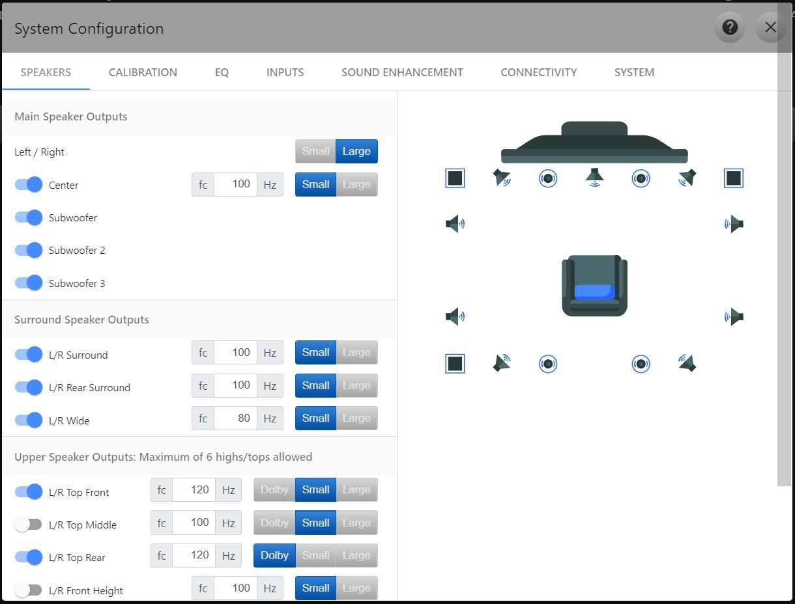

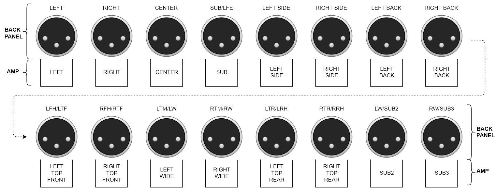

### Example 9.1.6 Speaker Configuration (Upper Level On the Ceiling)

This speaker configuration uses 9 surround sound speakers, 1 subwoofer and 6 height speakers. The height speakers are mounted high on the walls, in the corners of the listening area.

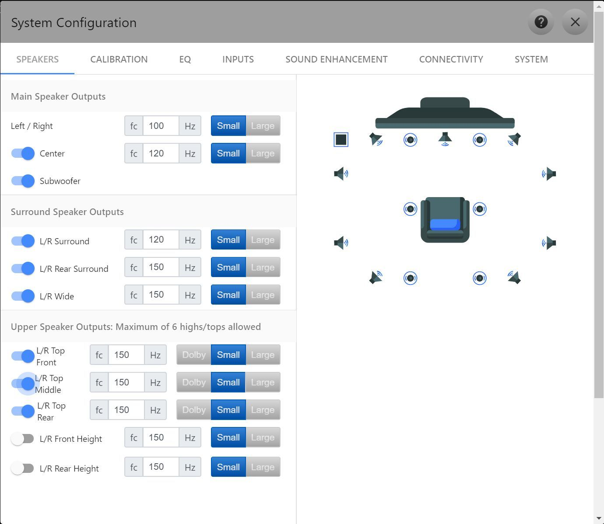

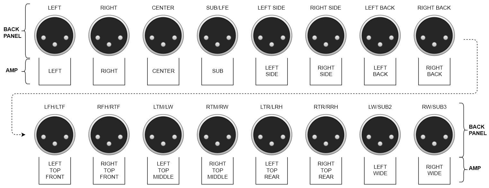
