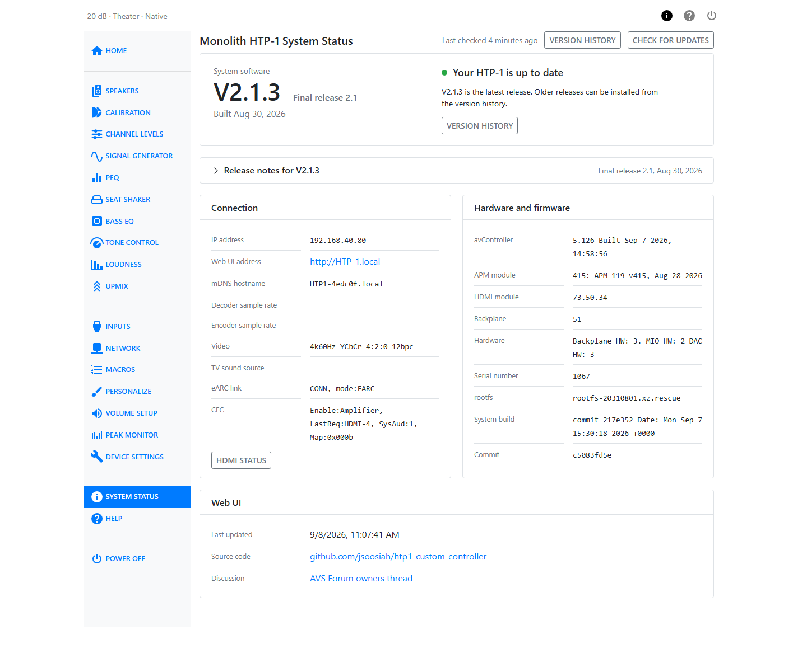

# System Status

The System Status page tells you what software the HTP-1 is running, whether a newer release
is available, and the current state of its network and HDMI connections. It also lists the
exact hardware and software versions that support will ask for if you report a problem.

## System software

The controls at the top right apply to the whole page: **Last checked** tells you how old the
information is, **Version history** opens the list of every release you can install, and
**Check for updates** asks the release server again. The unit also checks on its own every six
hours.

The panel below is about the software itself. On the left is the version you are running, for
example `V2.1.3`, with its stage next to it (**Final release 2.1**, **Release candidate 2**) and
the date it was built. On the right is where you stand:

| You see | It means |
| --- | --- |
| **Your HTP-1 is up to date** | You have the newest release. |
| **V2.1.3 is available** | A newer release exists, with a one-line summary beneath. **Install V2.1.3** installs it after a confirmation; **What's new in V2.1.3** scrolls to its release notes. |
| **Can't check for updates** | The unit could not reach the release server the last time it checked, so it cannot tell whether a newer release exists. See [Updates and Support](maintenance.md#without-an-internet-connection). |
| **Not a public release** | The unit is running a developer build rather than a public release. Owners will not normally see this. |

When an update is available, a **What's new** panel lists its new features, changes and fixes.
The release notes for the version you have are folded beneath it; open them with the arrow.

See [Updates and Support](maintenance.md) for the update procedure and what to expect.

## Connection

| Field | What it shows |
| --- | --- |
| IP address | The IP address currently assigned to the HTP-1 on your network. |
| Web UI address | The local address for opening the HTP-1 Web UI in a browser. |
| mDNS hostname | The HTP-1’s unique hostname used for mDNS/Bonjour discovery, so applications can identify and connect to this specific unit on the local network. |
| Decoder sample rate | The sample rate of the incoming audio, after decoding. |
| Encoder sample rate | The sample rate of the audio being sent to the speaker outputs. |
| Video | The current video resolution, color space, chroma subsampling, HDR status, bit depth, and 3D status for video received through an HTP-1 HDMI input. No video details are shown when ARC/eARC is used. |
| TV sound source | Where the audio driving the TV input is coming from, for example `eARC`. |
| eARC link | The state of the eARC connection to your TV. |
| CEC | The state of CEC (Consumer Electronics Control) communication with your TV and other HDMI devices. |

The last two fields report a short internal status string rather than a friendly sentence.
Support may ask you to read one of them aloud, or you can copy it exactly when writing in for
help. See [Reference](reference.md) for a glossary of the terms that appear in them.

**HDMI status** under this panel opens a detailed dump of the current HDMI connection, useful
when troubleshooting handshake, ARC/eARC, or CEC problems with your TV or other HDMI devices.
**Refresh** inside the dialog pulls a new reading without closing it.

## Hardware and firmware

| Field | What it is |
| --- | --- |
| avController | The version of the component that manages audio control and device state. |
| APM module | The version of the audio processing module. |
| HDMI module | The version of the HDMI receiver/transmitter firmware. |
| Backplane | The version running on the internal communication hub. |
| Hardware | The hardware revision of the backplane, MIO board, and DAC. |
| Serial number | Your unit's serial number. |
| rootfs | The base Linux filesystem image version. |
| System build | The build of the control and automation layer. |
| Commit | The exact source revision of the installed software. |

!!! tip
    If you contact support, include the system software version, avController, APM module,
    serial number and commit from this page. They let the development team match your report to
    the exact build you are running.

## Web UI

When the web interface itself was last updated, with links to its source code and the
community discussion thread.
