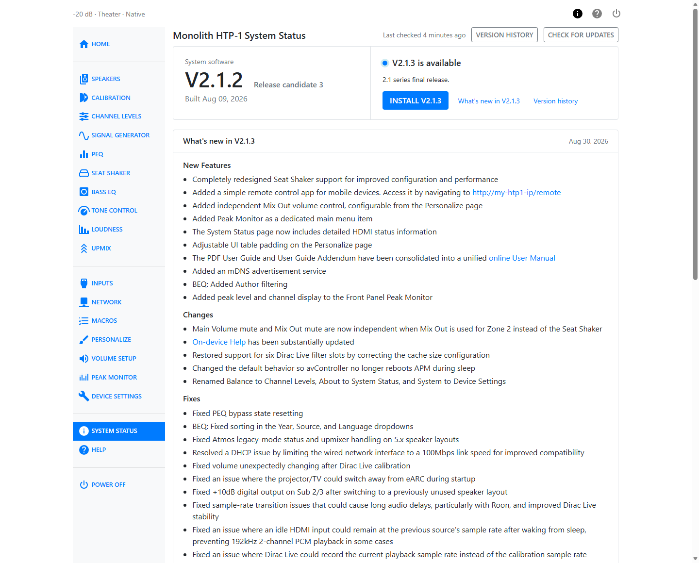
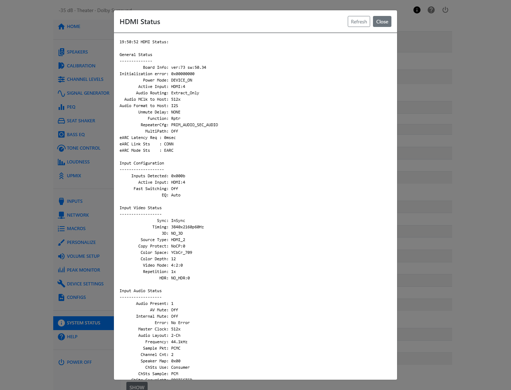

# System Status

The System Status page tells you what software the HTP-1 is running, whether an update is
available, and the current state of its network and HDMI connections. It also lists the exact
hardware and software versions that support will ask for if you report a problem.

## History and Updates

The **System Software Version** row shows the version currently running, with a **Release Notes**
link next to it. Read the release notes before updating — they list new features, fixed issues,
and any known issues for that release.

The **History and Updates** row has an **Open History page** button. This opens a separate page
where you check for new firmware and install it. See [Updates and Support](maintenance.md) for the
full update procedure.

If a newer release is available, an **Update available** badge appears next to the button. No
badge means you are already on the latest release for your branch.

## Detailed Status

| Field | What it shows |
| --- | --- |
| IP Address | The address the HTP-1 is using on your network. |
| Decoder Sample Rate | The sample rate of the incoming audio, after decoding. |
| Encoder Sample Rate | The sample rate of the audio being sent to the speaker outputs. |
| Video Status | The current video resolution, color space, chroma subsampling, HDR status, bit depth, and 3D status. |
| TV Sound Source | Where the audio driving the TV input is coming from, for example `eARC`. |
| eARC Link Status | The state of the eARC connection to your TV. |
| CEC Status | The state of CEC (Consumer Electronics Control) communication with your TV and other HDMI devices. |

These last two fields report a short internal status string rather than a friendly sentence.
Support may ask you to read one of them aloud, or you can copy it exactly when writing in for
help. See [Reference](reference.md) for a glossary of the terms that appear in them.

## Software and Hardware Versions

This table lists every version number that identifies your unit:

| Field | What it is |
| --- | --- |
| System Software | The main firmware version, for example `V2.1.1`. |
| Node-RED GUI | The build of the control and automation layer. |
| avController | The version of the component that manages audio control and device state. |
| APM Module | The version of the audio processing module. |
| HDMI Module | The version of the HDMI receiver/transmitter firmware. |
| Backplane Firmware | The version running on the internal communication hub. |
| Hardware | The hardware revision of the backplane, MIO board, and DAC. |
| Serial Number | Your unit's serial number. |
| rootfs Version | The base Linux filesystem image version. |

!!! tip
    If you contact support, include the System Software, avController, APM Module, and Serial
    Number values from this table. They let the development team match your report to the exact
    build you are running.

## HDMI Status

Click **Show** under HDMI Status to open a detailed dump of the current HDMI connection —
useful when troubleshooting handshake, ARC/eARC, or CEC problems with your TV or other HDMI
devices. Click **Refresh** inside the dialog to pull a new reading without closing it.

