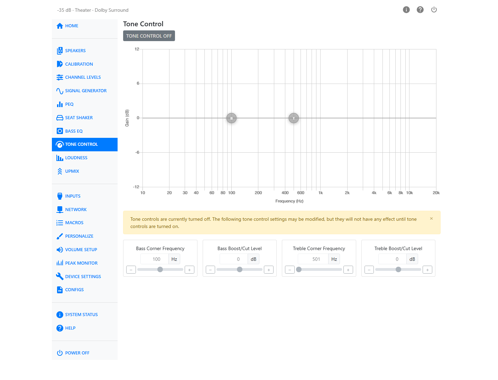
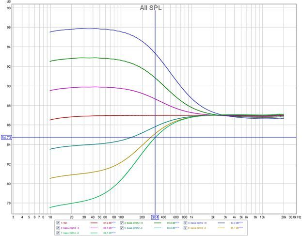
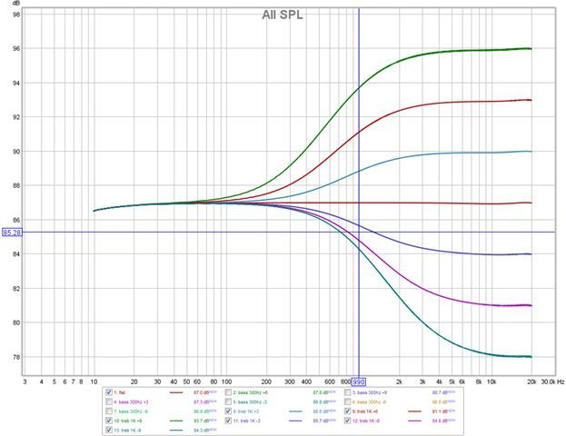

# Tone Control

Tone Control gives you a simple bass and treble adjustment, similar to the tone controls on a traditional stereo receiver — a broad shelf of boost or cut above or below a corner frequency you choose, rather than the narrow, per-band adjustments PEQ offers.

Turn Tone Control on or off with the **Tone Control** button at the top of the page. When it is off, an alert reminds you that the settings below can still be changed, but they will have no effect until Tone Control is turned on — the controls are disabled to make this clear.

The page shows an interactive tone curve that updates as you change the settings.

| Control | Range |
|---|---|
| Bass Corner Frequency | 20–500 Hz |
| Bass Boost/Cut Level | −12 to +12 dB |
| Treble Corner Frequency | 600–8000 Hz |
| Treble Boost/Cut Level | −12 to +12 dB |

The following plots show the sort of adjustment range these controls achieve.

If enabled under Personalize, Bass and Treble can also be adjusted directly from the Home page, without opening this settings page.
