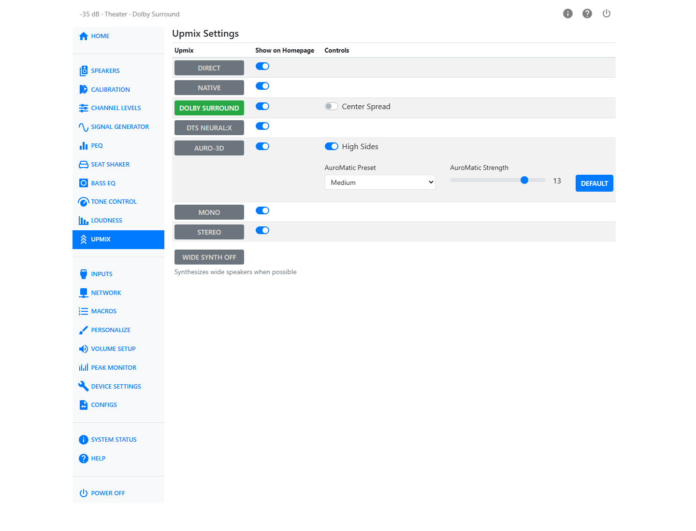

# Upmix

An upmixer takes an input signal and maps it to more speakers than it was originally mixed for —
for example, spreading a stereo or 5.1 soundtrack across a full height and wide speaker layout. The
Upmix page lists every available upmixer, lets you turn each one on, choose whether it appears as a
button on the Home page, and adjust the settings specific to it.

You request an upmixer through the interface, but the requested mode may not always be possible.
The current mode is shown in the audio status. This is most often noticed when you request
something like Auro-3D but the source is Dolby Atmos or DTS-X — only the mono and stereo modes can
override a native Atmos or DTS-X stream.

## Available Upmixers

| Upmixer | Description |
| --- | --- |
| Direct | The input stream is presented without modification. Appropriate for a stereo source you want to hear through the front speakers only. Whether the subwoofer is engaged depends on the bass management settings on the Speakers page. |
| Native | HTP-1 uses whichever upmixer is native to the decode format. Dolby signals are processed with Dolby Surround, DTS signals with DTS Neural:X, and Auro-3D encoded signals are decoded. PCM, Atmos and DTS-X signals pass through unchanged. |
| Dolby Surround | Dolby's own upmixing algorithm, an evolution of the older Pro Logic algorithms. It uses cues in the signal to route sound to the speaker set, including extracting material common to left and right into the center channel. Works on any signal of 8 channels or fewer. |
| DTS Neural:X | DTS's own upmixing algorithm, an evolution of the older Neo algorithms, following the same kind of rules as Dolby Surround. Works on any signal of 8 channels or fewer. |
| Auro-3D | Auro Technologies' Auro-Matic algorithm, again extracting common left/right material to the center channel. When upper speakers are present the effect is called Auro 3D; without upper speakers it becomes Auro 2D. Auro-Matic is not applied to 192 kHz content. |
| Mono | Mixes the input down to mono and applies the same mix to every speaker. |
| Stereo | Mixes the input down to stereo and applies the left and right channels to all left and right speakers respectively, with a mono mix routed to the center. |

!!! note
    Dolby Atmos and DTS-X streams play in their native format and cannot be requested or replaced
    by another upmixer, except by Mono or Stereo.

## Show on Homepage

Each upmixer has its own **Show on Homepage** switch. Turn this on for the upmixers you switch
between often, so they appear as buttons on the Home page.

## Dolby Surround: Center Spread

When Dolby Surround is selected, a **Center Spread** switch becomes available. Turning it on
spreads the center channel signal to the left and right front speakers as well, in addition to the
center.

## Auro-3D Controls

Selecting Auro-3D reveals three additional controls:

- **High Sides** — when off, high side content is mixed to the rear height or top rear speakers.
  When on (the default), it is mixed to the top middle speakers instead.
- **AuroMatic Preset** — one of **Small**, **Medium**, **Large**, **Movie**, or **Speech**. This
  shapes how much the Auro-Matic upmix behaves like an added-reverb effect.
- **AuroMatic Strength** — a slider from 1 to 16 controlling how much of the Auro-Matic signal is
  mixed into the original. A **Default** button restores the factory value.

## Wide Synth

Most source material does not include dedicated wide-channel content, even though Dolby Atmos can
carry objects placed there. Dolby Surround does not produce wide channels, the DTS-X decoder and
Neural:X upmixer produce only 12 channels, and Auro-3D does not produce wide signals either.

**Wide Synth**, at the bottom of the page, applies to any of the upmixers above. When it is on, the
wide speakers receive a mix of the front and side signals plus any wide content already present. It
also applies to the top middle channels: with six upper speakers and no existing top-middle
content, they receive a mix of the upper front and rear channels. The synthesized mix is attenuated
by 6 dB relative to the channels it is drawn from.

!!! note
    Wide Synth is disabled in Direct mode.
