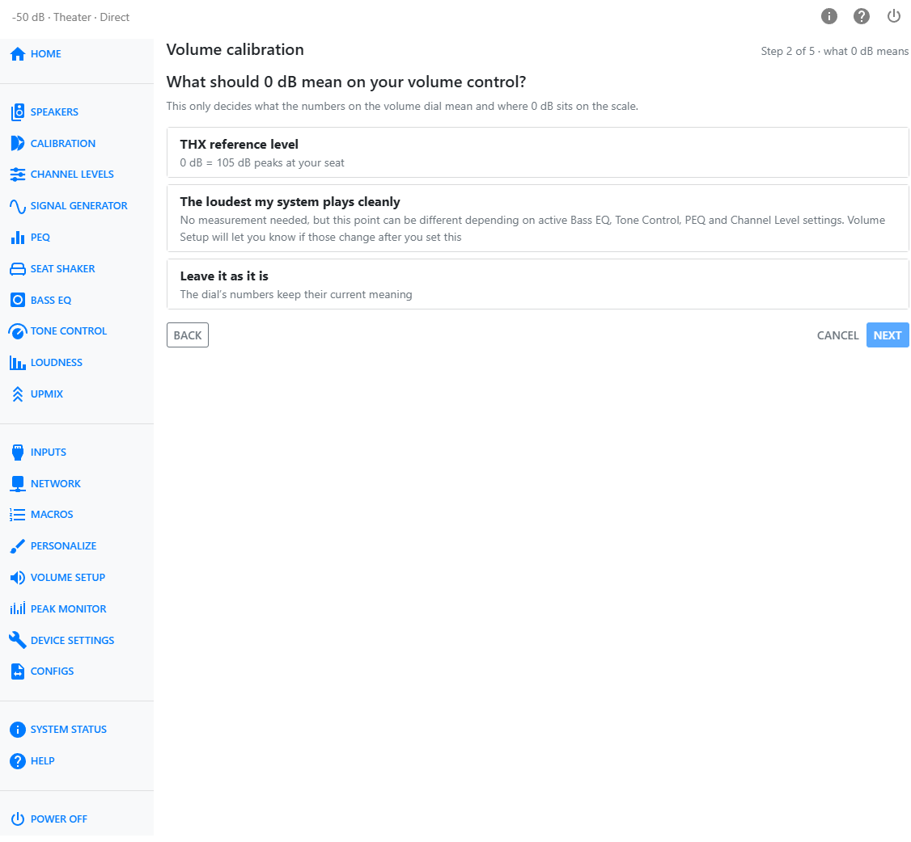
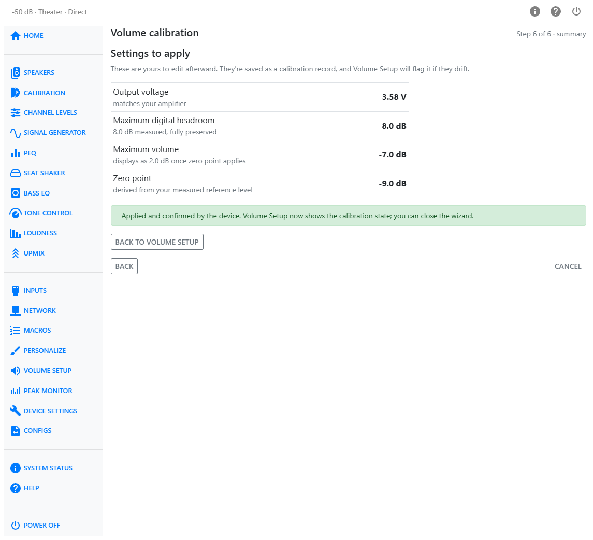

# Volume Calibration

**Volume Calibration** is a guided setup that configures the volume system from your goals rather than from individual settings. It asks what your amplifier needs, what **0 dB** should mean on the volume scale, and how much digital headroom your content and processing actually use — measured with the HTP-1's own tools rather than estimated. From those answers it derives **Reference Output Voltage**, **Maximum Digital Headroom**, **Maximum Volume**, and **Zero Point**, and shows each value with its reasoning. Nothing is changed until you apply the result.

The wizard is opened from the **Volume Calibration** section of [Volume Setup](volume-setup.md). The individual settings remain available there for anyone who wants to inspect or adjust them manually; a calibration is a starting point, not a lock.

## Before You Start

- Run Volume Calibration **after** Dirac Live calibration. Its measurements are taken through your active filters, so a new Dirac calibration calls for a new measurement.
- Have some of your most demanding program material ready — content with heavy, multi-channel bass produces the most representative measurement.
- An SPL meter (or the UMIK microphone you used for Dirac Live, with REW's SPL meter) is needed only if you choose to anchor **0 dB** to THX reference level.
- Playback pauses while a test sweep runs.

## Amplifier Sensitivity

The first step asks what input voltage your amplifier needs for full power. Take this from the amplifier's specification sheet — look for *input sensitivity* or *input level for full power*. Everything the wizard calculates is derived from this value.

This asks what your **amplifier** needs, not what **Reference Output Voltage** should be. The wizard usually sets **Reference Output Voltage** higher than the amplifier's sensitivity and lowers **Maximum Volume** to match: at the top of the volume range the amplifier still receives the voltage you entered, and the additional output range becomes digital headroom for processing. Reallocating gain this way protects processing boost from digital clipping; it does not create output capability beyond the hardware's limits.

## What 0 dB Should Mean

Next, choose what **0 dB** on the volume scale should represent:

| Choice | Meaning | Measurement needed |
|---|---|---|
| THX reference level | 0 dB corresponds to reference playback level — 105 dB peaks at your seat | SPL measurement, added as a later step |
| The loudest my system plays cleanly | 0 dB is the highest volume at which the full configured digital headroom is preserved | None |
| Leave it as it is | Your **Zero Point** setting is not touched | None |

This choice sets **Zero Point**, which only offsets the displayed volume value. It does not change actual playback level. You can switch between the first two choices at any point before applying.

## Measuring Headroom Demand

The headroom step establishes how much digital headroom your system actually needs, in three parts.

### 1. Watch peaks while demanding content plays

The embedded [Peak Monitor](peak-monitor.md) records the largest post-processing sample peaks while you play a few minutes of demanding, bass-heavy material at your normal volume. Real content exercises everything your processing adds at once — Dirac Live, PEQ, trims, bass management, and multi-channel summing — which makes it the most representative source for the headroom number.

The wizard captures the highest observed peak automatically and adds back the digital headroom that was available at the measuring volume, so the result does not depend on how loud you happened to play.

!!! tip
    The measurement only covers what you played. A few minutes of genuinely demanding material is worth more than a long stretch of quiet content.

### 2. Bass EQ presets

If you use [Bass EQ](bass-eq.md) presets for movie playback, the calibration provisions additional headroom for them. The allowance is sized for your system rather than assumed: a short test sweep measures the boost your chain already has in the 15–40 Hz band, the typical Bass EQ title's boost is stacked on that figure, and only the portion your overall measurement does not already cover is added. By default the allowance covers the median catalogue title (10 dB of effective boost); an option provisions for the heaviest titles instead (22 dB, covering all but the most extreme few percent).

The question must be answered either way, and answering *yes* requires the Bass EQ band sweep in the next part.

### 3. Per-channel sweep

A quiet test sweep plays tones through each channel individually and reports the frequency and channel with the most boost. It serves two jobs:

- **Sizing the Bass EQ allowance** — a short sweep of the 15–40 Hz band only, taking a few minutes.
- **Re-measuring after a filter change** — a full-range sweep, taking substantially longer, useful for comparing a newly transferred Dirac Live filter against the previous one. The expected duration is shown before you start.

Because the sweep plays one channel at a time, it cannot see bass that several channels contribute simultaneously, so the content measurement usually finds a higher overall number. Tones whose readings cannot be verified are retried and, if still unverifiable, skipped and reported rather than trusted.

### Reusing previous measurements

Measurements are stored with the Dirac Live filter and sound settings they were taken against. When nothing has changed since, the wizard offers the previous result instead of asking you to measure again — useful when re-running only to change what **0 dB** means. Any change to the filter or the processing chain invalidates the stored result automatically.

## Measuring Reference Level

If you chose THX reference level, the wizard plays band-limited pink noise at −30 dBFS through the front left speaker. Raise the volume until an SPL meter at your seat reads **75 dB** (C-weighted, slow), then capture that volume. This follows the standard alignment in which peaks reach 105 dB at reference; Dirac Live has already matched the other channels to the measured one.

The captured value records the output level at which your room reaches reference, so **0 dB** keeps meaning reference level even if other settings change later. A previously measured reference is offered for reuse when your filters and settings are unchanged.

## The Result

The result step reports where your system lands and asks the one trade-off question the calibration cannot answer for you.

For a reference-level calibration it reports whether your system reaches reference exactly, falls short by a stated amount, or has usable range above it. A shortfall means the amplifier reaches full power before the room reaches reference; more amplifier power or more sensitive speakers would close the gap, and no processor setting can.

When the measured demand exceeds what the amplifier's full output leaves room for, the wizard presents a choice of what the top of the scale should deliver:

| Choice | Effect |
|---|---|
| Loudest | The amplifier reaches full power at the top of the scale; the headroom reserve takes the shortfall |
| Cap at reference | The scale tops out at your measured reference level; the spare range above it becomes headroom |
| Preserve all measured headroom | Every measured decibel is protected; the top of the scale lands where that requires |

Each option is labeled with exactly what it costs. The **Reference Output Voltage** operating point is selected automatically for the most processing reserve — every operating point delivers the same loudness at the top of the scale — and can be changed from the same step.

## Summary and Apply

The final step lists the four settings the wizard will write — **Reference Output Voltage**, **Maximum Digital Headroom**, **Maximum Volume**, and **Zero Point** — each with the reasoning behind its value. **Apply** writes them together and stores a calibration record on the HTP-1, so the calibration state is visible from any browser.

Applying is blocked while a Dirac Live filter transfer or calibration is in progress, and when the measurement no longer matches the active filter.

## After You Apply

The **Volume Calibration** section of [Volume Setup](volume-setup.md) then shows the calibration status:

- the date and the Dirac Live slot the calibration was measured against;
- what **0 dB** means on your scale;
- the highest volume that preserves the full configured digital headroom — and, if your **Maximum Volume** allows the scale to run past that point, a note that levels above it consume the reserve and may allow clipping on loud content.

The status is checked continuously:

- **In sync** — the settings still match what the calibration derived.
- **Settings changed** — one of the four values was edited by hand. The page names the field and offers **Recalculate** (re-derive everything from the new value) or **Keep my changes** (adopt the edit into the record).
- **Measurement out of date** — the measured Dirac Live slot's filter or the processing chain has changed since measurement; a re-measurement is offered.
- **Slot not measured** — the active Dirac Live slot has no measurement yet. Settings cover the most demanding slot measured so far, so a gentler slot is covered; a more demanding one may not be.

Nothing is ever changed automatically — the status only reports, and every remedy is a button you choose to press.

## Notes on Measurement Conditions

- [Loudness](loudness.md) is turned off automatically during test sweeps and the reference-level measurement, and restored afterward. The calibration's results are independent of the Loudness setting: its compensation applies at lower volumes, where reducing the master volume has already made digital headroom plentiful.
- A content measurement taken with Loudness enabled can only overstate the demand, never understate it.
- Test sweeps run at a reduced, fixed volume; the sweep is aborted safely if another control surface changes the volume or sound settings mid-measurement.
