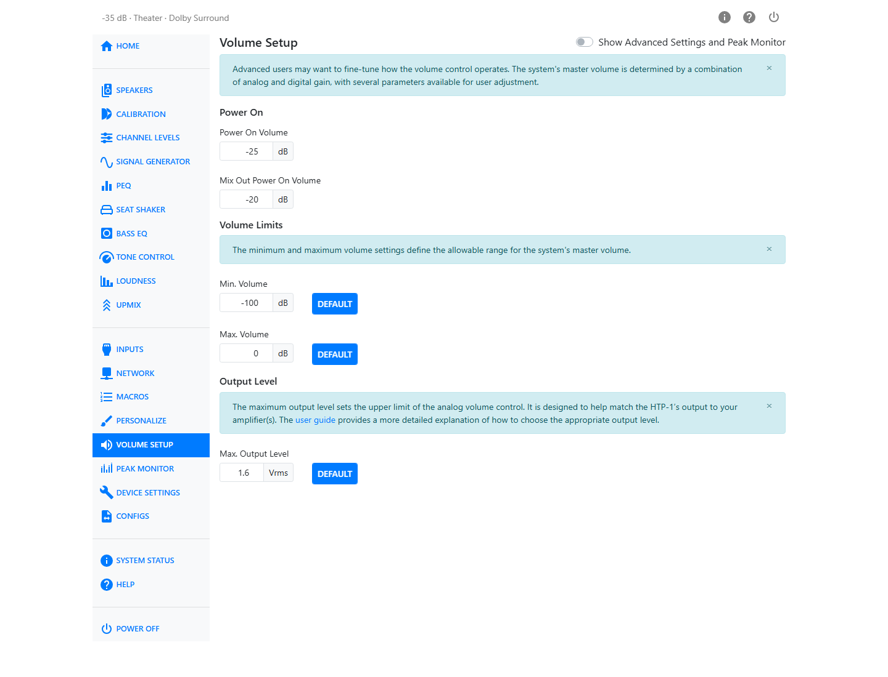
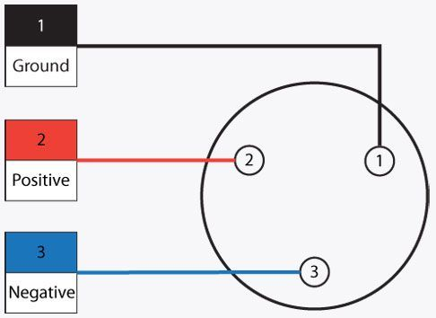
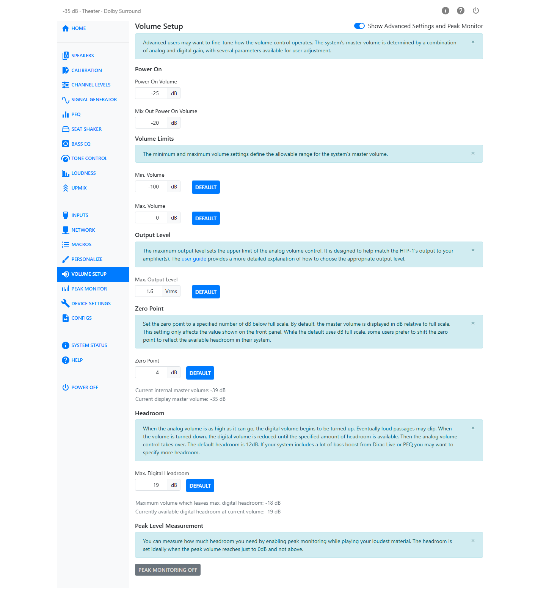

# Volume Setup

The HTP-1's master volume is a combination of analog and digital gain. Volume Setup is where you
set how that combination behaves: the volume the unit wakes up at, the range you're allowed to
move it in, and how its output level is matched to your amplifier.

## Power On

**Power On Volume** sets the master volume the HTP-1 comes up at when it turns on, from −100 to 0 dB.

**Mix Out Power On Volume** does the same for the Mix Out (Zone 2) output, which has its own
independent volume. Set it separately if you use Mix Out for a zone that should come up at a
different level than the main output.

## Volume Limits

The **Min. Volume** and **Max. Volume** controls define the allowed range for the master volume
control, so you — or anyone else in the house — can't drive the system below or above levels
you've decided are sensible.

| Control | Range | Default button |
|---|---|---|
| Min. Volume | −100 to −60 dB | Resets to the factory minimum |
| Max. Volume | −59 to +22 dB | Resets to the factory maximum |

## Output Level

The **Max. Output Level** sets the maximum analog output level, in Vrms. It is designed to match the HTP-1's maximum output to your amplifier's input sensitivity—the input voltage required to drive the amplifier to full power.

If the maximum output is set much higher than your amplifier requires, the upper end of the volume range becomes less usable because small volume changes produce relatively large changes in sound level. Setting the Max. Output Level closer to your amplifier's actual input sensitivity spreads the usable range more evenly, making volume adjustments easier and more precise.

| Control | Range | Default button |
|---|---|---|
| Max. Output Level | 0.1 to 4 Vrms | Resets to the factory value |

The HTP-1's balanced outputs are on XLR connectors.

## Show Advanced Settings and Peak Monitor

Turn on **Show Advanced Settings and Peak Monitor** to reveal the Zero Point, Headroom, and Peak
Monitor controls described below.

### Zero Point

By default, the master volume is displayed using the HTP-1's standard volume scale. **Zero Point** applies an offset to that displayed value, allowing you to choose which listening level appears as 0 dB. This changes only the numbers shown on the front panel and in the web UI; it does not affect the actual output level or internal master volume.

Zero Point ranges from −100 to +22 dB and includes a **Default** button. The advanced section displays both the internal master volume and the displayed volume so you can see how the offset is applied.

### Headroom

**Max. Digital Headroom**: The HTP-1 uses a two-stage volume control. Volume is first increased in the analog domain. Once the configured maximum analog output level is reached, any further increase is applied digitally. **Max. Digital Headroom** determines how many decibels are reserved in the digital signal for this second stage.

### Peak Level Measurement

This is the same tool available under [Peak Monitor](peak-monitor.md). It is repeated here because peak levels are primarily used to configure **Max. Digital Headroom**, making it easier to observe clipping while adjusting the setting. See [Peak Monitor](peak-monitor.md) for a full description of its features.

Use **Peak Monitor** to determine the smallest **Max. Digital Headroom** value that avoids clipping. Reducing the reserved digital headroom increases the available analog volume range, but leaves less margin for digital peaks before clipping.

!!! tip
    If you want to ensure the digital volume stage is never used, set **Max. Volume** to the
    negative value of **Max. Digital Headroom**, minus 1 dB (an additional 1 dB of headroom is
    already applied internally). With the default 12 dB headroom, that means a **Max. Volume**
    of −13 dB.

| Control | Range | Default |
|---|---|---|
| Max. Digital Headroom | 0 to 30 dB | 12 dB |

The page also shows two live readouts:

- **Highest volume with full digital headroom** — the highest master-volume setting at which the full configured digital headroom remains available. Above this level, further volume increases use digital gain and reduce the remaining headroom.
- **Currently available digital headroom at current volume** — the digital headroom remaining at the current master-volume setting.

!!! tip
    Play your loudest material with **Peak Monitor** enabled and reduce **Max. Digital Headroom**
    until no channels clip.
